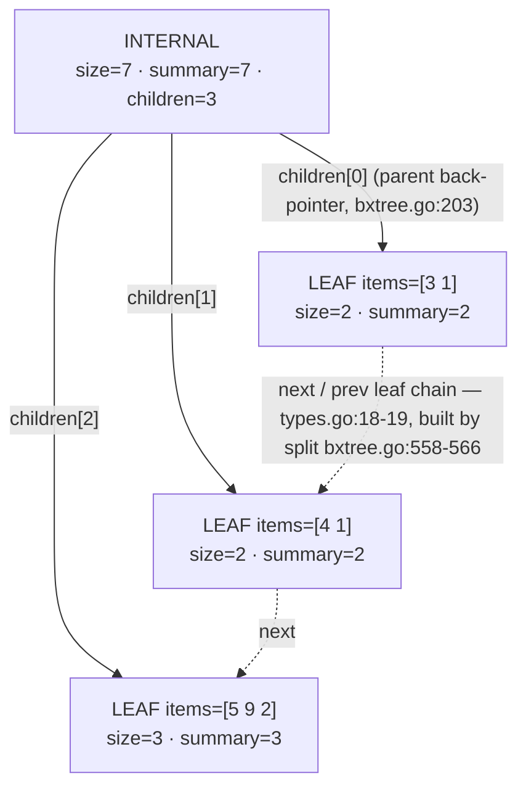

# BxTree: Layout and Invariants

`bxtree` is a **positional** B+tree: like a classic B+tree it stores its payload
in sorted leaves and keeps the tree shallow by capping fan-out, but it drops the
key array entirely. There are no search keys at all — you address items by
**index** ("give me item 42", not "find key 42"), and each node stores a `size`
(its subtree's item count) so an index can be *counted* down to a leaf. That is
what "positional" buys you: O(log n) random access, insert, and delete at an
arbitrary position, which is exactly what a text/sequence CRDT needs — position
is the primary key for edits, not identity.

The second idea is the B+tree part with summaries: every node carries a
`summary` field that folds a user-supplied aggregate over its whole subtree
([`go/bxtree/types.go:16`](../../go/bxtree/types.go#L16), maintained by the `Summarizer` interface,
[`go/bxtree/types.go:43-50`](../../go/bxtree/types.go#L43-L50)). The tree updates these aggregates automatically on
every mutation, so "sum everything before item i" or "find the first position
where an accumulated sum passes k" is a walk from the root, not a scan.

The concrete types are two generics: `BxTree[T, S]` (payload `T`, summary `S`)
holding the root, the ends of the leaf chain, and the occupancy bounds
([`go/bxtree/types.go:54-64`](../../go/bxtree/types.go#L54-L64)); and `Node[T, S]`, the single node type that plays
both leaf and branch ([`go/bxtree/types.go:12-21`](../../go/bxtree/types.go#L12-L21)).

## The node: one struct, two shapes

There is no separate leaf type. A `Node` is a leaf when `isLeaf` is true and
its `items` slice holds payload; otherwise it is a branch holding `children`.
Every node always carries `parent`, `size`, and `summary`
([`go/bxtree/types.go:12-21`](../../go/bxtree/types.go#L12-L21)):

```go include go/bxtree/types.go L10-L21
// Node represents a node in the BxTree. It can be either a leaf node containing items
// or an internal node containing child nodes.
type Node[T any, S any] struct {
	isLeaf   bool
	parent   *Node[T, S]
	size     int
	summary  S
	items    []T           // only for leaf nodes
	next     *Node[T, S]   // only for leaf nodes
	prev     *Node[T, S]   // only for leaf nodes
	children []*Node[T, S] // only for internal nodes
}
```

Note what is *absent*, because it changes how you read everything else:

- **No key array.** A classic B+tree's internal nodes route by comparing
  search keys against separators. Here there is nothing to compare: descent
  uses positional arithmetic only (see [§ Descent](#finding-item-i-descent-not-key-search)).
- **No per-item counts.** `size` is stored per node and maintained by the
  mutation code (`addUpward`, [`go/bxtree/bxtree.go:878-890`](../../go/bxtree/bxtree.go#L878-L890)). For a leaf,
  `size` always equals `len(items)`.

Occupancy bounds come as constants ([`go/bxtree/types.go:3-8`](../../go/bxtree/types.go#L3-L8)) and are
configurable per tree (`WithLeafNodeSize` / `WithInternalNodeSize`,
[`go/bxtree/bxtree.go:30-48`](../../go/bxtree/bxtree.go#L30-L48)):

```go include go/bxtree/types.go L3-L8
const (
	DefaultInternalMinSize = 16
	DefaultInternalMaxSize = 32
	DefaultLeafMinSize     = 64
	DefaultLeafMaxSize     = 128
)
```

So a default-shaped tree has leaves of 64–128 items and fanout 16–32 per
internal level — the 1M–2M items a typical text CRDT holds resolve in 2–3
levels of branch nodes.

## Layout: node fields and the two invariants that never break

Here is the 7-item tree `3, 1, 4, 1, 5, 9, 2` (built with tiny bounds — leaf
`[2,3]`, internal `[2,3]` — so you can see every node, with a `count`
summarizer so `summary` == number of items). Every edge is the `children`
slice of a branch node; `parent`, `next`, `prev` run the opposite ways:



The two invariants the diagram *is*:

1. **`size` = `Σ children.size`** (leaves: `size` = `len(items)`) — the root's
   `size` (7) is the tree's total item count; `Size()` just reads
   `tree.root.size` ([`go/bxtree/bxtree.go:234-243`](../../go/bxtree/bxtree.go#L234-L243)).
2. **`summary` = user aggregate over the subtree** — for the count summarizer
   above, `Add` is `+`, so root `summary` = 2+2+3 = 7, same as `size` here,
   but with a sum-only summarizer they look different: `summary` is whatever
   `S` you fold, `size` is always item count.

The tree-level fields you see in the diagram come from
`BxTree.root` / `BxTree.first` / `BxTree.last` ([`go/bxtree/types.go:55-57`](../../go/bxtree/types.go#L55-L57)) —
the `first`/`last` pair plus each leaf's `next`/`prev` form the doubly-linked
leaf chain that `All()` and `Reverse()` iterate in O(n) with no tree walking
([`go/bxtree/bxtree.go:246-279`](../../go/bxtree/bxtree.go#L246-L279)).

### Worked example: 7 inserts, 3 leaves (simulator output, verbatim)

Tree built by repeated `InsertAt` (append) with leaf `[2,3]` and internal
`[2,3]`, count summarizer; `size` and `summary` printed per node. Steps 4 and
6 are the ones where a leaf overflows `leafMaxSize=3` and `split()`
([`go/bxtree/bxtree.go:517-616`](../../go/bxtree/bxtree.go#L517-L616)) cuts it in half — the split mechanics themselves
are stepped through page by page in
`docs/bxtree/02-insert-delete.md`; here we only show the states:

| Op | State after (from the simulator) |
|----|----------------------------------|
| `InsertAt(0, 3)` | `LEAF items=[3] size=1 summary=1`, root = that leaf |
| `InsertAt(1, 1)` | `LEAF items=[3 1] size=2 summary=2` |
| `InsertAt(2, 4)` | `LEAF items=[3 1 4] size=3 summary=3` |
| `InsertAt(3, 1)` | leaf overflows 4 items → split at `mid = len(items)/2` → root `INTERNAL children=2 size=4 summary=4`, leaves `[3 1]` / `[4 1]` |
| `InsertAt(4, 5)` | appended to last leaf → `LEAF items=[4 1 5] size=3 summary=3` |
| `InsertAt(5, 9)` | last leaf overflows → split → root `children=3`, leaves `[3 1]` `[4 1]` `[5 9]` |
| `InsertAt(6, 2)` | `LEAF items=[5 9 2] size=3 summary=3` |

The final state the simulator printed:

```
INTERNAL children=3 size=7 summary=7
  LEAF items=[3 1] size=2 summary=2
  LEAF items=[4 1] size=2 summary=2
  LEAF items=[5 9 2] size=3 summary=3
first=[3 1] last=[5 9 2] Size=7
```

Check the invariants you just read: `7 = 2 + 2 + 3` (root `size` is the fold of
child `size`s), leaf summaries match item counts, and `first`/`last` bracket
the leaf chain. Nothing here was hand-computed — the states above are the
actual package output produced by a tiny driver built against `go/bxtree`.

## Occupancy: the envelope every node must live in

Every leaf or branch keeps between a configured `min` and `max` occupants,
with one exemption: **the root** may fall below its own minimum (a
freshly-built short tree can even have a below-min root). The envelope is
validated *once*, at construction ([`go/bxtree/bxtree.go:98-118`](../../go/bxtree/bxtree.go#L98-L118): leaf
`min >= 1`, both kinds `max >= min`, and `max >= 2*min-1`, which is the
inequality `split()` and merge/rebalance rely on to always produce two
in-bounds halves; [`go/bxtree/bxtree.go:91-97`](../../go/bxtree/bxtree.go#L91-L97) derives that arithmetic).
Bad configs return `*InvalidNodeSizeError` ([`go/bxtree/errors.go:14-30`](../../go/bxtree/errors.go#L14-L30)), not
a misbehaving tree. One asymmetry to note: internal nodes enforce
`min >= 2` ([`go/bxtree/bxtree.go:108-110`](../../go/bxtree/bxtree.go#L108-L110)), while a leaf's minimum is the
leaf constant (`min >= 1` above):

```go include go/bxtree/bxtree.go L24-L35
// WithInternalNodeSize sets the minimum and maximum number of children for internal nodes.
// Larger sizes increase branching factor and reduce tree height but increase work per node.
//
// Supported sizes require min >= 2, min <= max, and max >= 2*min-1 so that
// split/merge can keep every non-root node within [min, max]. New returns an
// *InvalidNodeSizeError for any other configuration.
func WithInternalNodeSize[T any, S any](min, max int) Option[T, S] {
	return func(tree *BxTree[T, S]) {
		tree.internalMinSize = min
		tree.internalMaxSize = max
	}
}
```

So the code never has to "hope" a mutation lands in range: split divides an
overflowed `max+1` node into halves each ≥ `min` (bxtree.go:544 does
`mid = len(items)/2`, and `max+1 >= 2*min` guarantees both halves reach the
minimum), and merge never produces an overfull node — a merge is only chosen
for a pair whose combined size is `<= 2*min-1 <= max` (merge/rebalance
decision at [`bxtree.go:733`](../../go/bxtree/bxtree.go#L733), comment `:729-732`).

There is **no sentinel node** anywhere in this package — emptiness is
`tree.root == nil` (`insert`'s first-leaf branch, [`go/bxtree/bxtree.go:448-468`](../../go/bxtree/bxtree.go#L448-L468)
creates the root leaf; the `delete` loop tears it down when `root.size == 0`,
[`go/bxtree/bxtree.go:666-669`](../../go/bxtree/bxtree.go#L666-L669)). If you were expecting a `Check()`-style
function, see [§ Invariants](#invariants) below: the package's invariant
checker lives as test helpers, not as production code.

## Finding item *i*: descent, not key search

`GetAt(i)` / `GetAtNode(i)` ([`go/bxtree/bxtree.go:333-351`](../../go/bxtree/bxtree.go#L333-L351)) both route through
`getAt`, which is the whole positional story in one function. Position is
resolved by *counting down* the index through child sizes:

```go include go/bxtree/bxtree.go L353-L365 L367-L383
func (tree *BxTree[T, S]) getAt(index int) (*Node[T, S], int, error) {
	if tree == nil {
		panic("bxtree: getAt called on nil tree")
	}
	if index < 0 || index >= tree.Size() {
		return nil, -1, ErrIndexOutOfBounds
	}
	if index < tree.first.size {
		return tree.first, index, nil
	}
	if index >= tree.Size()-tree.last.size {
		return tree.last, index - (tree.Size() - tree.last.size), nil
	}
// …
	curr := tree.root
	for !curr.isLeaf {
		found := false
		for _, child := range curr.children {
			if index < child.size {
				curr = child
				found = true
				break
			}
			index -= child.size
		}
		if !found {
			panic(fmt.Sprintf("bxtree: index %d not found in internal node during traversal", index))
		}
	}
	return curr, index, nil
}
```

Three decisions worth naming:

- **Two fast paths first** ([`bxtree.go:360-365`](../../go/bxtree/bxtree.go#L360-L365)): asking for an index inside
  `first` or inside `last` skips the tree entirely. Text edits cluster near
  the beginning and end of documents (typing!), so these cover a large share
  of real traffic in O(1).
- **Linear scan within a node, this is a documented trade** ([`bxtree.go:370-377`](../../go/bxtree/bxtree.go#L370-L377)):
  `getAt` walks `children` left-to-right, subtracting sizes. With
  `DefaultInternalMaxSize = 32` that is at most 32 comparisons per level —
  cheap and branch-predictable. There is no binary search here; the loop is
  a plain `for range` over the child slice.
- **`found` guards the invariant**, not the user ([`bxtree.go:378-380`](../../go/bxtree/bxtree.go#L378-L380)): if the
  sizes ever failed to cover the index, the panic fires — malformed trees
  surface as a crash *here*, not as silent wrong-data.

### Descent walkthrough (simulator, final 7-item tree)

Tracing the same 7-item tree as the worked example, `getAt(2)`: not inside
`first` (`first.size = 2`), not inside `last` (`Size()-last.size = 4`); so it
descends from the root:

| Step | Node | Action |
|---|---|---|
| 1 | root `children=[3 1] [4 1] [5 9 2]` | child 0 has `size=2`, `2 < 2` is false → `index -= 2` → 0 ([`bxtree.go:376-377`](../../go/bxtree/bxtree.go#L376-L377)) |
| 2 | child 1 `[4 1]` | `0 < 2` → descend, first match ([`bxtree.go:371-373`](../../go/bxtree/bxtree.go#L371-L373)) |
| 3 | leaf `[4 1]` | return `pos = 0`, i.e. item `4` ([`bxtree.go:381-382`](../../go/bxtree/bxtree.go#L381-L382)) |

The real API agrees:

```
child 0 size=2 remaining index=2
child 1 size=2 remaining index=0
  descend into child 1
leaf [4 1] pos=0
GetAtNode(2) -> leaf [4 1] pos=0
```

And `getAt(5)` takes the fast path straight to `last=[5 9 2]` at `pos = 5 - 4`
([`bxtree.go:363-365`](../../go/bxtree/bxtree.go#L363-L365)); both traces come from the simulator drive where a copy
of the loop was run alongside the real calls — `GetAtNode(0..6)` all agree with
the trace.

`FindPath` ([`go/bxtree/bxtree.go:1007-1063`](../../go/bxtree/bxtree.go#L1007-L1063)) is the *summary-driven* cousin of
the same descent: instead of counting an index down, it walks children while a
caller predicate over `(accumulated summary, current summary)` is false
([`bxtree.go:1026-1043`](../../go/bxtree/bxtree.go#L1026-L1043)), then scans the leaf with `FromItem` per item
([`bxtree.go:1050-1061`](../../go/bxtree/bxtree.go#L1050-L1061)). It is how "jump to the first position where the
aggregate up to it crosses k" costs a root-to-leaf walk:

```go include go/bxtree/bxtree.go L1026-L1043
	for !curr.isLeaf {
		found := false
		for _, child := range curr.children {
			var nextAcc S
			if first {
				nextAcc = child.summary
			} else {
				nextAcc = tree.summarizer.Add(acc, child.summary)
			}

			if predicate(acc, child.summary) {
				curr = child
				found = true
				break
			}
			acc = nextAcc
			first = false
		}
```

## Summaries: how aggregates live in the tree

A leaf's own summary is a fold of `FromItem` over its items
([`go/bxtree/bxtree.go:50-61`](../../go/bxtree/bxtree.go#L50-L61)):

```go include go/bxtree/bxtree.go L50-L61
func (tree *BxTree[T, S]) summarizeItems(items []T) S {
	var s S
	for i, item := range items {
		m := tree.summarizer.FromItem(item)
		if i == 0 {
			s = m
		} else {
			s = tree.summarizer.Add(s, m)
		}
	}
	return s
}
```

From there, everything flows upward by adding child summaries. When an internal
node is built (e.g. during `NewFromSlice`'s bottom-up construction,
[`go/bxtree/bxtree.go:188-216`](../../go/bxtree/bxtree.go#L188-L216)) the fold is per child:

```go include go/bxtree/bxtree.go L202-L214
			for j, child := range nd.children {
				child.parent = nd
				size += child.size
				if tree.summarizer != nil {
					if j == 0 {
						s = child.summary
					} else {
						s = tree.summarizer.Add(s, child.summary)
					}
				}
			}
			nd.size = size
			nd.summary = s
```

The trick that makes the summary *cheap* is that mutations advance it
**differentially**: `insert` computes the delta summary of just the new items
(`deltaSummary`, [`bxtree.go:478-481`](../../go/bxtree/bxtree.go#L478-L481) and `:502-505`), and `addUpward` pushes
that one delta along the whole ancestor chain — no re-fold from scratch
([`go/bxtree/bxtree.go:878-890`](../../go/bxtree/bxtree.go#L878-L890)):

```go include go/bxtree/bxtree.go L878-L890
func (n *Node[T, S]) addUpward(deltaSize int, deltaSummary S, tree *BxTree[T, S]) {
	if tree == nil {
		panic("bxtree: addUpward called with nil tree")
	}
	curr := n
	for curr != nil {
		curr.size += deltaSize
		if tree.summarizer != nil {
			curr.summary = tree.summarizer.Add(curr.summary, deltaSummary)
		}
		curr = curr.parent
	}
}
```

The same `addUpward(-n, -delta)` pattern subtracts on deletion
([`bxtree.go:660`](../../go/bxtree/bxtree.go#L660), using `Sub`, [`go/bxtree/types.go:48-49`](../../go/bxtree/types.go#L48-L49)), and node-splitting
keeps summaries correct by recomputing the shrinking node with `Sub` while the
new half gets a fresh fold ([`bxtree.go:548-552`](../../go/bxtree/bxtree.go#L548-L552)). Delete/rebalance details
belong to the next page (`docs/bxtree/02-insert-delete.md`), which shows each
of those maintenance sites in step diagrams.

Summarizer state at a glance — one interface, three obligations
([`go/bxtree/types.go:39-50`](../../go/bxtree/types.go#L39-L50)):

```go include go/bxtree/types.go L39-L50
// Summarizer defines the interface for maintaining tree-wide summaries.
// T is the type of items in the tree, and S is the type of the summary metadata.
//
// Summaries are updated automatically during insertions and deletions.
type Summarizer[T any, S any] interface {
	// FromItem converts a single item into its summary representation.
	FromItem(item T) S
	// Add combines two summaries. This is used when moving up the tree.
	Add(a, b S) S
	// Sub subtracts a summary from another. This is used during deletions.
	Sub(a, b S) S
}
```

A no-summarizer tree is fully usable — `New` defaults `summarizer` to nil
([`go/bxtree/types.go:63`](../../go/bxtree/types.go#L63)); `FuzzBxTree` exercises exactly that configuration
([`go/bxtree/fuzz_test.go:36-40`](../../go/bxtree/fuzz_test.go#L36-L40)). `size` is always maintained regardless;
`summary` is simply not maintained (`addUpward` skips it behind
`tree.summarizer != nil`, [`bxtree.go:885-887`](../../go/bxtree/bxtree.go#L885-L887)), and summary-driven callers
like `FindPath` then panic by design ([`bxtree.go:1018-1020`](../../go/bxtree/bxtree.go#L1018-L1020)).

Worked example with an aggregate that *differs from size* — the simulator built
a 10-item tree with a **sum** summarizer and `leaf [2,4]` / `internal [2,3]`;
`NewFromSlice` ([`go/bxtree/bxtree.go:126-232`](../../go/bxtree/bxtree.go#L126-L232)) distributes 10 items across
leaves of sizes 4/3/3 via `splitSizes` ([`bxtree.go:141-153`](../../go/bxtree/bxtree.go#L141-L153)) and folds
bottom-up:

```
INTERNAL children=3 size=10 summary=550
  LEAF items=[10 20 30 40] size=4 summary=100
  LEAF items=[50 60 70] size=3 summary=180
  LEAF items=[80 90 100] size=3 summary=270
```

Same invariant, different fold: `550 = 100 + 180 + 270`, and `size = 4 + 3 + 3
= 10` is kept separately from `summary`. Range queries get prefix aggregates
directly from the summaries: `Node.SummaryBefore` sums every left-sibling's
summary up the spine ([`go/bxtree/bxtree.go:939-963`](../../go/bxtree/bxtree.go#L939-L963)), and `Node.Index()`
does the same arithmetic on `size` ([`go/bxtree/bxtree.go:981-998`](../../go/bxtree/bxtree.go#L981-L998)).

## Invariants

This package has **no `Check()` function**; the equivalent is the test-only
`verifyNode`/`verifyTree` pair ([`go/bxtree/helpers_test.go:58-189`](../../go/bxtree/helpers_test.go#L58-L189)), which
every structural test in the package asserts after each mutation. Each listed
invariant cites its checker and where the mutation code maintains it:

1. **Subtree `size` is exact** — leaf: `size == len(items)`; branch:
   `size == Σ children.size`. Maintained by `addUpward`
   ([`go/bxtree/bxtree.go:883-889`](../../go/bxtree/bxtree.go#L883-L889)), by split's re-fold
   ([`bxtree.go:574-603`](../../go/bxtree/bxtree.go#L574-L603)), and by redistribute's `recompute` closure
   ([`bxtree.go:813-830`](../../go/bxtree/bxtree.go#L813-L830)). Checked at [`helpers_test.go:160-162`](../../go/bxtree/helpers_test.go#L160-L162).
2. **Subtree `summary` folds exactly as the node would if rebuilt** —
   leaf `summary == FromItem-fold of items`, branch `== Add-fold of child
   summaries`. Maintained in `addUpward` ([`bxtree.go:886-887`](../../go/bxtree/bxtree.go#L886-L887)) and by
   explicit recomputation after structural changes (`UpdateSummary`,
   [`bxtree.go:910-927`](../../go/bxtree/bxtree.go#L910-L927)). Checked at [`helpers_test.go:164-166`](../../go/bxtree/helpers_test.go#L164-L166).
3. **Occupancy within `[min, max]` for every non-root node** — the root may
   hold fewer (a 1-item root is legal, even 0 before the first insert).
   Bounds *configuration* is validated against `max >= 2*min-1` upfront
   ([`bxtree.go:99-116`](../../go/bxtree/bxtree.go#L99-L116)), and every non-root node is re-checked as a helper
   assertion at [`helpers_test.go:168-186`](../../go/bxtree/helpers_test.go#L168-L186) (mini-B+tree version at
   [`helpers_test.go:193-224`](../../go/bxtree/helpers_test.go#L193-L224)).
4. **The leaf chain is a linear, complete list** — `first → next … last`
   visits every leaf exactly once and its items sum to `Size()`;
   `next`/`prev`/`last` updates happen inside `split` and `merge` only
   ([`bxtree.go:558-566`](../../go/bxtree/bxtree.go#L558-L566), `:853-858`). Checked at [`helpers_test.go:99-122`](../../go/bxtree/helpers_test.go#L99-L122).
5. **Stored content equals the expected content**, order preserved — the
   ForEach/`GetAt` walkthrough at [`helpers_test.go:66-92`](../../go/bxtree/helpers_test.go#L66-L92) pins this.
6. **Parent back-pointers agree with the actual child lists** —
   `checkNodeBounds` ([`helpers_test.go:216-221`](../../go/bxtree/helpers_test.go#L216-L221)) walks parent/child edges
   of the built tree; `rebalance`'s `redistribute*` reassigns
   `child.parent` ([`bxtree.go:809-811`](../../go/bxtree/bxtree.go#L809-L811)).
7. **`size` and `summary` include any delta as soon as a mutation returns** —
   there is no lazy rebuild anywhere in the package: each
   `InsertAt` / `DeleteAt` call reconciles summaries *before touching
   the array*, e.g. the deletion-path call ordering in `delete`
   ([`bxtree.go:653-662`](../../go/bxtree/bxtree.go#L653-L662)) computes the delta summary first (using `Sub`,
   [`bxtree.go:654-659`](../../go/bxtree/bxtree.go#L654-L659)), then `addUpward`, then edits `items`. `Size()`
   ([`bxtree.go:234-243`](../../go/bxtree/bxtree.go#L234-L243)) staying equal to `root.size` is thus an assumption
   every caller may rely on.

Verification story: the targeted tests in `go/bxtree/bxtree_test.go` (plus
`new_from_slice_test.go`, `rebalance_occupancy_test.go`, `summary_ops_test.go`)
assert `verifyTree` after every operation; `FuzzBxTree`
([`go/bxtree/fuzz_test.go:10-40`](../../go/bxtree/fuzz_test.go#L10-L40)) generates thousands of insert/delete
interleavings over random byte streams and runs the same verification after
each step, with and without a summarizer. Plain `go test -C go ./bxtree` runs
the seed corpus; `go test -C go ./bxtree -fuzz=FuzzBxTree -fuzztime=30s`
explores deeper. A node-occupancy drift, a wrong summary fold, or a broken
leaf chain anywhere in the interleaving fails the suite — that is the whole
safety net this package runs on (deliberately: production code stays lean and
every invariant is a *test* assertion, not runtime overhead).

Insert/split state machines and delete/rebalance decision logic get their own
step-series pages — refer to `docs/bxtree/02-insert-delete.md` rather than
re-deriving them here.

---

*Related: `docs/pheap/01-pairing-heap.md` (the other tree-shaped container in
the repo, with its own invariants), `docs/index.md` for reading order.*
