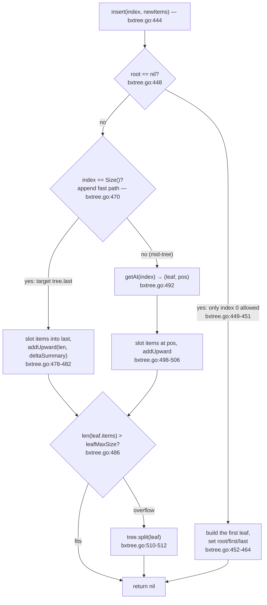
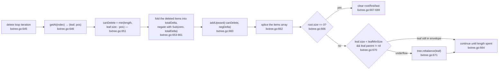
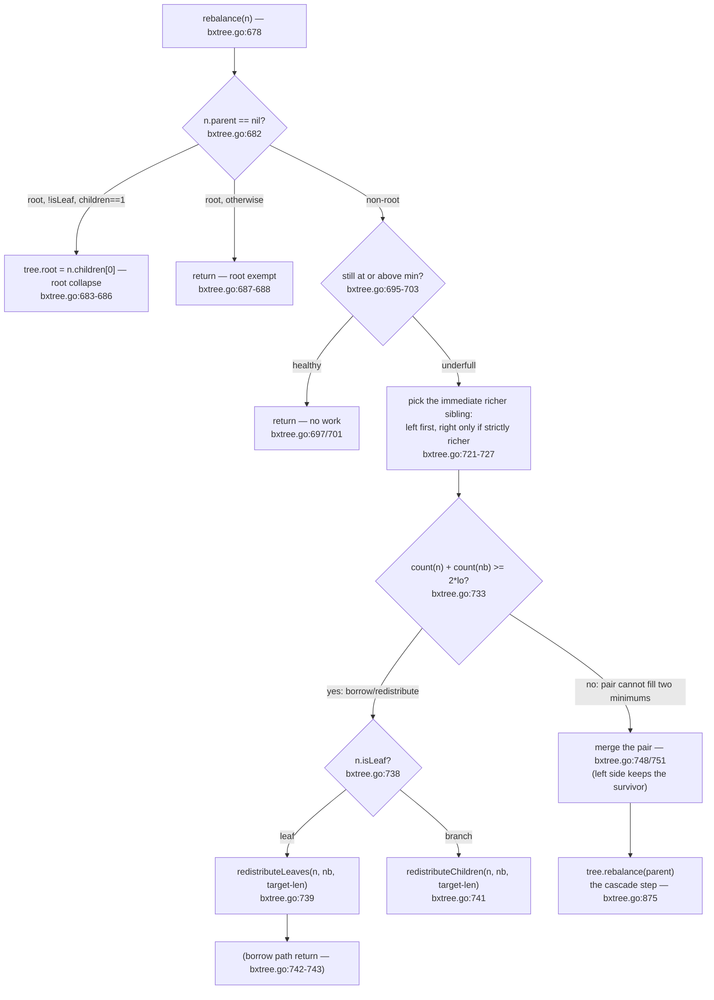
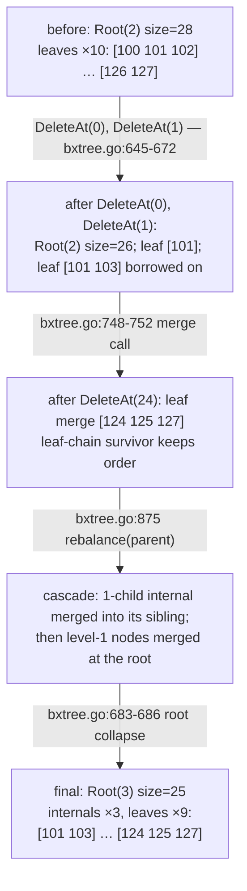

# BxTree: Insert, Split, Delete, and Rebalance

This page continues from `docs/bxtree/01-bxtree-structure.md` (node fields,
`size`/`summary` plumbing, occupancy envelope). Page 01 covered *how a tree
finds an item*; this page covers *how mutations change a tree*. The recurring
theme: nothing is rebuilt lazily — every insert and delete follows a small set
of code paths, and each carries a summary-update site, often *before* the
array edit.

- Insert path: three entry branches and one split-out call — `insert` ([`go/bxtree/bxtree.go:444-515`](../../go/bxtree/bxtree.go#L444-L515)) → `split` ([`go/bxtree/bxtree.go:517-616`](../../go/bxtree/bxtree.go#L517-L616)).
- Delete path: per-leaf chunk loop — `delete` ([`go/bxtree/bxtree.go:634-676`](../../go/bxtree/bxtree.go#L634-L676)) → `rebalance` ([`go/bxtree/bxtree.go:678-753`](../../go/bxtree/bxtree.go#L678-L753)) → `redistributeLeaves` / `redistributeChildren` / `merge` ([`go/bxtree/bxtree.go:759-876`](../../go/bxtree/bxtree.go#L759-L876)).

Throughout, node states in the worked examples are the **verbatim output of a
scratch driver built against `go/bxtree` using the exported API only** (the
same driver that produced page 01's dumps). Quoted dumps are the only source
of truth for the states; nothing is hand-derived.

## One insert, three phases

`InsertAt` and `InsertRange` both resolve to `tree.insert(index, newItems)`
([`go/bxtree/bxtree.go:429-443`](../../go/bxtree/bxtree.go#L429-L443)). The function's three entry branches:



The append and mid branches are near-duplicates; the only difference is *which
leaf* they splice into and where. Both:

1. append the new items onto the leaf's `items` and shift the tail right to
   open a hole at `pos` ([`bxtree.go:498-500`](../../go/bxtree/bxtree.go#L498-L500)),
2. compute the *delta* summary of just the new items (`summarizeItems`,
   [`bxtree.go:50-61`](../../go/bxtree/bxtree.go#L50-L61)) and push it up the ancestor chain with
   `leaf.addUpward(len(newItems), deltaSummary, tree)` ([`bxtree.go:502-506`](../../go/bxtree/bxtree.go#L502-L506);
   `addUpward` itself at [`bxtree.go:878-890`](../../go/bxtree/bxtree.go#L878-L890), shown in
   [§ Summary maintenance](#summary-maintenance-after-every-mutation)),
3. act only if the leaf crossed `leafMaxSize` ([`bxtree.go:510-512`](../../go/bxtree/bxtree.go#L510-L512)) — a split
   is *not* speculative, it is a fix-up after the fact.

Note the ordering: summaries are reconciled *before* any structural change,
and `split` maintains them again across the partition, so the tree is
consistent as seen from the root both before and after.

### Worked example: 7 inserts, and what splitting looks like (driver output, verbatim)

Tree built by repeated `InsertAt(i, v)` with `leaf [2,3]` / `internal [2,3]`
and a count summarizer. State after each op, from the driver:

| Op | State after (driver output) |
|----|------------------------------|
| `InsertAt(0, 3)` | `LEAF items=[3] size=1 summary=1`, root = that leaf |
| `InsertAt(1, 1)` | `LEAF items=[3 1] size=2 summary=2` |
| `InsertAt(2, 4)` | `LEAF items=[3 1 4] size=3 summary=3` — at `leafMaxSize`, not over |
| `InsertAt(3, 1)` | 4 items > 3 → `split`; root becomes `INTERNAL children=2 size=4`, leaves `[3 1]` / `[4 1]` |
| `InsertAt(4, 5)` | appended to `last` → `LEAF items=[4 1 5] size=3`, root `size=5` |
| `InsertAt(5, 9)` | `last` overflows → split; root `children=3`, leaves `[3 1]` `[4 1]` `[5 9]` |
| `InsertAt(6, 2)` | last leaf grows to `[5 9 2] size=3`; root `size=7` |

The three interesting states, printed verbatim:

```
--- after InsertAt(3, 1) ---
INTERNAL children=2 size=4 summary=4
  LEAF items=[3 1] size=2 summary=2
  LEAF items=[4 1] size=2 summary=2
first=[3 1] last=[4 1] Size=4
--- after InsertAt(5, 9) ---
INTERNAL children=3 size=6 summary=6
  LEAF items=[3 1] size=2 summary=2
  LEAF items=[4 1] size=2 summary=2
  LEAF items=[5 9] size=2 summary=2
first=[3 1] last=[5 9] Size=6
--- after InsertAt(6, 2) ---
INTERNAL children=3 size=7 summary=7
  LEAF items=[3 1] size=2 summary=2
  LEAF items=[4 1] size=2 summary=2
  LEAF items=[5 9 2] size=3 summary=3
first=[3 1] last=[5 9 2] Size=7
```

Read back the two structural invariants from page 01 against the dump: root
`size` 7 = 2 + 2 + 3, and each node's `summary` folds its subtree. The first
split (step 4) also stitched the leaf chain: before step 4 there is exactly
one leaf (`first == last == the root`); after it, `first=[3 1]` and
`last=[4 1]` bracket a 2-leaf chain.

## split: one overflowed node, two in-envelope halves

`split(n)` ([`go/bxtree/bxtree.go:517-616`](../../go/bxtree/bxtree.go#L517-L616)) is called with a node holding one
occupant too many (a leaf at `leafMaxSize+1` items, or an internal node at
`internalMaxSize+1` children). Its anatomy:

1. **Root lift** ([`bxtree.go:521-532`](../../go/bxtree/bxtree.go#L521-L532)): if `n` is the root, a fresh empty root
   is created above it so `n` now has a `parent`. This is the only place
   height grows.
2. **Cut in half**: `mid = len(n.items)/2` for leaves ([`bxtree.go:544`](../../go/bxtree/bxtree.go#L544)),
   `mid = len(n.children)/2` for branches ([`bxtree.go:570`](../../go/bxtree/bxtree.go#L570)); the fresh
   `right` sibling shares `n.parent` ([`bxtree.go:538-541`](../../go/bxtree/bxtree.go#L538-L541)). The envelope
   `max >= 2*min-1` (validated at construction, page 01) is what guarantees
   both halves reach the minimum: the overfull node held `>= 2*min` items.
3. **Leaf-chain splice** ([`bxtree.go:558-566`](../../go/bxtree/bxtree.go#L558-L566)): `right` is stitched between
   `n` and `n.next` in the doubly-linked leaf chain; `tree.last` moves to
   `right` when `n` was last.
4. **Parent splice** ([`bxtree.go:607-611`](../../go/bxtree/bxtree.go#L607-L611)): the parent's `children` gains the
   right node immediately after `n`.
5. **Recursion on the parent** ([`bxtree.go:613-615`](../../go/bxtree/bxtree.go#L613-L615)): only if the parent now
   exceeds `internalMaxSize`.

The leaf branch, with the summary maintenance in context — this is
[`go/bxtree/bxtree.go:543-556`](../../go/bxtree/bxtree.go#L543-L556), where `n` shrinks and is re-based
differentially while `right` gets a fresh fold ([`go/bxtree/bxtree.go:544-556`](../../go/bxtree/bxtree.go#L544-L556)):

```go include go/bxtree/bxtree.go L547-L560
	if n.isLeaf {
		mid := len(n.items) / 2
		right.items = make([]T, len(n.items)-mid)
		copy(right.items, n.items[mid:])

		if tree.summarizer != nil {
			rightSummary := tree.summarizeItems(right.items)
			right.summary = rightSummary
			n.summary = tree.summarizer.Sub(n.summary, rightSummary)
		}

		n.items = n.items[:mid]
		n.size = len(n.items)
		right.size = len(right.items)
```

Why it matters: notice the two *different* strategies in one block. The new
`right` summary is built as a fresh fold over `right.items` (the mass was just
re-partitioned), while `n`'s summary is updated **differentially** with `Sub`
([`go/bxtree/bxtree.go:551`](../../go/bxtree/bxtree.go#L551)). Both approaches end with exactly correct values;
either is valid, and the code picks one per half.

The branch-node case does the same partition for `children`, with both sides
re-folded per child and the gained children re-pointed at `right`
([`go/bxtree/bxtree.go:574-603`](../../go/bxtree/bxtree.go#L574-L603)), and then the parent splice plus recursion:

```go include go/bxtree/bxtree.go L611-L619
	parent := n.parent
	idx := n.getParentIndex()
	parent.children = append(parent.children, nil)
	copy(parent.children[idx+2:], parent.children[idx+1:])
	parent.children[idx+1] = right

	if len(parent.children) > tree.internalMaxSize {
		tree.split(parent)
	}
```

Why it matters: the parent itself may overflow after the splice — that is the
whole recursion, one call per ancestor level at most. An overflow is induced
by exactly one splice per level, so the recursion terminates at the root
lift (step 1).

### Mid-tree insert example (driver output, verbatim)

Starting from the 7-item state above, insert at a mid-tree position and at
the front. Verbatim dumps:

```
--- after InsertAt(3, 99) ---
INTERNAL children=3 size=8 summary=8
  LEAF items=[3 1] size=2 summary=2
  LEAF items=[4 99 1] size=3 summary=3
  LEAF items=[5 9 2] size=3 summary=3
first=[3 1] last=[5 9 2] Size=8
--- after InsertAt(0, 7) ---
INTERNAL children=3 size=9 summary=9
  LEAF items=[7 3 1] size=3 summary=3
  LEAF items=[4 99 1] size=3 summary=3
  LEAF items=[5 9 2] size=3 summary=3
first=[7 3 1] last=[5 9 2] Size=9
```

`InsertAt(3, 99)`: the first leaf holds 2 items, so `getAt` counts one index
off and descends with index `1`; the root's child 0 (`[3 1]`, size 2) is
also counted off, and the descent lands in leaf `[4 1]` at `pos = 1` — right
after item `4`. The splice ([`go/bxtree/bxtree.go:498-500`](../../go/bxtree/bxtree.go#L498-L500)) inserts the new
item at `pos`, so the leaf becomes `[4 99 1]`, 3 items: `3 > leafMaxSize`
is false, so **no split fires** ([`go/bxtree/bxtree.go:510-512`](../../go/bxtree/bxtree.go#L510-L512)). The only
other work is the delta summary (`+1`): root went `size=7` → `8`.

`InsertAt(0, 7)` takes the first-leaf fast path (position 0 < `first.size`,
page 01's `getAt` walk) and splices at `pos = 0` into the head leaf:
`[3 1]` → `[7 3 1]`, with no split again (3 ≤ `leafMaxSize`). Nothing
structural moved except `first` and the root count: splits fire only on
overflow.

## delete: chunked leaf deletion, one loop

`DeleteRange(index, length)` / `DeleteAt(index)` resolve to `tree.delete`
([`go/bxtree/bxtree.go:619-632`](../../go/bxtree/bxtree.go#L619-L632)). Deletion runs in per-leaf chunks:



Why it matters: the loop body is the *only* site where `size`/`summary` go
down; the negation trick and the spine walk are the entire ascent. A range
crossing several leaves loops: each iteration stops at a leaf boundary
(`canDelete` clamps), re-resolves `getAt`, rebalances only if that leaf became
underfull.

The `deltaSummary` expression is a negation trick, not a mystery — the lines
below ([`go/bxtree/bxtree.go:653-662`](../../go/bxtree/bxtree.go#L653-L662)) are the deletion path's bookkeeping:

```go include go/bxtree/bxtree.go L669-L678
		// Update summary before deleting
		var deltaSummary S
		if tree.summarizer != nil {
			deletedItems := leaf.items[pos : pos+canDelete]
			totalDelta := tree.summarizeItems(deletedItems)
			deltaSummary = tree.summarizer.Sub(S(*new(S)), totalDelta)
		}
		leaf.addUpward(-canDelete, deltaSummary, tree)

		leaf.items = append(leaf.items[:pos], leaf.items[pos+canDelete:]...)
```

Why it matters: `Sub(a, b)` is the Summarizer's subtraction
([`go/bxtree/types.go:48-49`](../../go/bxtree/types.go#L48-L49)); here `a` is the *zero* summary
(`S(*new(S))`), so `Sub(zero, totalDelta) = -totalDelta` — a complete negative
summary of exactly the items being deleted, which `addUpward` then subtracts
from every ancestor. Crucially, this runs *before* the `items` splice
([`bxtree.go:662`](../../go/bxtree/bxtree.go#L662)), so the summaries never lag the array.

And the guards at the top of the loop ([`go/bxtree/bxtree.go:638-651`](../../go/bxtree/bxtree.go#L638-L651)):

```go include go/bxtree/bxtree.go L654-L667
	if length == 0 {
		return nil
	}
	if index < 0 || index+length > tree.Size() {
		return ErrIndexOutOfBounds
	}

	for length > 0 {
		leaf, pos, err := tree.getAt(index)
		if err != nil {
			return err
		}

		canDelete := min(length, leaf.size-pos)
```

Why it matters: `length == 0` returns immediately, an out-of-range request
returns `ErrIndexOutOfBounds` ([`go/bxtree/bxtree.go:640-643`](../../go/bxtree/bxtree.go#L640-L643)), and only then
does the chunk loop start, resolving `getAt` fresh ([`go/bxtree/bxtree.go:645-649`](../../go/bxtree/bxtree.go#L645-L649))
and clamping `canDelete` at the leaf boundary ([`go/bxtree/bxtree.go:651`](../../go/bxtree/bxtree.go#L651))
before touching anything.

## Underflow: borrow (redistribute) vs merge, exact thresholds

`rebalance(n)` runs when a *non-root* node fell below its configured minimum
([`go/bxtree/bxtree.go:670-672`](../../go/bxtree/bxtree.go#L670-L672) calls it for leaves; merges below cascade into
branch nodes). The whole sibling-pick-and-decide block
([`go/bxtree/bxtree.go:721-752`](../../go/bxtree/bxtree.go#L721-L752)):

```go include go/bxtree/bxtree.go L737-L768
	var nb *Node[T, S]
	if idx > 0 {
		nb = parent.children[idx-1]
	}
	if idx+1 < len(parent.children) && (nb == nil || count(parent.children[idx+1]) > count(nb)) {
		nb = parent.children[idx+1]
	}

	// If the two nodes can be split so both hold at least the minimum, move
	// items/children from the neighbour into the underfull node until the pair
	// is as evenly filled as the min/max envelope allows. Otherwise the only
	// option is to merge them (merged size < 2*lo <= hi, so it never overfills).
	if count(n)+count(nb) >= 2*lo {
		target := (count(n) + count(nb) + 1) / 2
		if target > hi {
			target = hi
		}
		if n.isLeaf {
			tree.redistributeLeaves(n, nb, target-len(n.items))
		} else {
			tree.redistributeChildren(n, nb, target-len(n.children))
		}
		return
	}

	// Merge the underfull node with its richer neighbour. The left node
	// survives (it absorbs the right one), preserving the leaf chain.
	if idx > 0 && nb.getParentIndex() < idx {
		tree.merge(nb, n)
	} else {
		tree.merge(n, nb)
	}
```

Why it matters: `lo` / `hi` are the node kind's `[min, max]` bounds (chosen at
[`go/bxtree/bxtree.go:708-718`](../../go/bxtree/bxtree.go#L708-L718); `count` is `len(items)` for a leaf or
`len(children)` for a branch, [`go/bxtree/bxtree.go:712-717`](../../go/bxtree/bxtree.go#L712-L717)). The single
comparison `count(n)+count(nb) >= 2*lo` at [`go/bxtree/bxtree.go:733`](../../go/bxtree/bxtree.go#L733) decides
the action: pair rich enough to fill two minimums → redistribute; otherwise
→ merge, and the merged pair can never overfill the survivor because the
pair total is `<= 2*min-1 <= max` (the `max >= 2*min-1` envelope from page
01). The full decision tree:



Both `redistribute` calls take `target-len(n.*)` as the amount to move into
the underfull node — moving the pair *as evenly full as the envelope allows*,
capped by `hi` ([`bxtree.go:734-737`](../../go/bxtree/bxtree.go#L734-L737)). Items/children cross the shared
boundary only, since the leaves (branches) touch at their shared edge
([`bxtree.go:765-776`](../../go/bxtree/bxtree.go#L765-L776) decides the direction by comparing
`getParentIndex()`).

### Worked example: 3 keys deleted, one borrow, one merge (driver output, verbatim)

A **4-level** tree. Built by `NewFromSlice` with 28 consecutive items
(`100 … 127`), `leaf [2,3]` / `internal [2,3]`, count summarizer. `NewFromSlice`
buys the full depth immediately: 28 items distributed bottom-up (10 leaves of
sizes 3…2, four level-1 internals, two level-2 internals, one root — the
distribution logic is `splitSizes`, [`go/bxtree/bxtree.go:141-153`](../../go/bxtree/bxtree.go#L141-L153)). The whole
starting tree, as the driver printed:

```
INTERNAL children=2 size=28 summary=28
  INTERNAL children=2 size=18 summary=18
    INTERNAL children=3 size=9 summary=9
      LEAF items=[100 101 102] size=3 summary=3
      LEAF items=[103 104 105] size=3 summary=3
      LEAF items=[106 107 108] size=3 summary=3
    INTERNAL children=3 size=9 summary=9
      LEAF items=[109 110 111] size=3 summary=3
      LEAF items=[112 113 114] size=3 summary=3
      LEAF items=[115 116 117] size=3 summary=3
  INTERNAL children=2 size=10 summary=10
    INTERNAL children=2 size=6 summary=6
      LEAF items=[118 119 120] size=3 summary=3
      LEAF items=[121 122 123] size=3 summary=3
    INTERNAL children=2 size=4 summary=4
      LEAF items=[124 125] size=2 summary=2
      LEAF items=[126 127] size=2 summary=2
first=[100 101 102] last=[126 127] Size=28
```

(That is all 10 leaves. Level count from the dump: leaves ×10, level-1
internals ×4, level-2 internals ×2, root — 4 levels. Item arithmetic: the
left subtree's 6 leaves carry 3 each (18), the right subtree's leaves carry
3·2 + 2·2 = 10; total 28.)

### Step 1: `DeleteAt(0)` — no rebalance yet

Removing `100`: leaf `[100 101 102]` → `[101 102]`, 2 items — *at*
`leafMinSize=2`, no rebalance. The only bookkeeping was the summary delta
(`delta = -1`) pushed up one spine of 3 ancestors + root. Driver dump:

```
INTERNAL children=2 size=27 summary=27
  INTERNAL children=2 size=17 summary=17
    INTERNAL children=3 size=8 summary=8
      LEAF items=[101 102] size=2 summary=2
      LEAF items=[103 104 105] size=3 summary=3
      LEAF items=[106 107 108] size=3 summary=3
    INTERNAL children=3 size=9 summary=9
      LEAF items=[109 110 111] size=3 summary=3
      LEAF items=[112 113 114] size=3 summary=3
      LEAF items=[115 116 117] size=3 summary=3
  INTERNAL children=2 size=10 summary=10
    INTERNAL children=2 size=6 summary=6
      LEAF items=[118 119 120] size=3 summary=3
      LEAF items=[121 122 123] size=3 summary=3
    INTERNAL children=2 size=4 summary=4
      LEAF items=[124 125] size=2 summary=2
      LEAF items=[126 127] size=2 summary=2
first=[101 102] last=[126 127] Size=27
```

Also visible: `first` moved from `[100 101 102]` to `[101 102]` — the head of
the leaf chain is the *same node*, only its items changed.

### Step 2: `DeleteAt(1)` — one borrow

Removing `102`: leaf `[101 102]` → `[101]`, count 1, underfull (`1 <
leafMinSize=2`). `rebalance` picks the right sibling `[103 104 105]`
(count 3) — with the leaf being `parent.children[0]`, there is no left
sibling, so the right branch fires because `nb == nil` ([`bxtree.go:722-727`](../../go/bxtree/bxtree.go#L722-L727)).
Pair `1 + 3 = 4 >= 2*lo = 4` → **borrow** (redistribute): `target =
(1+3+1)/2 = 2`, `move = target - len(n.items) = 1` item; one item is taken
from the right sibling's *leading* items (the `else` branch of
`redistributeLeaves`, [`go/bxtree/bxtree.go:771-776`](../../go/bxtree/bxtree.go#L771-L776)). Driver dump after the
borrow:

```
INTERNAL children=2 size=26 summary=26
  INTERNAL children=2 size=16 summary=16
    INTERNAL children=3 size=7 summary=7
      LEAF items=[101 103] size=2 summary=2
      LEAF items=[104 105] size=2 summary=2
      LEAF items=[106 107 108] size=3 summary=3
    INTERNAL children=3 size=9 summary=9
      LEAF items=[109 110 111] size=3 summary=3
      LEAF items=[112 113 114] size=3 summary=3
      LEAF items=[115 116 117] size=3 summary=3
  INTERNAL children=2 size=10 summary=10
    INTERNAL children=2 size=6 summary=6
      LEAF items=[118 119 120] size=3 summary=3
      LEAF items=[121 122 123] size=3 summary=3
    INTERNAL children=2 size=4 summary=4
      LEAF items=[124 125] size=2 summary=2
      LEAF items=[126 127] size=2 summary=2
first=[101 103] last=[126 127] Size=26
```

What changed: `[101]` → `[101 103]` and `[103 104 105]` → `[104 105]`. That's
the whole change — parent internals kept their shapes (both still ≥ min),
and each moved-into leaf's summary was re-folded (`redistributeLeaves`
re-folds both sides, [`go/bxtree/bxtree.go:780-783`](../../go/bxtree/bxtree.go#L780-L783)). The leaf chain was
untouched: `redistributeLeaves` explicitly does not stitch `next`/`prev`
(node comment [`go/bxtree/bxtree.go:755-758`](../../go/bxtree/bxtree.go#L755-L758) — both leaves survive as chain
members).

### Step 3: `DeleteAt(24)` — one leaf merge, then a cascade

Removing the item at global index 24, which (after steps 1–2) is `126`:
leaf `[126 127]` → `[127]`, count 1, underfull. Left sibling `[124 125]`
count 2 → pair `1 + 2 = 3 < 2*lo = 4` → **merge**. Direction logic
([`go/bxtree/bxtree.go:748-752`](../../go/bxtree/bxtree.go#L748-L752)): `nb` = left sibling, `nb.getParentIndex() <
idx`, so `merge(nb, n)` — the left leaf absorbs the right leaf's items. In
`merge` itself ([`go/bxtree/bxtree.go:833-876`](../../go/bxtree/bxtree.go#L833-L876)) the absorbing left node appends
`right.items` and fixes the leaf chain ([`go/bxtree/bxtree.go:853-858`](../../go/bxtree/bxtree.go#L853-L858)):

```go include go/bxtree/bxtree.go L866-L875
		if tree.summarizer != nil {
			left.summary = tree.summarizer.Add(left.summary, right.summary)
		}
		left.next = right.next
		if left.next != nil {
			left.next.prev = left
		}
		if tree.last == right {
			tree.last = left
		}
```

Why it matters: the leaf chain splice is `merge`'s only leaf-specific
rearrangement; the surviving left leaf stays *in* the chain at the same
position, and `first`/`last` are re-bracketed when the survivor's neighbor
chain changed at the ends.

`merge` then removes `right` from the parent and recurses:

```go include go/bxtree/bxtree.go L887-L892
	idx := right.getParentIndex()
	copy(parent.children[idx:], parent.children[idx+1:])
	parent.children = parent.children[:len(parent.children)-1]

	tree.rebalance(parent)
}
```

Why it matters: `tree.rebalance(parent)` is the *cascade step* — the parent
can itself underflow, and the whole decide-borrow-or-merge logic runs again,
one level up.

The cascade, level by level — each step is `merge` calling
`tree.rebalance(parent)` until a `rebalance` returns without merging:

1. **Leaf merge**: `merge([124 125], [127])` — `[127]`'s items ride over and
   the leaf chain is spliced (`[126 127]` gone; `last` becomes
   `[124 125 127]`). The parent internal node strips the absorbed child.
2. **First branch merge**: that parent is the internal node which held
   exactly `[124 125]` and `[126 127]` — after the merge it holds 1 child
   (internal MinSize is 2). Its sibling internal (the one over
   `[118 119 120]`/`[121 122 123]`) has 2 children; pair `1 + 2 = 3 < 4` →
   `merge` again: the left internal absorbs the right one's remaining child,
   joining the `children` lists and re-pointing `child.parent` for the
   moved subtree ([`go/bxtree/bxtree.go:860-869`](../../go/bxtree/bxtree.go#L860-L869)).
3. **Second branch merge**: the level above (which held the two just-merged
   internals) is at 1 child; its richer sibling at the same level has
   `2`; pair `3 < 4` → merge again.
4. **Root collapse**: the cascade is now at the root, and the root holds
   `1` child, so `rebalance` hits the root branch `n.parent == nil` with
   `!n.isLeaf && len(n.children) == 1` → `tree.root = n.children[0]`
   ([`go/bxtree/bxtree.go:683-686`](../../go/bxtree/bxtree.go#L683-L686)). Height went 4 → 3 levels.

Read the final dump against that trace: the old root is gone; the top node is
the merged survivor — the old root child which, after absorbing its sibling,
holds `2 + 1 = 3` internal children. That is exactly the dump's root:
`INTERNAL children=3 size=25`, whose children (sizes 7 / 9 / 9) each fold
over their 3 leaves. Note the merged-into top node was under the *left* side
throughout: all three branch merges preserved leaf/sibling order
(`left` absorbs `right`). Every value in the dump checks out against the
arithmetic; the cascade above is read off the code, the dump pins the final
state.

The final driver dump after that one `DeleteAt(24)`:

```
INTERNAL children=3 size=25 summary=25
  INTERNAL children=3 size=7 summary=7
    LEAF items=[101 103] size=2 summary=2
    LEAF items=[104 105] size=2 summary=2
    LEAF items=[106 107 108] size=3 summary=3
  INTERNAL children=3 size=9 summary=9
    LEAF items=[109 110 111] size=3 summary=3
    LEAF items=[112 113 114] size=3 summary=3
    LEAF items=[115 116 117] size=3 summary=3
  INTERNAL children=3 size=9 summary=9
    LEAF items=[118 119 120] size=3 summary=3
    LEAF items=[121 122 123] size=3 summary=3
    LEAF items=[124 125 127] size=3 summary=3
first=[101 103] last=[124 125 127] Size=25
```

State series of the cascade, as a Mermaid series (items elided; only shape;
labels quoted):



The whole drive: 3 keys deleted, exactly one leaf borrow (step 2), exactly
one direct leaf merge (`DeleteAt(24)`); the *cascade* then ran internal-level
merges on its own — that is what `merge`'s trailing
`tree.rebalance(parent)` ([`go/bxtree/bxtree.go:875`](../../go/bxtree/bxtree.go#L875)) exists for. Every leaf
in the final dump holds 2–3 items: `Size=25` = Σ leaf sizes =
2+2+3+3+3+3+3+3+3 = 25.

## Summary maintenance after every mutation

Every site where a node's `size` or `summary` changes, in one table — this is
the entire bookkeeping contract, each row citing real code:

| Mutation | Bookkeeping | Code |
|---|---|---|
| `insert`, append / mid path | `deltaSummary` folded from just the new items, then `addUpward(+len, +delta)` | [`bxtree.go:478-482`](../../go/bxtree/bxtree.go#L478-L482), `:502-506` |
| `split`, root lift | new root copies the lifted node's summary | [`bxtree.go:521-532`](../../go/bxtree/bxtree.go#L521-L532) |
| `split`, leaf partition | `right` fresh fold; `n` differential `Sub` | [`bxtree.go:549-552`](../../go/bxtree/bxtree.go#L549-L552) |
| `split`, branch partition | both halves re-folded per child | [`bxtree.go:574-603`](../../go/bxtree/bxtree.go#L574-L603) |
| `delete`, per chunk | `Sub(zero, delta)` → `addUpward(-count, -delta)` | [`bxtree.go:653-661`](../../go/bxtree/bxtree.go#L653-L661) |
| `redistributeLeaves` | re-folds both leaves | [`bxtree.go:780-783`](../../go/bxtree/bxtree.go#L780-L783) |
| `redistributeChildren` | `recompute` closure re-folds both nodes per child | [`bxtree.go:813-831`](../../go/bxtree/bxtree.go#L813-L831) |
| `merge` | leaf: `Add(left.summary, right.summary)`; branch: per-child `Add`, re-point parents | [`bxtree.go:850-868`](../../go/bxtree/bxtree.go#L850-L868) |
| `addUpward`, shared spine walk | every ancestor: `size += deltaSize`, `summary = Add(summary, deltaSummary)` | [`bxtree.go:878-890`](../../go/bxtree/bxtree.go#L878-L890) |

This is the code [`go/bxtree/bxtree.go:878-890`](../../go/bxtree/bxtree.go#L878-L890) — `addUpward`, the spine walk
every leaf-level carry rides:

```go include go/bxtree/bxtree.go L894-L906
func (n *Node[T, S]) addUpward(deltaSize int, deltaSummary S, tree *BxTree[T, S]) {
	if tree == nil {
		panic("bxtree: addUpward called with nil tree")
	}
	curr := n
	for curr != nil {
		curr.size += deltaSize
		if tree.summarizer != nil {
			curr.summary = tree.summarizer.Add(curr.summary, deltaSummary)
		}
		curr = curr.parent
	}
}
```

Why it matters: that *differential* bookkeeping is what keeps mutations cheap.
A 2–3-level tree means an insert touches 2–3 nodes of bookkeeping plus at most
one kind-specific re-fold (`split` / `redistribute*` / `merge`); nothing ever
re-accumulates from item level during a mutation. The exception (and it is a
deliberate one) is `UpdateSummary` / `UpdateSummaryUpward`
([`go/bxtree/bxtree.go:909-936`](../../go/bxtree/bxtree.go#L909-L936)), exact re-accumulation offered as a *public
API* to external callers — page 03 shows those along with `FindPath`.

A note on what `size` counts when there is *no* summarizer: `size` is still
maintained everywhere above; `addUpward` skips the `summary` update behind
`tree.summarizer != nil` ([`go/bxtree/bxtree.go:884-888`](../../go/bxtree/bxtree.go#L884-L888)), so the same
insert/delete code runs for both tree shapes. `FuzzBxTree` exercises both
([`go/bxtree/fuzz_test.go:26-42`](../../go/bxtree/fuzz_test.go#L26-L42)).

## Invariants recap

Everything this page relied on lands on the checklist the package asserts
with **test helpers, not runtime checks** — there is no `Check()` function in
`go/bxtree` production code:

- `verifyNode` ([`go/bxtree/helpers_test.go:125-189`](../../go/bxtree/helpers_test.go#L125-L189)) — the recursive walker
  behind every test assertion: leaf `size == len(items)` / branch
  `size == Σ children.size`, parent back-pointer consistency, occupancy
  within `[min, max]` for every non-root node, `summary` folding equal to a
  rebuild, and the doubly-linked leaf chain.
- `verifyTree` ([`go/bxtree/helpers_test.go:58-123`](../../go/bxtree/helpers_test.go#L58-L123)) — the entry point tests
  call after every op; walks the leaf chain and asserts content & order.
- `checkNodeBounds` ([`go/bxtree/helpers_test.go:193-224`](../../go/bxtree/helpers_test.go#L193-L224)) — the mini-B+tree
  occupancy assertion walking the whole node tree.

The structural driver is `FuzzBxTree` ([`go/bxtree/fuzz_test.go:10-101`](../../go/bxtree/fuzz_test.go#L10-L101)): it
reads a byte stream as an op stream, runs `InsertAt` ([`fuzz_test.go:66-73`](../../go/bxtree/fuzz_test.go#L66-L73))
and `DeleteRange` (`:86-89`) at random positions against a mirrored reference
slice, and calls `verifyTree` every 10 ops (`:94-96`) and once at the end
(`:99`), with and without a summarizer (`:26-31`). Trigger the full check with:

```
go test -C go ./bxtree
go test -C go ./bxtree -fuzz=FuzzBxTree -fuzztime=30s
```

That is the entire safety net for what this page showed, from `split`'s
recursion to the multi-level cascade merge: every mutation path above is
exercised on every interleaving, and any malformed tree state fails
`verifyNode` there.

---

*Related: [docs/bxtree/01-bxtree-structure.md](01-bxtree-structure.md) (node
fields, occupancy envelope, the verifier helpers) and
[docs/bxtree/03-filtered-summaries.md](03-filtered-summaries.md) (`FindPath`
and the summary read-side — the queries the bookkeeping this page cites
keeps cheap).*
