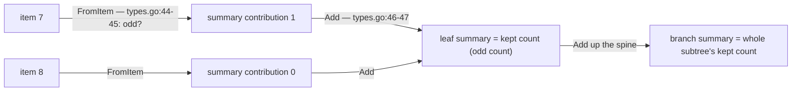
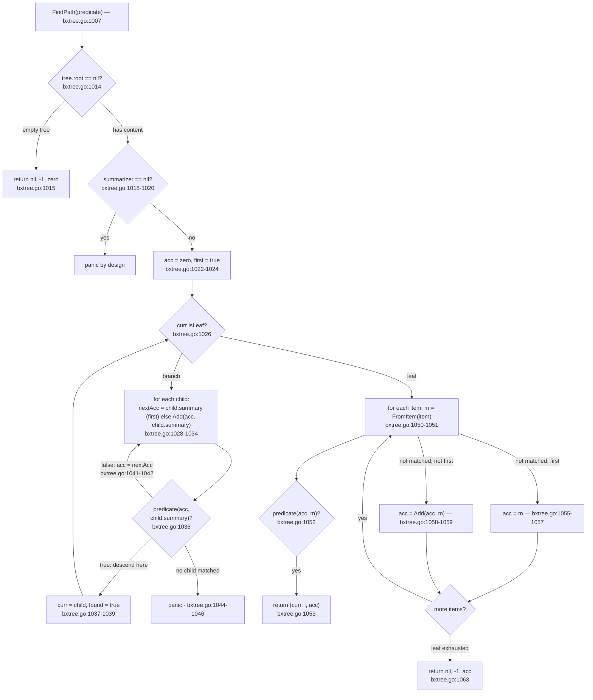

# BxTree: Filtered Traversal and Summaries

Plain scope statement first, so you read the rest of this page with the right
expectations: **`go/bxtree` has no per-item filtered traversal API.** No function in the package takes a
predicate over items and walks or returns the matching subset (grep the file:
the only `predicate` parameter anywhere is `FindPath`'s
`go/bxtree/bxtree.go:1007`). What the package *does* provide is a
predicate-based traversal over **summaries**, plus the summary read-side
helpers a caller can use to build a filtered walk by hand:

| API | Answers | Code |
|---|---|---|
| `FindPath(predicate)` | "the first item whose accumulated summary satisfies a `(acc, cur)` predicate" — O(height + items in one leaf) | `go/bxtree/bxtree.go:1007-1063` |
| `Node.SummaryBefore(tree)` | total summary of every item before this leaf | `go/bxtree/bxtree.go:938-963` |
| `Node.Index()` | absolute index of the leaf's first item | `go/bxtree/bxtree.go:980-998` |
| `Node.UpdateSummary` / `Node.UpdateSummaryUpward` | re-accumulate this node's summary (and its ancestors') from scratch | `go/bxtree/bxtree.go:909-936` |
| `All()` / `Reverse()` | full iteration, the substrate for a caller-written filter | `go/bxtree/bxtree.go:244-279` |

If you came here looking for "give me every item passing a predicate":
that is `All()` plus your own predicate in Go (see
[§ A real filter](#a-real-filter-all-plus-your-own-predicate)). The distinctive
piece — the one summaries exist for — is `FindPath`: it jumps to the first
singular position where an accumulated sum crosses a threshold, in a
root-to-leaf walk.

## The substrate: what a summary is, in one paragraph

Every node carries a `summary` field folded over its subtree, maintained by
the `Summarizer[T, S]` interface (`go/bxtree/types.go:39-50`): `FromItem`
turns one item into its summary contribution, `Add` combines summaries, `Sub`
subtracts (page 02's delete path negates with `Sub(zero, delta)`
(`go/bxtree/bxtree.go:658`)). A leaf's summary is the `FromItem`-fold of its
items (`go/bxtree/bxtree.go:50-61`); a branch's is the `Add`-fold of its
children's summaries. Mutations maintain all of it differentially — the
mechanics and every maintenance site are page 02's
[§ Summary maintenance](02-insert-delete.md#summary-maintenance-after-every-mutation).

The worked example on this page picks a summarizer whose *meaning* is a
filter: `FromItem(item) = 1` when the item is odd, `0` otherwise. Then a
node's `summary` is the count of odd items in its subtree — the aggregate a
"keeps the odd ones only" view cares about:



The numbers are all one digit: leaf `summary` = count of odd items it holds;
branch `summary` = fold of children. `size` is still item count — the two
fields now say different things, which is the point.

## FindPath: the predicate flow

`FindPath(predicate func(acc S, cur S) bool) (*Node, int, S)`
(`go/bxtree/bxtree.go:1007`) walks the tree with the predicate over
**(accumulated summary before the child, the child's summary)**. Semantics,
exactly:

- `acc` is the summary of every item visited so far — it *excludes* the
  candidate (`acc = child.summary` for the first child, else
  `Add(acc, child.summary)`, `bxtree.go:1030-1042`).
- In a branch: the *first child* whose `predicate(acc, child.summary)` is true
  is descended into (`bxtree.go:1036-1039`); if no child satisfies, the code
  panics (`bxtree.go:1044-1046`) — a caller predicate must be consistent with
  the tree's summary 0-anchoring (see below).
- In a leaf: per *item*, the predicate gets `(acc, FromItem(item))`
  (`bxtree.go:1050-1053`). The first satisfying item wins: return
  `(leaf, pos, acc)` where `acc` is the summary accumulated *just before* that
  item.
- If nothing matches in the leaf, `FindPath` returns `(nil, -1, acc)` — the
  accumulated total (`bxtree.go:1063`).
- `tree.root == nil` → `(nil, -1, zero)` (`bxtree.go:1014-1016`); missing
  summarizer or nil predicate → panic (`bxtree.go:1018-1020`).



The descent loop in source — the state (`acc`, `first`) and the descent
decision, `go/bxtree/bxtree.go:1022-1047`:

```go include go/bxtree/bxtree.go L1022-L1047
	var acc S
	first := true
	curr := tree.root

	for !curr.isLeaf {
		found := false
		for _, child := range curr.children {
			var nextAcc S
			if first {
				nextAcc = child.summary
			} else {
				nextAcc = tree.summarizer.Add(acc, child.summary)
			}

			if predicate(acc, child.summary) {
				curr = child
				found = true
				break
			}
			acc = nextAcc
			first = false
		}
		if !found {
			panic("bxtree: FindPath failed to find child matching predicate")
		}
	}
```

Why it matters: the two phases (branch loop / leaf scan) share one
`acc`/`first` state, so the first item that satisfies the predicate is found
in one root-to-leaf walk plus one in-leaf scan — O(depth + leaf items), not
O(n). The `!found` panic (`bxtree.go:1045-1046`) is an *assertion on the
predicate*, not on the tree: if the predicate returns false for every child of
some branch node the walk cannot continue and the panic fires. It is the
caller's responsibility to call `FindPath` on trees whose accumulated
aggregates include the needed mass — e.g. also-validate with `All()`-style
content checks during evaluation.

### Worked example: 10-item tree, odd-only predicate, kept/dropped counts per node

Built by `NewFromSlice` with items `1 … 10`, `leaf [2,4]` /
`internal [2,3]`, and the odd/`FromItem` summarizer above. Driver dumps,
verbatim — first the bare tree, then the same tree annotated with kept
(counted) and dropped (even) counts per node:

```
INTERNAL children=3 size=10 summary=5
  LEAF items=[1 2 3 4] size=4 summary=2
  LEAF items=[5 6 7] size=3 summary=2
  LEAF items=[8 9 10] size=3 summary=1
first=[1 2 3 4] last=[8 9 10] Size=10
--- per-node odd kept/dropped annotation ---
INTERNAL children=3 kept=5 dropped=5 summary=5
  LEAF items=[1 2 3 4] kept=2 dropped=2 summary=2
  LEAF items=[5 6 7] kept=2 dropped=1 summary=2
  LEAF items=[8 9 10] kept=1 dropped=2 summary=1
```

Both numbers in the annotation are facts the tree draws itself from its
items: `kept=5` = the sum of leaf summaries (2 + 2 + 1); each leaf's
`summary` equals its `kept` count. Now FindPath on this tree — the two
driver runs, verbatim:

```
--- FindPath: first item where accumulated odd-summary reaches 5 ---
child[0]: child summary=2 acc=0 predicate? false
child[1]: child summary=2 acc=2 predicate? false
child[2]: child summary=1 acc=4 predicate? true
  -> descend into this child
leaf [8 9 10]: no match at pos=0, contribution +0, acc now 4
leaf [8 9 10]: pos=1 acc=4, Match with item 9
--- FindPath: first item with odd summary reached when counting to 3 (predicate), then remaining item summaries leaf-scan ---
child[0]: child summary=2 acc=0 predicate? false
child[1]: child summary=2 acc=2 predicate? true
  -> descend into this child
leaf [5 6 7]: pos=0 acc=2, Match with item 5
```

Both runs line up with the kept/dropped counts:

1. `>= 5` query: children 0 and 1 hold `2 + 2 = 4` odd items, so the
   predicate is called with `acc=4` at child 2; `predicate(4, 1)`
   (`4 + 1 >= 5`) is true, so child 2 wins the descent. In the leaf:
   item `8` contributes `0` (even, a *dropped* count-0 item — predicate
   `4 + 0 >= 5` false), item `9` contributes `1` (kept: `4 + 1 >= 5` true) →
   match at `pos=1`. Returned `acc=4` — exactly the odd-count of every item
   *before* the match, across the whole tree.
2. `>= 3` query: `predicate(2, 2)` (`2 + 2 >= 3`) is true at child 1 →
   descend. The leaf scan hits at the leaf's first item (`5` — predicate
   `2 + 1 >= 3` true) → `(leaf [5 6 7], pos=0, acc=2)`; the `acc=2` is the
   odd-count of the entire leaf before it (`[1 2 3 4]`).

Both return `(leaf, pos, acc)` with `acc` = summary of exactly the items
*before* the match — the caller can place the match absolutely with
`Node.Index()` + `pos` (`go/bxtree/bxtree.go:981-998`).

### The two drives, as a table

| Phase | Query `>= 5` | Query `>= 3` |
|---|---|---|
| branch child 0 | `summary=2`, `acc=0` → false | `summary=2`, `acc=0` → false |
| branch child 1 | `summary=2`, `acc=2` → false | `summary=2`, `acc=2` → true, *descend* |
| branch child 2 | `summary=1`, `acc=4` → true, *descend* | — |
| leaf scan | `8` no (even, a dropped item), `9` *match*: `(leaf [8 9 10], pos=1, acc=4)` | `5` *match*: `(leaf [5 6 7], pos=0, acc=2)` |

## A real filter: All() plus your own predicate

If the task is *"walk only the matching items"*, do it in the caller —
`All()` walks the doubly-linked leaf chain in O(n) with no tree walking
(`go/bxtree/bxtree.go:246-262`, page 01 § layout); a value-predicate filter
is then a plain Go 1.26 range loop on top. The package deliberately ships
*this* and not a filtered API: `FromItem` maps **one item** — the "filter"
`FindPath` supports is the accumulated aggregate thresholds, not arbitrary
per-item retention semantics on the item stream.

## The read-side helpers, in code

`UpdateSummary` / `UpdateSummaryUpward` rebuild exact summaries from children
/ items — this is `go/bxtree/bxtree.go:909-927`:

```go include go/bxtree/bxtree.go L909-L927
// UpdateSummary recomputes the summary for this node based on its children or items.
func (n *Node[T, S]) UpdateSummary(tree *BxTree[T, S]) {
	if tree.summarizer == nil {
		return
	}
	if n.isLeaf {
		n.summary = tree.summarizeItems(n.items)
	} else {
		var s S
		for i, child := range n.children {
			if i == 0 {
				s = child.summary
			} else {
				s = tree.summarizer.Add(s, child.summary)
			}
		}
		n.summary = s
	}
}
```

Why it matters: this function is the *source of truth* the summary invariant
rests on — "a node's summary equals a fresh fold of its subtree". Page 02's
mutation table showed when the code runs it *structurally*; this public API
exposes it to external callers who mutate summaries intentionally (e.g.
external bookkeeping that modifies one item's contribution).

`UpdateSummaryUpward` applies the same recompute walking from a leaf up to
the root (`go/bxtree/bxtree.go:929-936` — plain `UpdateSummary` at every ancestor).
`SummaryBefore` walks the *left-sibling* sums — its definition plus spine walk,
`go/bxtree/bxtree.go:939-963`:

```go include go/bxtree/bxtree.go L943-L962
	var s S
	first := true

	curr := n
	for curr.parent != nil {
		parent := curr.parent
		for _, child := range parent.children {
			if child == curr {
				break
			}
			if first {
				s = child.summary
				first = false
			} else {
				s = tree.summarizer.Add(s, child.summary)
			}
		}
		curr = parent
	}
	return s
```

Why it matters: this is the prefix aggregate for a node — for the count
summarizer, `SummaryBefore + len(items)` is the item's absolute index past
the leaf's end (`go/bxtree/bxtree.go:962`). `Node.Index()`
(`go/bxtree/bxtree.go:980-998`) is the same arithmetic counted on `size`, so
for a count-summarizer tree `SummaryBefore(tree) == n.Index()` is *the same
invariant written twice*, and the package's summary ops test drives exactly
that (`go/bxtree/summary_ops_test.go:28-38`):

```go include go/bxtree/summary_ops_test.go L29-L37
	tree := buildCountTree(300) // multiple leaves and internal levels
	for n := tree.First(); n != nil; n = n.Next() {
		if got, want := n.SummaryBefore(tree), n.Index(); got != want {
			t.Errorf("leaf at Index %d: SummaryBefore=%d, want %d", n.Index(), got, want)
		}
	}
	if got := tree.Last().SummaryBefore(tree) + len(tree.Last().Items()); got != 300 {
		t.Errorf("last leaf SummaryBefore+len = %d, want 300", got)
	}
```

Why it matters: `buildCountTree` builds a 300-item tree — many leaves and
internal levels — and thus pins `SummaryBefore` against `Index()` on *every*
leaf: a drill that would catch an off-by-one anywhere in `SummaryBefore`'s
spine walk or `GetAt`/`Index` bookkeeping.

## FindPath edge cases, as the package tests them

`go/bxtree/summary_ops_test.go:76-105` pins the cases a caller should trust:

```go include go/bxtree/summary_ops_test.go L82-L89
	// Predicate that becomes true at 30 (acc before it is 30).
	node, pos, acc := tree.FindPath(func(acc, cur int) bool { return acc+cur > 45 })
	if node == nil {
		t.Fatal("FindPath(>45) returned a nil node")
	}
	if got := node.Items()[pos]; got != 30 || acc != 30 {
		t.Errorf("FindPath(>45) = item %d at pos %d acc %d, want 30/2/30", got, pos, acc)
	}
```

Why it matters: the sum summarizer holds items `10 20 30 40`; the `> 45`
predicate crosses exactly at item `30` — i.e. the returned triple
`(leaf, pos=2, acc=30)` is *the first singular 30* — `acc` is the accumulated
value **before** the item again. The same test also pins the always-true
predicate case (`go/bxtree/summary_ops_test.go:91-98` — stops at the first
item with `acc == 0`) and the empty tree (`(nil, -1, zero)`, `101-104`);

## Invariants and verification

Summaries in this package maintain two written-twice invariants, both asserted
by the test helpers (no runtime `Check()` in the package — page 01 and
page 02's invariants sections):

- `verifyNode` (`go/bxtree/helpers_test.go:164-166` within
  `go/bxtree/helpers_test.go:125-189`) — summary correctness: a leaf's
  `summary` equals the `FromItem`-fold of its items; a branch's equals the
  `Add`-fold of its children's summaries (the *same fold* a rebuild would
  compute).
- `verifyNode` + `checkNodeBounds` (`go/bxtree/helpers_test.go:168-186`,
  `go/bxtree/helpers_test.go:193-224`) — occupancy & parent/child edge
  shape.

The driver: `FuzzBxTree` (`go/bxtree/fuzz_test.go:10-101`) generates
insert/delete interleavings with and without a summarizer
(`go/bxtree/fuzz_test.go:24-42`), mirroring the content, and asserts the whole
walker after each op; the summary-specific tests add the `FindPath` +
`UpdateSummary` + `SummaryBefore` coverage pinned above:

```
go test -C go ./bxtree
go test -C go ./bxtree -fuzz=FuzzBxTree -fuzztime=30s
```

Read pages 01 and 02 first for the summary-supply contract (who maintains
leaf folds, page 02's
[§ Summary maintenance](02-insert-delete.md#summary-maintenance-after-every-mutation))
— everything in this page sits *on top* of it.

---

*Related: [docs/bxtree/01-bxtree-structure.md](01-bxtree-structure.md)
(`Summarizer` interface, `FindPath` in page 01's "Finding item *i*" section) and
[docs/bxtree/02-insert-delete.md](02-insert-delete.md) (the summary
maintenance sites this page's read-side machinery relies on).*
