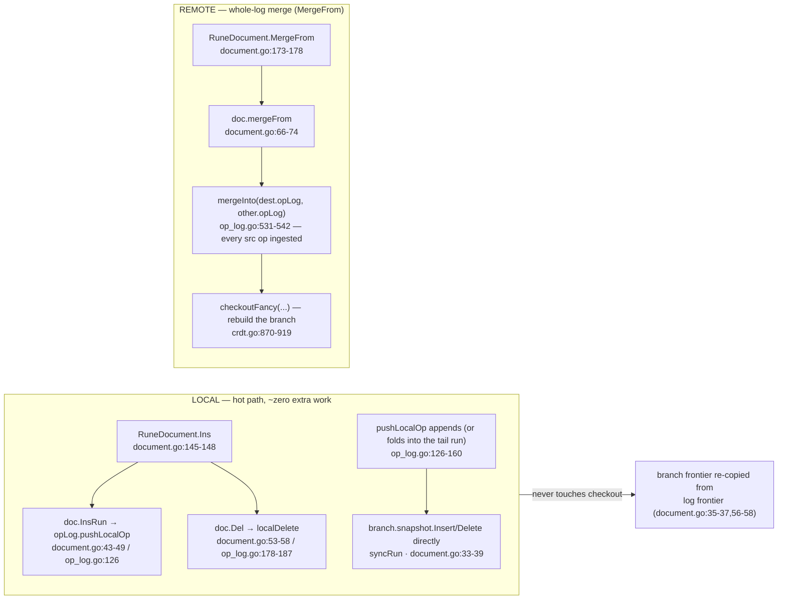

# CRDT: The Replica Model

`crdt` is the repo's CRDT framework: it answers the problem that two copies
of the same document — two replicas — can be edited independently while
disconnected, and must end up with *identical* content after they exchange
what they did, regardless of who merges into whom and in which order
(`go/crdt/document.go:14-26`, convergence is what the fuzz swarm hunts for,
`go/crdt/fuzz_test.go:182`). Everything else in this package — the op log and
its per-agent sequence index (`docs/crdt/02-op-log.md`), the merge drive
(`docs/crdt/03-merge-drive.md`), serialization/compaction
(`docs/crdt/05-binary-and-compaction.md`), delta frames
(`docs/crdt/06-deltas-and-checkout.md`) — exists to implement, transport, or
speed up this one model:

> **A replica is a document that owns a complete, append-only log of every
> operation it has ever applied (its own edits and everyone else's merged
> ones). Merging means replaying the other replica's log tail through a
> deterministic tie-breaking drive, never guessing at clocks or at "who
> wins a conflict."**

There are three exported document types — `RuneDocument` (text),
`ArrayDocument[T]` (any element type), `MapDocument[K,V]` (last-writer-wins
key/value) — all layered over one content-generic engine (the `doc` family
wrapper in `go/crdt/document.go:18-26`).

## One engine, three families

The engine that does the actual CRDT work knows nothing about runes, items,
or keys: it carries a `C` (content) type parameter standing for one *run* of
characters, and every operation in the engine counts "characters" — LV slots —
without ever looking inside a run's payload
(`go/crdt/content.go:9-14`). This is the same shape of trade as `bxtree`
taking a `Summarizer`: type-erasure keeps one algorithm serving three shells.

```go include go/crdt/document.go L14-L26
// doc is the content-generic CRDT core shared by every document family. The
// visible document is the branch's contentTree (a rope of content runs);
// element type E has been erased from the engine and lives only in the family
// wrappers and concrete run types.
type doc[C content[C]] struct {
	opLog  *opLog[C]
	agent  int
	branch *branch[C]
}

func newDoc[C content[C]](agent int) *doc[C] {
	return &doc[C]{opLog: newOpLog[C](), agent: agent, branch: newBranch[C]()}
}
```

Why this matters: everything you need to know about collision-freedom lives
in these three fields plus the `op` type — the visible document (`branch`) is
just a *derived view*, and any time the log changes the view is re-derived,
which is exactly what `Check()` will assert at the end of this page.

On top of the core sit the three exported families (`go/crdt/document.go:125-142`:

- **`RuneDocument`** — text. Its run type is `runeText` (a string whose
  `Len` counts runes, `go/crdt/content.go:18-20`), rendered through
  `GetString` with a lazy cache (`document.go:150-160`).
- **`ArrayDocument[T]`** — a slice of anything; the whole engine story of the
  page applies with `T` erased under an `itemRun[T]` (`go/crdt/content.go:55-81`).
- **`MapDocument[K,V]`** — a key→value map with last-writer-wins resolution
  per key; the *winner* is picked by `(agent, seq)` comparison in `Get`
  (`go/crdt/document.go:525-578`), and never gets wall-clock time — that is
  the theme of the next section.

The map's LWW pick is not an authority decision a human argued about: it is
deterministic given the log. Here is the winner scan (cited from
`go/crdt/document.go:550-564`, the loop inside `Get`):

```go include go/crdt/document.go L556-L564
	for _, l := range concurrentLVs {
		o := m.opLog.opAt(l)
		if first || o.id.agent > bestID.agent || (o.id.agent == bestID.agent && o.id.seq > bestID.seq) {
			bestV = m.mapEntryAt(l).Value
			bestID = o.id
			bestLV = l
			first = false
		}
	}
```
Two values written concurrently for the same key: the *larger* agent id wins,
and `agent` being equal the larger `seq` does — a total order over ops rather
than an appeal to clocks, which is why two replicas resolving the same race
can't disagree.

The `T`-typed freedom is never absolute: an element whose type satisfies
`Mergeable` (`go/crdt/types.go:132-135`) recurses. `ArrayDocument.Ins` pushes
one length-1 op per Mergeable element precisely so that the recursive-merge
pass can later match those ops by id and fold child state into it
(`go/crdt/document.go:307-326`):

```go include go/crdt/document.go L307-L326
func (doc *ArrayDocument[T]) Ins(pos int, items []T) {
	if len(items) > 0 {
		if _, ok := any(items[0]).(Mergeable); ok {
			for i, item := range items {
				doc.doc.opLog.pushLocalOp(doc.doc.agent, op[itemRun[T]]{
					opType:  opTypeIns,
					content: itemRun[T]{item},
					pos:     pos + i,
				})
			}
			doc.doc.syncRun(pos, itemRun[T](items))
			doc.itemsDirty = true
			return
		}
	}
	doc.doc.InsRun(pos, itemRun[T](items))
	if len(items) > 0 {
		doc.itemsDirty = true
	}
}
```

The same recursion appears in `MapDocument.Get`/`MergeFrom`
(`document.go:569-575`, `document.go:647-681`) and in
`ArrayDocument.mergeRecursive` (`document.go:449-477`): a nested value is
itself a CRDT, so at each level the losing concurrent value is
`MergeFromAny`-merged *into* the winner rather than discarded.

## What "replica" means here: the op log

Each document owns one opLog; the struct's fields are the raw append-only
history plus the derived indexes that make lookups fast
(`go/crdt/types.go:47-67`):

```go include go/crdt/types.go L47-L67
type opLog[C content[C]] struct {
	ops      []op[C]
	opLV     []lv // opLV[i] is op i's first LV
	totalLV  lv   // Running character count covered by ops
	frontier []lv
	version  remoteVersion
	idToLV   map[id]lv

	// anchorCoverage is set only on compacted logs: a snapshot of version at
	// compaction time (agent -> max seq covered by the anchor). nil otherwise.
	anchorCoverage remoteVersion

	// seqIndex maps agent -> that agent's run ops as parallel seq-ascending
	// slices: starts[i] is the op's first per-agent sequence number,
	// headLVs[i] the lv of its FIRST character (opLV of the op). headLVs
	// survive run splits immutable (lv spans are never renumbered), which
	// makes (start, headLV) a stable seq->op reference: resolution goes
	// headLV -> opIdxAt -> the CURRENT op covering the seq, even after
	// later splits shortened the original run.
	seqIndex map[int]*agentSeqIndex
}
```

- **`ops` is the replica's entire history** — every op this replica ever made
  or merged, in the order it was appended. Nothing is ever deleted from it
  until `Compact` (`go/crdt/op_log.go:631-661`).
- **`frontier` is this replica's *now*:** the set of log tips (a replica that
  has never seen a merge has exactly one — the last op's end LV,
  `go/crdt/op_log.go:169`; after a merge of divergent histories there are
  several, maintained by `advanceFrontier`, `go/crdt/op_log.go:234-248`).
- **`version` is the per-agent sequence vector** the wire handshake compares
  (`go/crdt/types.go:45`): `version[agent]` is the highest sequence number we
  hold from that agent, and it is exactly what seals off delivery of an op
  twice (`go/crdt/op_log.go:524-526`).

What is genuinely clock-like here is *nothing*. Every op carries a logical
pair: an **id** `(agent, seq)` — the peer that made it and its
local counter — and an **lv** (*log version*: this op's slice of the replica's
character-count addressing space, `go/crdt/types.go:16-21`). lv is the
cross-replica coordinate the ordering machinery uses, and it comes from the
log's *length*, not from any clock (`totalLV`, `go/crdt/types.go:49-50`).

```go include go/crdt/types.go L35-L43
type op[C content[C]] struct {
	opType   opType
	content  C
	length   int // Number of characters/elements this op spans (set at push)
	pos      int // Original position for local ops
	id       id
	parents  []lv
	coverage remoteVersion // set only on anchor ops: agent -> max seq covered
}
```

## The version tree: ops as a forest, kept forever

`parents` in that `op` struct is the crucial field: when a replica appends an
op, the op's `parents` are the frontier tip(s) it was built on top of
(`go/crdt/op_log.go:162-163`, `go/crdt/op_log.go:447`). Those parent links
turn `ops` into a **version DAG** — a forest of causal histories in which
"these two ops were concurrent" is a property you can *query* (`isAncestor`,
`go/crdt/op_log.go:196-225`: walk down from the descendant until you find the
candidate parent). Nothing is ever estimated, timestamped, or compared by
wall clock: descent in this DAG is *the* definition of happened-before.

Deleting, reordering, or re-numbering any op would break all of it, because
`parents` point at `lv` coordinates other replicas' logs will reference. That
is why the log is append-only and why the only sanctioned collapse is
`Compact` — which rewrites the *whole* log into a single anchor op and is
out of this page's scope (`docs/crdt/05-binary-and-compaction.md`).

```mermaid
graph LR
    subgraph replicaA["replica A · agent 0"]
        p0[("∅<br/>parents: none")] -->|O1| p1[("O1 ins“Hi”<br/>{agent0·seq0-1}<br/>lv0-1")] -->|O2| p2[("O2 ins“AB”<br/>{agent0·seq2-3}<br/>lv2-3")]
        p2 -->|a.Ins(1,·) parents=[3 lv]| cA[("O3 ins“c”<br/>{agent0·seq4}<br/>lv4")]
        p2 -->|merged X, parents=[3]| cB[("O4 ins“X”<br/>{agent1·seq0}<br/>lv5")]
    end
    v["frontier after merging X into A: {lv4, lv5} — two tips"]
```

(Labels are `agent·seq` ids plus the lv span; that diagram is the same one
re-derived concretely in the worked example below.)

## Two paths: local edits run hot, merges run the drive

From the *model level*, a replica only ever does one of two things, and each
goes through a completely different machinery (the call graph below is the
whole of this page's structure — `mergeFrom`'s internals are the next page's
subject, `docs/crdt/03-merge-drive.md`):



- **Local path** — `Ins`/`Del` push exactly one run op and mutate the
  branch content *directly* (`syncRun` / `snapshot.Delete`,
  `go/crdt/document.go:33-58`). There is a deliberate fast shortcut here:
  character-adjacent same-agent inserts *fuse* into the previous tail run —
  the run-granular fast path — because merging text usually means appending
  to a burst of typing and there is no reason to mint one op per character
  (`go/crdt/op_log.go:141-160`). The observable proof: two `Ins` calls on a
  fresh `RuneDocument(0)` leave `version()` at `map[0:1]`, i.e. one op
  covering `seq 0..1`, not two:

  ```
  after Ins(0,"H")+Ins(1,"i"): GetString="Hi", version(0)=map[0:1]
  ```

- **Remote path** — the merge exchanges the *entire* log (`mergeInto`
  iterates `src.ops` end to end and lets `pushRemoteOpLV` discard ops dest
  already holds, `go/crdt/op_log.go:524-527`), then runs the branch through
  the checkout drive once (`checkoutFancy`, `go/crdt/crdt.go:870-919`) — the
  winding walk that resolves concurrent positions (next page). Delta frames
  are a wire-efficient delivery of the same ingest
  (`docs/crdt/06-deltas-and-checkout.md`; not model-level content).

So: local edits are structurally "extend the forest below the current tip";
merging is "graft the peer's whole history in and reconcile content." The
first is O(run) pointer work; the second costs log traversal plus a rebuilt
branch, which is why `mergeInto` skips already-held ops before resolving
anything (`go/crdt/op_log.go:519-526`).

## Worked example: two replicas diverge, then converge

Driven by the real API (a scratch `main.go` under `/tmp/opencode` wired to
this repo's module; prints verbatim below). Two agents, four ops total
(counting the `H`/`i` pair that fused into one folded op), run through
`RuneDocument` `Ins`/`MergeFrom`:

| # | Wire call | State after (from the simulator) |
|---|-----------|----------------------------------|
| 0 | `a.Ins(0, "H")`, `a.Ins(1, "i")` | a: `"Hi"` · `version {0:1}` — both calls fold into one op, seqs `0..1` (see the local path above) |
| 1 | `a.Ins(0, "AB")` | a: `"ABHi"` · `version {0:3}` — one agent-0 op, seqs `2..3` |
| 2 | `b.MergeFrom(a)` | b: `"ABHi"` (b now has a's whole log — same `version`) |
| 3 | `b.Ins(2, "X")` | b: `"ABXHi"` · `version {0:3, 1:0}` — agent-1 seq 0, parent = a's tip `lv3` |
| 4 | `a.Ins(1, "c")` | a: `"AcBHi"` · `version {0:4}` — agent-0 seq 4 (not folded: pos 1 is not the tail burst of pos 0) |
| 5 | `a.MergeFrom(b)` | a: `"AcBXHi"` — merge grafts `lv5` under `lv3`, and `checkoutFancy` places `X` *after* the concurrent `c` |
| 6 | `b.MergeFrom(a)` | b: `"AcBXHi"` — same string; merges back the now-shared `c` |

Simulator output, verbatim:

```
warmup: a = Hi version: map[0:1]
1 a.Ins(0,"AB")  a = ABHi version: map[0:3]
2 b.MergeFrom(a) b = ABHi version: map[0:3]
3 b.Ins(2,"X")   b = ABXHi version: map[0:3 1:0]
4 a.Ins(1,"c")   a = AcBHi version: map[0:4]
5 a.MergeFrom(b) a = AcBXHi version: map[0:4 1:0]
6 b.MergeFrom(a) b = AcBXHi version: map[0:4 1:0]
a==b: true
Check() OK
```

In the final state, both replicas are `"AcBXHi"` — lexicographically, so is
`"AcBHi"`+`"X"`-inserted-2: the merged `X` is placed by the *same* tie-break
`apply` uses on the receiving side (`integrate`, `go/crdt/crdt.go:323-394`),
which is why a replica can also accept its own ops being re-delivered to it
(`pushRemoteOpLV`'s version check, `go/crdt/op_log.go:401-404`). The
first-version printout above also shows the version handshake in action: the
version *vectors after the second merge are identical* (`agent0=4`, `agent1=0`)
on both sides. Convergence is therefore not a coincidence of this example's
order — it is guaranteed by the walk; `FuzzMergeConvergence`
(`go/crdt/fuzz_test.go:182`) pummels it with random topologies.

### And the two ids at play

The `version` map the API hands around is *id-space* (per-agent seq), while
the *log* is indexed in `lv`. They connect only through the log structure:
`version[1]=0` means "we hold agent 1's op at seq 0", and where it lives in
*our* log (`lv5`) is *our* log's decision, made inside `pushRemoteOpLV`
(`go/crdt/op_log.go:442-450`). Ids wire-referencing lvs is what makes the
model portable across replicas that may have split runs differently
(`resolveParentLV`, `go/crdt/op_log.go:355-368`); details on the op-log page.

## `Check()`: the whole-invariant tool

Every document family exposes a public `Check()` method
(`go/crdt/document.go:218-228` for `RuneDocument`, `document.go:427-437` for
`ArrayDocument`). The engine wraps the same property: **a full checkout
replay of the log must equal the branch's live snapshot.**

```go include go/crdt/document.go L218-L228
func (doc *RuneDocument) Check() {
	if doc.doc.opLog.anchorCoverage != nil {
		checkCompacted(doc.doc.opLog)
	}
	doc.doc.check(func(a, b *contentTree[runeText]) bool {
		var sa, sb strings.Builder
		a.ForEachContent(func(r runeText) { sa.WriteString(string(r)) })
		b.ForEachContent(func(r runeText) { sb.WriteString(string(r)) })
		return sa.String() == sb.String()
	})
}
```

Why this matters: it is the cheapest complete audit you have — it does not
trust that `Ins`/`Del`/`MergeFrom` kept the branch in sync; it *recomputes*
what the log would produce from scratch (`checkout`, `go/crdt/crdt.go:598-617`)
and asserts equality, which is what makes every invariant on this page a
*called* property rather than an assumed one. The two halves it chains:

1. **`doc.check`** (`go/crdt/document.go:96-101`) — full `checkout()` replay
   compared against `branch.snapshot`; mismatch panics
   (`"Document content out of sync"`). This is A full-log invariant:
   if anyone corrupts `branch`, every subsequent `Check()` trips.
2. **`checkCompacted`** (`go/crdt/op_log.go:682-696`) — only when the log has
   an anchor: anchor must be ops[0] and carry coverage, no other anchor ops
   may appear, and `anchorCoverage` may never claim seq numbers `version`
   doesn't cover:

```go include go/crdt/op_log.go L682-L696
func checkCompacted[C content[C]](log *opLog[C]) {
	if len(log.ops) > 0 && log.ops[0].id.agent == anchorAgent && log.ops[0].coverage == nil {
		panic("Check: compacted log's anchor op must carry coverage")
	}
	for i := 1; i < len(log.ops); i++ {
		if log.ops[i].id.agent == anchorAgent {
			panic("Check: compacted log's anchor op must be the first op")
		}
	}
	for agent, seq := range log.anchorCoverage {
		if log.version[agent] < seq {
			panic("Check: anchorCoverage exceeds version")
		}
	}
}
```

Two asymmetries worth knowing before reaching for it:

- `MapDocument` has **no** `Check()` at all (deliberate — see the compaction
  plan note in its `doc` comment, `go/crdt/document.go:740-743`; its own
  compaction path runs the log-level `checkCompacted` where it can,
  `document.go:807-809`).
- Deltas get free checking: `ApplyDelta` calls `doc.Check()` en route
  (`go/crdt/document.go:200,400`), so wire corruption surfaces as a panic at
  the merge site, not as a delayed divergence.

Running it: it is invoked at the end of most mutation-API paths already
(`Compact`, `ApplyDelta`), and the targeted test suite
(`go test -C go ./crdt`) plus fuzz targets `FuzzDocumentOps`,
`FuzzMergeConvergence`, `FuzzArrayDocument`, `FuzzMapDocument`
(`go/crdt/fuzz_test.go:136,182,676,291`) call it after every step they
generate — so a single `go test -C go ./...` already runs thousands of
`Check()` invocations, and `go test -C go ./crdt -fuzz=FuzzMergeConvergence`
explores deeper.

## Invariants

Each bullet names what must hold, the code that enforces it, and at least one
checker that vaults it (`go test -C go ./crdt` for the tests; the fuzz targets
under `-fuzz` for deeper exploration):

1. **The op log is append-only** — `pushLocalOp` and `pushRemoteOpLV` never
   mutate an existing op's lv span (an op that re-arrives *extended* is
   rejected and re-appended wholesale, `go/crdt/op_log.go:411-436`), because
   `branch.frontier`, `parents`, and `idToLV` all reference fixed lvs. The
   only whole-log rewrite is `Compact` (`op_log.go:631-661`).
2. **Ops are never dropped merges must leave a replica holding a superset** —
   `mergeInto` iterates src's ops and lets the version check (`last >=
   seq+length-1`) drop only what dest already fully holds
   (`op_log.go:524-527`); no "loser" op churns away. That is what makes
   merge-back (`b.MergeFrom(a)` after `a.MergeFrom(b)`) a no-op on the log
   and a no-op on content, as in the worked example.
3. **Version vector and frontier agree with the log** — local pushes bump
   `version[agent]` and reset a single-tip frontier (`op_log.go:169-171`),
   remote pushes use `advanceFrontier` (`op_log.go:447`), and `Check()`'s
   full replay (`code` cited above) panics the moment the branch disagrees.
4. **Concurrent insert collisions are resolved deterministically** —
   `integrate`'s scan (agent order + insertion-origin comparison,
   `crdt.go:323-394`) decides placement for the same two ops identically on
   every replica — the property `FuzzMergeConvergence` asserts by demanding
   equal `GetString` after both-way merges (`fuzz_test.go:182`).
5. **Mergeable values recurse by identity** — a Mergeable element's op stays
   length-1 (`content.go:71-81` makes such runs non-collapsible) and its
   `id` is what the losing side's state is folded through
   (`document.go:449-477`); nothing concurrent breaks the invariant that
   `Get`/`Set` on any replica converge on the same value.
6. **`Check()` is the single place** every **structural** panic belongs: byte
   layout bug in the log topology, wrong delTargets stored, even the
   `branch` cache behind `GetString`, are all caught here
   (`document.go:218-228`). Like `bxtree`'s test-time `verifyTree`
   (`docs/bxtree/01-bxtree-structure.md`), `Check()` is an *opt-in*
   invariant hinge — cheap enough to call in tests, loud enough to be the
   panic the other tests hinge on.

Unlike `bxtree`, though, `Check()` here *is* production code, exported as a
public method — you can call it in production whenever you want a paranoid
snapshot of "does my branch say what my log implies?". For tests and CI,
`go test -C go ./...` is the trigger; for the actual merge/pass mechanics
that the drive (`journal: submit → verify → sandbox_severed_apply` flow of
the next page's subject) walks, continue to
`docs/crdt/03-merge-drive.md`.

The mechanical details of the structures this page named — `op`/`lv` layout,
per-agent sequence index, `first`/`runIdxForSeq` — are the op log page's
subject (`docs/crdt/02-op-log.md`); the *fast* (delta) exchange in which the
log only ever crosses the wire slices of itself is `docs/crdt/06-deltas-and-checkout.md`.

---

*Related: `docs/bxtree/01-bxtree-structure.md` (the ordered container under the
branch), `docs/pheap/01-pairing-heap.md` (the priority queue the diffing
walks use, e.g. `crdt.go:18`, `:641`), `docs/index.md` for reading order.*
