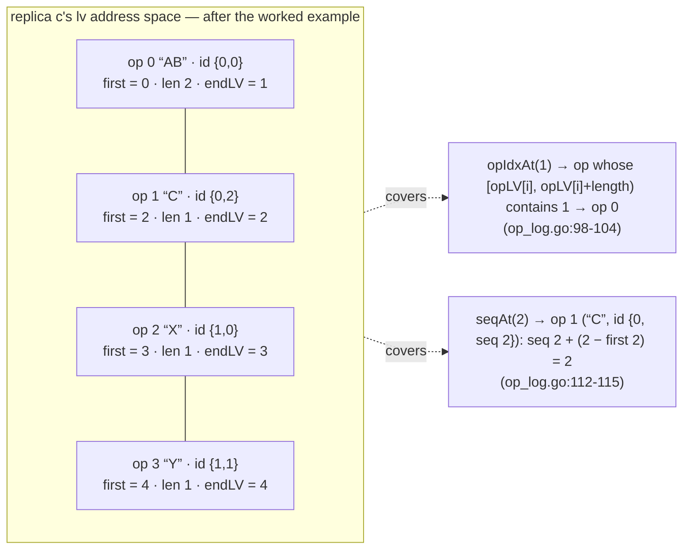
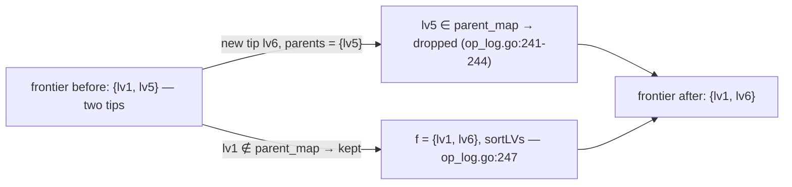
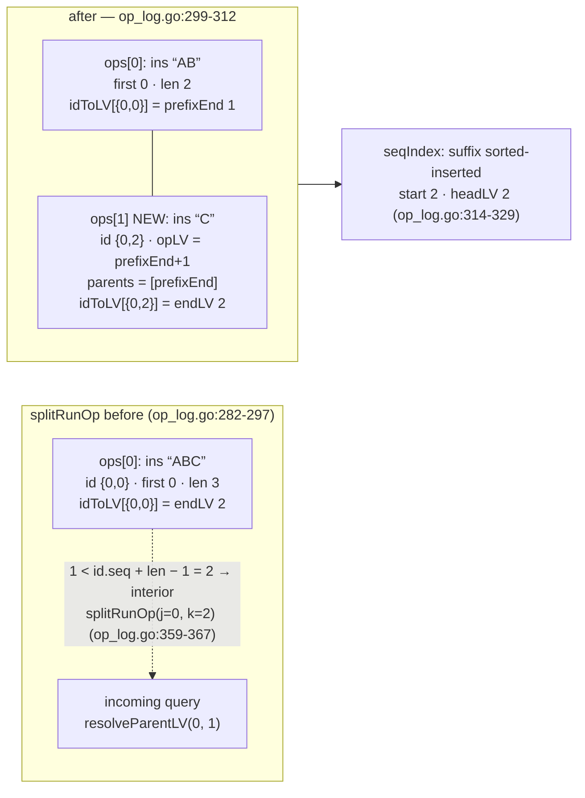
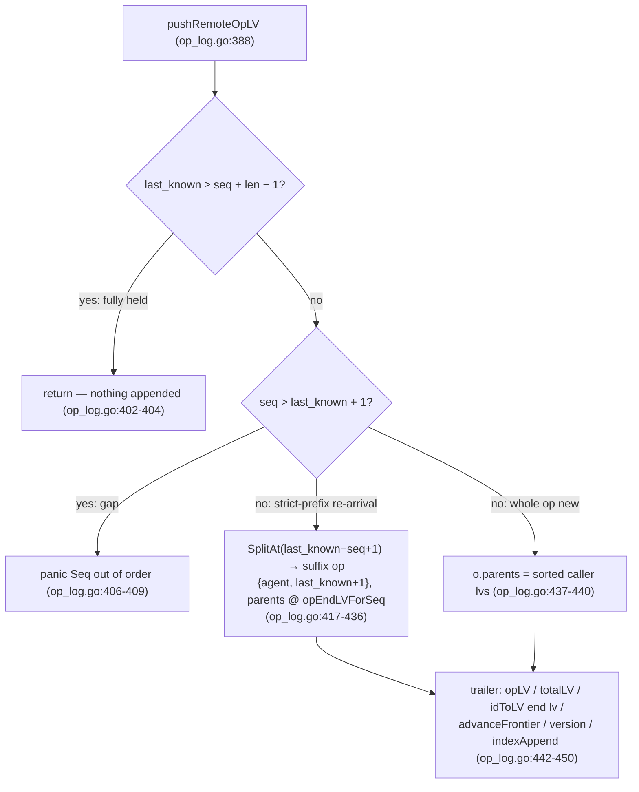
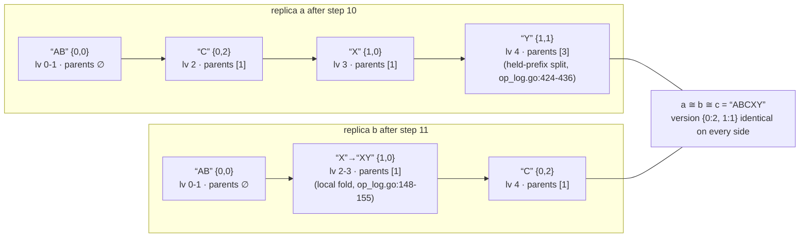

# CRDT: The Op Log — `lv`, Parents, and the Per-Agent Sequence Index

`docs/crdt/01-replica-model.md` treated the op log as a black box that
"remembers everything". This page opens that box: the raw history lives in
`go/crdt/op_log.go` (plus the op/id types in `go/crdt/types.go:16-67`), and
everything in it is addressed by one number the page title names:

- **`lv`** (*log version*) — a dense index into *this replica's* log,
  covering every character every held op spans. It is minted from log
  length (`totalLV`, `go/crdt/types.go:50`), never from a clock; two
  replicas can both mint an `lv4` and it names a *different op* on each
  (the worked example shows it live).
- **`id` `(agent, seq)`** — the peer that minted the op and its own gap-free
  counter; the cross-replica reference every wire format carries.

The sections in order: the two coordinate systems and how any character
resolves back to a run op (`first`); the version forest and what "advancing
the frontier" means; the per-agent sequence index — including the
`runIdxForSeq` backward scan it replaced; cross-replica parent resolution
with its split machinery; and the two op insertion paths, where runs split
rather than renumber anything. The worked example exercises every branch at
once.

## The two coordinate systems: `lv` and `(agent, seq)`

Here are the types the whole mechanism builds on (`go/crdt/types.go:16-33`):

```go include go/crdt/types.go L16-L33
type lv int

type id struct {
	agent int
	seq   int
}

type opType string

const (
	opTypeIns opType = "ins"
	opTypeDel opType = "del"
)

// anchorAgent is the sentinel agent id reserved for compaction anchor ops.
// User documents must never use it; Compact refuses a log that holds real ops
// from this agent.
const anchorAgent = -1
```

Three things to notice because the rest of the page leans on them:

- `lv` and `id` are deliberately separate address spaces. Seq numbers are
  owned by their agent and gap-free (`pushRemoteOpLV`'s gap panic,
  `go/crdt/op_log.go:406-409`); lvs are owned by this replica's log and
  change shape only by append or split, never renumber.
- `anchorAgent = -1` is reserved for compaction snapshots
  (`go/crdt/types.go:30-33`). Parent references resolving into a folded
  history are the subject of `docs/crdt/05-binary-and-compaction.md`; this
  page only threads the interception hook (`coveredByAnchor`,
  `go/crdt/op_log.go:601-607`).
- An op's `parents []lv` exist only *after* translation:
  `pushLocalOp` copies the current frontier into them
  (`op_log.go:162-163`), `pushRemoteOpLV` takes destination-resolved lvs
  (`op_log.go:437-440`), and the `(agent, seq)` id space is never a parent
  directly — `resolveParentLV` (§ below) is the only translator.

One caveat that trips readers: `idToLV` maps an id not to its first lv but
to its *end* lv (`go/crdt/op_log.go:168,446`) — because what parent edges
and wire deltas reference are end seqs, and `splitRunOp` re-points the two
halves' entries when a run is cut (`go/crdt/op_log.go:311-312`).

## `first`: why a run's first LV matters

Every op occupies a contiguous slice of `[0, totalLV)` — insert runs and
delete runs both, so the *first-LV table* leaves no gaps
(`go/crdt/op_log.go:96-97`). A run's start is its **first LV**: minted as
`first := log.totalLV` (`go/crdt/op_log.go:164` locally, `:442` remotely)
and appended to `opLV`, the parallel table that makes the log addressable
(`go/crdt/types.go:49`). Why it matters: nearly every per-character
resolution goes through it — the binary search for the run owning a
character lv (`go/crdt/op_log.go:94-104`), then seq arithmetic on top:

```go include go/crdt/op_log.go L88-L104
// covers reports whether the character lv x lies inside some run op's span.
func (log *opLog[C]) covers(x lv) bool {
	i := sort.Search(len(log.opLV), func(i int) bool { return log.opLV[i] > x })
	return i > 0 && x < log.opLV[i-1]+lv(log.ops[i-1].length)
}

// opIdxAt returns the index of the run op whose [opLV[i], opLV[i]+length) span
// contains the character lv x. Every character lv belongs to exactly one run op
// (insert runs and delete runs both occupy length character slots), so the
// first-LV table partitions [0, totalLV).
func (log *opLog[C]) opIdxAt(x lv) int {
	i := sort.Search(len(log.opLV), func(i int) bool { return log.opLV[i] > x })
	if !(i > 0 && x < log.opLV[i-1]+lv(log.ops[i-1].length)) {
		panic(fmt.Sprintf("oplog: lv %d not covered by any op", x))
	}
	return i - 1
}
```

```go include go/crdt/op_log.go L111-L120
// seqAt returns the per-agent sequence number of the character at lv x.
func (log *opLog[C]) seqAt(x lv) int {
	i := log.opIdxAt(x)
	return log.ops[i].id.seq + int(x-log.opLV[i])
}

// endLV returns the last character lv covered by run op i (its causal head).
func (log *opLog[C]) endLV(i int) lv {
	return log.opLV[i] + lv(log.ops[i].length) - 1
}
```

So the mental picture of the log is not "a list of ops" but a partition:
`opLV` enumerates the runs in lv order, each `length` sizes its slice, and
every lv falls into exactly one op — which is why `opIdxAt` may panic on a
miss instead of guessing (`go/crdt/op_log.go:100-102`). The picture for a
4-op log (from the worked example's replica `c`):



Two numbers live at both ends of each op and get confused: `first`
(`opLV[i]`) and `endLV(i) = first + length − 1`
(`go/crdt/op_log.go:117-120`). The frontier, parents, and `idToLV` all store
**end** lvs; `opLV` and the seq index resolve through **first** lvs. The seq
index is where `first` outlives everything else — keep reading.

## The version forest and what "advancing the frontier" means

`parents` make `ops` a forest, not a queue: a walk down the parent edges
(`isAncestor`, `go/crdt/op_log.go:196-225`, already shown in
`docs/crdt/01-replica-model.md` under the version tree) *is* the
happened-before relation — nothing estimates it from LV order, lvs of
concurrent ops simply do not compare. The log keeps the tips of that forest
in `frontier` — the end lvs of the ops nothing descends from — and every
remote append shifts it with `advanceFrontier` (`go/crdt/op_log.go:234-248`):

```go include go/crdt/op_log.go L234-L248
func advanceFrontier(frontier []lv, cur_lv lv, parents []lv) []lv {
	f := []lv{}
	parent_map := make(map[lv]bool)
	for _, p := range parents {
		parent_map[p] = true
	}

	for _, v := range frontier {
		if !parent_map[v] {
			f = append(f, v)
		}
	}
	f = append(f, cur_lv)
	return sortLVs(f)
}
```

Why this matters: the frontier is the replica's remembered "causal now".
*Advancing* it means the new tip replaces whichever former tips it descends
from (they are the op's `parents`), keeps the former tips it does not
descend from, and stays sorted. A single-entry frontier is a replica that
has never seen divergence; a multi-tip one is exactly its memory of
concurrency. On the remote path `advanceFrontier` is the only place that
set changes (`go/crdt/op_log.go:447`); local pushes reset it wholesale to
the new tail (`go/crdt/op_log.go:169`, `:152` on the fold path):



## The per-agent sequence index: `(agent, seq)` lookups, then and now

The only entries into the log by peer sequence numbers are
`resolveParentLV` and `opEndLVForSeq` (both § below), needing "which run op
of that agent covers this seq". Until 2026-09-06 that lookup was a
**backward whole-log scan** — O(#ops) per call, paid once or twice per
incoming op, which is what made a first-sync merge O(N·k) and put
`runIdxForSeq` at 91% of map-merge CPU at 50k ops
(`docs/superpowers/plans/2026-09-05-mergeinto-skip-held-ops.md:26`). It sat
parked (`TODO.md:29`) until the per-agent index replaced it.

The index as it exists now (`go/crdt/op_log.go:12-32`):

```go include go/crdt/op_log.go L12-L32
type agentSeqIndex struct {
	starts  []int
	headLVs []lv
}

// indexAppend records one run op in the per-agent seq index. Appends MUST be
// seq-ascending per agent: pushLocalOp/pushRemoteOpLV only ever append
// version[agent]+1 (gap panics enforce remote order), and Unmarshal's
// rebuild walks valid logs. A violation is a structural bug — panic.
func (log *opLog[C]) indexAppend(agent int, start int, head lv) {
	idx := log.seqIndex[agent]
	if idx == nil {
		idx = &agentSeqIndex{}
		log.seqIndex[agent] = idx
	}
	if n := len(idx.starts); n > 0 && start <= idx.starts[n-1] {
		panic(fmt.Sprintf("oplog: seqIndex append for agent %d not ascending (%d after %d)", agent, start, idx.starts[n-1]))
	}
	idx.starts = append(idx.starts, start)
	idx.headLVs = append(idx.headLVs, head)
}
```

Two properties keep it coherent, and both fail as panics rather than silent
repairs (`go/crdt/op_log.go:27-29`): appends arrive seq-ascending per agent
(local pushes mint `version[agent]+1`; remote ones panic on a gap), and
`splitRunOp` *sorted-inserts* its suffix entry instead of appending
(`go/crdt/op_log.go:314-329`), so ascending order survives splits too.

The lookup itself (`go/crdt/op_log.go:34-53`):

```go include go/crdt/op_log.go L34-L53
// seqIndexOf binary-searches the per-agent index for the op whose seq range
// contains seq, returning its CURRENT op index. Range validation happens on
// the resolved op (splits may have subdivided the entry's original span;
// the last start <= seq always points into the entry now covering seq).
func (log *opLog[C]) seqIndexOf(agent, seq int) (int, bool) {
	idx := log.seqIndex[agent]
	if idx == nil {
		return 0, false
	}
	i := sort.Search(len(idx.starts), func(i int) bool { return idx.starts[i] > seq }) - 1
	if i < 0 {
		return 0, false
	}
	j := log.opIdxAt(idx.headLVs[i])
	o := &log.ops[j]
	if o.id.agent != agent || seq >= o.id.seq+o.length {
		return 0, false
	}
	return j, true
}
```

Note the second half of that function: the binary search only lands on the
*entry* — the op whose original run started the seq range. The range check
then resolves which op is *currently* covering the seq, because
`headLVs[i]` is stable across run splits while op lengths shift under it
(splits carve an extension's span without touching its first lv, as §
`splitRunOp` below shows). The full lookup flow:

```mermaid
flowchart TD
    Q["(agent, seq) query — from resolveParentLV (op_log.go:355) or opEndLVForSeq (op_log.go:255)"] --> A0{"coveredByAnchor? (op_log.go:601-607)"}
    A0 -->|"yes: pre-critical history"| A1["anchor op's end lv (op_log.go:356-357, :256-258)"]
    A0 -->"no"| S1["seqIndexOf: sort.Search over starts — first entry with start > seq (op_log.go:43)"]
    S1 --> S2["step back one entry: last entry with start ≤ seq (op_log.go:43-46)"]
    S2 --> H["resolve headLVs[i] through opIdxAt (op_log.go:47, :98-104)"]
    H --> C1{"range check: seq < op.id.seq + op.length (op_log.go:49-51)<br/>later splits may cover the seq from a new op"}
    C1 -->"yes"| OK["return current op index j"]
    C1 -->"no"| NO["not found → runIdxForSeq panics (op_log.go:270-274)"]
```

`runIdxForSeq` itself is a thin wrapper on that (`go/crdt/op_log.go:266-275`),
with `opEndLVForSeq` beside it — the call chain is
`mergeInto`/`applyDelta` → `resolveParentLV`/`opEndLVForSeq` →
`runIdxForSeq`:

```go include go/crdt/op_log.go L250-L275
// opEndLVForSeq returns the end lv of the run op from `agent` whose seq range
// contains `seq`. Used to parent a split-off extension op correctly when a run
// op re-arrives in extended form, and to re-encode parent references across
// replicas whose run boundaries differ. Pre-critical references on a compacted
// log resolve to the anchor's end lv.
func (log *opLog[C]) opEndLVForSeq(agent, seq int) lv {
	if log.coveredByAnchor(agent, seq) {
		return log.endLV(0)
	}
	j := log.runIdxForSeq(agent, seq)
	if o := &log.ops[j]; o.id.agent == anchorAgent && seq != o.id.seq+o.length-1 {
		panic(nonAlignedAnchorMsg)
	}
	return log.endLV(j)
}

// runIdxForSeq returns the index of the run op from `agent` whose seq range
// contains `seq`, via the per-agent sequence index (O(log k + log n) vs the
// former backward whole-log scan).
func (log *opLog[C]) runIdxForSeq(agent, seq int) int {
	j, ok := log.seqIndexOf(agent, seq)
	if !ok {
		panic(fmt.Sprintf("oplog: no op from agent %d covers seq %d", agent, seq))
	}
	return j
}
```

And what the replaced body looked like — kept verbatim as the arbitration
oracle (`go/crdt/seq_index_test.go:7-18`); every `(agent, seq)` the log can
resolve must agree with it:

```go include go/crdt/seq_index_test.go L7-L18
// seqIndexLinear is the linear-scan oracle: the old runIdxForSeq body kept
// verbatim for cross-checking the index against, for every (agent, seq) the
// log can resolve.
func seqIndexLinear[C content[C]](log *opLog[C], agent, seq int) int {
	for i := len(log.ops) - 1; i >= 0; i-- {
		o := &log.ops[i]
		if o.id.agent == agent && seq >= o.id.seq && seq < o.id.seq+o.length {
			return i
		}
	}
	return -1
}
```

Old path vs new: the backward scan is O(#ops) per lookup (worst case walks
the entire log; nothing sorted to exploit); the index lookup is a binary
search over that agent's ops (O(log k), `go/crdt/op_log.go:43`) plus an
`opIdxAt` lookup (O(log n)). Measured same-session at trace scale
(`TODO.md:33-38`): `MergeAtScale` 1k **24.4 ms → 4.7 ms** (5.2×), 10k
296.5 → 65.0 ms, 50k 1157.7 → 565.3 ms, index ~5 B per replica-op at
83,751 op scale.

## Cross-replica parent resolution: `resolveParentLV` and `splitRunOp`

A parent edge crossing the wire names `(agent, seq)` in *sender* space; the
same causal character has to become a destination lv, and the two logs may
disagree about run boundaries (one holds text fused that the other split
after a re-arrival sync). `resolveParentLV` (`go/crdt/op_log.go:343-368`)
resolves *by character*, not by id — and when the referenced character
lands inside a run held fused, it **splits that op** rather than
approximating a boundary:

```go include go/crdt/op_log.go L343-L368
// resolveParentLV returns the run-node lv in log for the character (agent, seq).
// If that character is interior to one of our run ops (a replica observed a
// boundary inside a run we hold fused), the run is split at the character so the
// reference resolves to a real boundary. This keeps ancestry, and therefore the
// winding-based origin computation, identical across replicas whose run
// boundaries differ.
//
// On a compacted log, a reference into the pre-critical history (covered by
// anchorCoverage) resolves to the anchor's end lv: the folded history no longer
// exists as individual ops, and the anchor is its causal head. A reference to
// the anchor AGENT that is not at the anchor's end is the non-aligned
// compaction-points boundary and panics instead of splitting the anchor.
func (log *opLog[C]) resolveParentLV(agent, seq int) lv {
	if log.coveredByAnchor(agent, seq) {
		return log.endLV(0) // anchor spans [0, len): its end is the causal head for all pre-critical history
	}
	j := log.runIdxForSeq(agent, seq)
	o := &log.ops[j]
	if seq == o.id.seq+o.length-1 {
		return log.endLV(j)
	}
	if o.id.agent == anchorAgent {
		panic(nonAlignedAnchorMsg)
	}
	return log.splitRunOp(j, seq-o.id.seq+1)
}
```

The split machinery itself (`go/crdt/op_log.go:277-312`) preserves lv spans
exactly, which is why no `opLV`/`parents`/`frontier` shift anywhere:

```go include go/crdt/op_log.go L282-L312
func (log *opLog[C]) splitRunOp(j, k int) lv {
	o := log.ops[j]
	if o.opType != opTypeIns || k <= 0 || k >= o.length {
		panic("oplog: invalid run split")
	}
	prefix, suffix := o.content.SplitAt(k)
	prefixEnd := log.opLV[j] + lv(k) - 1

	suffixOp := op[C]{
		opType:  opTypeIns,
		content: suffix,
		length:  o.length - k,
		pos:     o.pos + k,
		id:      id{agent: o.id.agent, seq: o.id.seq + k},
		parents: []lv{prefixEnd},
	}

	o.content = prefix
	o.length = k
	log.ops[j] = o

	log.ops = append(log.ops, op[C]{})
	copy(log.ops[j+2:], log.ops[j+1:])
	log.ops[j+1] = suffixOp

	log.opLV = append(log.opLV, 0)
	copy(log.opLV[j+2:], log.opLV[j+1:])
	log.opLV[j+1] = prefixEnd + 1

	log.idToLV[o.id] = prefixEnd
	log.idToLV[suffixOp.id] = log.endLV(j + 1)
```

The mechanics: the query demands `seq 1` as a causal head, and replica-left
holds it interior to one 3-character run. Right-hand side after the split:
the run is two ops, the query resolves at a real boundary, and the only
bookkeeping changes are the two halves' `idToLV` entries plus a fresh
seqIndex row for the suffix:



Nothing was invented: the suffix inherits its parents from the split site
(`parents = [prefixEnd]`, `op_log.go:296`), the id's seq derives from the
offset, and totalLV is unchanged — only a *boundary* moved. That is what
lets replicas with divergent run boundaries still agree on ancestry, which
the merge drive depends on (`docs/crdt/03-merge-drive.md`). The reverse
adaptation — an op re-arrives extended — is the *other* split, below.

## The two op insertion paths and what never renumbers

An op enters a log at exactly two sites, with different rules:
`pushLocalOp` (`go/crdt/op_log.go:126-173`) may *fold* new characters into
the tail run it already owns; `pushRemoteOpLV`
(`go/crdt/op_log.go:386-450`) may only *append* — a held op's lv span is
immutable once applied, because ids, frontiers, and parents already
reference it.

### Local: `pushLocalOp`, the fold fast path

`id` and `length` are assigned first (`op_log.go:126-134`), then the fold
condition decides fold-vs-mint: the tail op must be the sole causal head,
an insert by the same agent, with the next seq exactly
`last.seq + last.length`, the pos exactly `last.pos + last.length`, and
neither content holding Mergeable elements (`op_log.go:141-146`). Fold
extends content in place (`op_log.go:148-159`); mint appends a fresh op
with the frontier as parents; both end at the same bookkeeping trailer:

```go include go/crdt/op_log.go L122-L135
// pushLocalOp appends (or extends) a local op and returns its first LV. A new
// insert op merges into log.ops[len-1] iff the tail op is the sole causal head,
// both are inserts from the same agent, the seq/pos are character-adjacent, and
// neither content holds Mergeable elements.
func (log *opLog[C]) pushLocalOp(agent int, o op[C]) lv {
	lastSeq, ok := log.version[agent]
	if !ok {
		lastSeq = -1
	}
	o.id = id{agent: agent, seq: lastSeq + 1}
	if o.opType != opTypeDel {
		o.length = o.content.Len()
	}

```

```go include go/crdt/op_log.go L136-L173
	last := len(log.ops) - 1
	lastEnd := lv(-1)
	if last >= 0 {
		lastEnd = log.endLV(last)
	}
	if last >= 0 && o.opType == opTypeIns && log.ops[last].opType == opTypeIns &&
		len(log.frontier) == 1 && log.frontier[0] == lastEnd &&
		log.ops[last].id.agent == agent &&
		o.id.seq == log.ops[last].id.seq+log.ops[last].length &&
		o.pos == log.ops[last].pos+log.ops[last].length &&
		o.content.Collapsible() && log.ops[last].content.Collapsible() {

		log.ops[last].content = log.ops[last].content.Concat(o.content)
		log.ops[last].length = log.ops[last].content.Len()
		first := log.opLV[last]
		end := first + lv(log.ops[last].length) - 1
		log.frontier = []lv{end}
		log.idToLV[log.ops[last].id] = end
		log.version[agent] = o.id.seq + o.length - 1
		log.totalLV += lv(o.length)
		// Fold path: no new seqIndex entry — the folded tail op keeps its
		// original start seq and headLV; the index entry made when the tail
		// was first appended already covers the extended span.
		return first
	}

	o.parents = make([]lv, len(log.frontier))
	copy(o.parents, log.frontier)
	first := log.totalLV
	log.ops = append(log.ops, o)
	log.opLV = append(log.opLV, first)
	log.totalLV += lv(o.length)
	log.idToLV[o.id] = first + lv(o.length) - 1
	log.frontier = []lv{first + lv(o.length) - 1}
	log.version[agent] = o.id.seq + o.length - 1
	log.indexAppend(o.id.agent, o.id.seq, first)
	return first
}
```

Why this matters: typing bursts stay O(1) per call and mint *one* op, and
the fold path deliberately does **not** add a seq index entry — the entry
recorded when that tail run was first minted already covers the extended
span (`op_log.go:156-158`), so `indexAppend` runs only on the mint path
(`op_log.go:171`).

### Remote: `pushRemoteOpLV`, held-prefix splitting on re-arrival

The remote path starts from the version vector, not the log tip: ops the
destination fully holds are dropped before anything is resolved
(`go/crdt/op_log.go:396-404`; `ingestOp` pre-checks the same thing before
wasting translation work, `go/crdt/op_log.go:518-527`), which is why a
converged merge-back is a no-op on the log:

```go include go/crdt/op_log.go L386-L409
// pushRemoteOpLV appends a run op received from another replica whose parent
// references are already resolved to destination character lvs.
func pushRemoteOpLV[C content[C]](log *opLog[C], o op[C], parents []lv) {
	agent := o.id.agent
	seq := o.id.seq

	if o.opType != opTypeDel {
		o.length = o.content.Len()
	}

	last_known_seq, ok := log.version[agent]
	if !ok {
		last_known_seq = -1
	}

	// Already hold the full seq range this op covers.
	if last_known_seq >= seq+o.length-1 {
		return
	}

	// A re-arrival must not create a gap.
	if seq > last_known_seq+1 {
		panic("Seq numbers out of order")
	}
```

The interesting branch is re-arrival. When the owner *extended* a run after
a prior sync — our copy is a strict prefix of the incoming op — the held
copy is never grown in place; the unknown suffix is carved off and appended
as a NEW op:

```go include go/crdt/op_log.go L411-L440
	// Re-arrival of an op we hold as a strict prefix (the owner extended the
	// run after a prior sync). Op lv spans are immutable once applied, so we
	// never grow our existing copy in place (that would move its end LV out
	// from under branch frontiers and op ids that already reference it).
	// Instead we keep our prefix op untouched and append the not-yet-known
	// suffix as a NEW op at the log tail, so no later opLV shifts.
	if seq <= last_known_seq {
		// On a compacted log the prefix op may be folded into the anchor
		// (its id no longer exists in idToLV); the coverage interception in
		// opEndLVForSeq then supplies the anchor end as the suffix's parent.
		if _, exists := log.idToLV[o.id]; !exists && !log.coveredByAnchor(agent, seq) {
			panic("overlapping seq range without a matching op id")
		}
		offset := last_known_seq + 1 - seq
		if o.opType == opTypeDel || offset >= o.content.Len() {
			panic("inconsistent extended op prefix")
		}
		_, suffix := o.content.SplitAt(offset)
		o = op[C]{
			opType:  opTypeIns,
			content: suffix,
			length:  suffix.Len(),
			pos:     o.pos + offset,
			id:      id{agent: agent, seq: last_known_seq + 1},
			parents: []lv{log.opEndLVForSeq(agent, last_known_seq)},
		}
	} else {
		// Whole op is new to us: parents were resolved by the caller.
		o.parents = sortLVs(parents)
	}
```

Why this matters: the prefix op stays byte-identical to everything that
already references it (`pushRemoteOpLV`'s comment, `op_log.go:411-417`),
and the suffix gets `{agent, last_known_seq + 1}` with a parent edge to
`opEndLVForSeq` of the last known seq — the held side's end lv
(`op_log.go:428-436`). "Held prefix + appended suffix" is exactly how two
replicas end up holding the same causal content under *different op
boundaries*, the divergence `resolveParentLV`/`splitRunOp` reconciles at
the next merge (`docs/crdt/03-merge-drive.md`). Whatever lands — fresh
suffix or whole op — goes through the same trailer:

```go include go/crdt/op_log.go L442-L450
	first := log.totalLV
	log.ops = append(log.ops, o)
	log.opLV = append(log.opLV, first)
	log.totalLV += lv(o.length)
	log.idToLV[o.id] = first + lv(o.length) - 1
	log.frontier = advanceFrontier(log.frontier, first+lv(o.length)-1, o.parents)
	log.version[agent] = o.id.seq + o.length - 1
	log.indexAppend(o.id.agent, o.id.seq, first)
}
```

Note the two trailer differences vs the local path: the frontier is
*advanced* (`:447`), so a divergent merge can leave several tips, and
`indexAppend` runs on every append (`:449`) because a remote op never
folds. A sibling entrance, `pushRemoteOp` (`go/crdt/op_log.go:378-384`),
takes *untranslated* parent ids and resolves them through `idToLV` —
production merges prefer `pushRemoteOpLV` with lvs resolved up front —
the full branch surface as code:



## Worked example: a fold, two splits, and an extended re-arrival

Driver (a scratch `main` not committed here, wired to this repo's module
via a `go.mod` `replace`; run the exported-API reproduction to get the same
lines), verbatim output:

```
1  a.Ins(0,"AB")     a = AB version: map[0:1]
2  b.MergeFrom(a)    b = AB version: map[0:1]
3  a.Ins(2,"C")      a = ABC version: map[0:2]
4  b.Ins(2,"X")      b = ABX version: map[0:1 1:0]
5  c.MergeFrom(a)    c = ABC version: map[0:2]
6  c.MergeFrom(b)    c = ABCX version: map[0:2 1:0]
7  a.MergeFrom(b)    a = ABCX version: map[0:2 1:0]
8  b.Ins(3,"Y")      b = ABXY version: map[0:1 1:1]
9  c.MergeFrom(b)    c = ABCXY version: map[0:2 1:1]
10 a.MergeFrom(b)    a = ABCXY version: map[0:2 1:1]
11 b.MergeFrom(a)    b = ABCXY version: map[0:2 1:1]
a==b==c: true
Check() OK
```

What to watch: step 3 **folds** (same agent, next seq 2, adjacent pos 2,
`op_log.go:141-146`) so `a` holds one op for "ABC" while `b` still holds
"AB" — the run-boundary divergence that makes steps 6/7 split runs through
`resolveParentLV`. Step 8 **folds again** — this time into b's own agent-1
op (the "XY" id `{1,0}` grows in place on b only). Steps 9 and 10 are the
**extended re-arrival**: `b`'s op re-sent as "XY" is a strict prefix we
hold as "X", so each receiving log carves the unknown suffix "Y" into a
NEW op (`pushRemoteOpLV`'s re-arrival branch, `op_log.go:417-436`) instead
of stretching its held copy. The log states below are derived from the
`push*` bookkeeping semantics; the driver prints `GetString()`/`Version()`
directly, and every per-op row is inferred from the cited source lines (the
note at the end of this section explains what pins them):

| # | Wire call | Log state after |
|---|-----------|-----------------|
| 1 | `a.Ins(0, "AB")` | a: op `{0,0}` lv 0–1, parents `[]` — only op so far, single tip (`op_log.go:164-169`) |
| 2 | `b.MergeFrom(a)` | b: op `{0,0}` lv 0–1 — same shape as a's copy |
| 3 | `a.Ins(2, "C")` | a: **fold** into `{0,0}` — content "ABC", lv 0–2, seq 0–2; still one op (`op_log.go:148-155`) |
| 4 | `b.Ins(2, "X")` | b: op `{1,0}` lv 2, parents `[1]` — tail run agent 0 ≠ local agent 1, so *no fold* (`op_log.go:143`) |
| 5 | `c.MergeFrom(a)` | c: op `{0,0}` lv 0–2 — the whole (still-fused) op |
| 6 | `c.MergeFrom(b)` | c: **splitRunOp** (X's parent = "AB" end seq 1 lands interior to the fused run) → `{0,2}` "C" at lv 2, `{1,0}` "X" at lv 3, each parents `[1]` (`op_log.go:355-368`, `:307-311`) — frontier `{2,3}` |
| 7 | `a.MergeFrom(b)` | a: its own fused op splits the same way — `{0,2}` "C" at lv 2, `{1,0}` "X" at lv 3 — frontier `{2,3}`, `version {0:2, 1:0}` |
| 8 | `b.Ins(3, "Y")` | b: **fold** into `{1,0}` — "XY", lv 2–3, seq 0–1 (`op_log.go:148-155`) |
| 9 | `c.MergeFrom(b)` | c: `{1,0}` "**XY**" re-arrives; held prefix is "X" → suffix `SplitAt(1)` = "Y" appended as **NEW** op `{1,1}` lv 4, parents `[3]` = held X's end LV (`op_log.go:424-436`) — frontier `{2,4}` |
| 10 | `a.MergeFrom(b)` | a: same re-arrival split — `{1,1}` "Y" lv 4, parents `[3]` — frontier `{2,4}`, `version {0:2, 1:1}` |
| 11 | `b.MergeFrom(a)` | b: `{1,0}`/"AB" fully held → skipped; "C" `{0,2}` finally lands at b's tail lv 4, parents `[1]` — frontier `{3,4}` |

The per-replica final log tables (derived as above; the driver's printed
versions match every claimed row):

- **a** (agent 0): `ops[0]` {0,0} "AB" lv 0–1, `ops[1]` {0,2} "C" lv 2,
  `ops[2]` {1,0} "X" lv 3, `ops[3]` {1,1} "Y" lv 4 — frontier `[2, 4]`,
  `version {0:2, 1:1}`, totalLV 5; `seqIndex[0]` starts `[0 2]` headLVs
  `[0 2]`, `seqIndex[1]` starts `[0 1]` headLVs `[3 4]`.
- **b**: `ops[0]` {0,0} "AB" lv 0–1, `ops[1]` {1,0} "XY" lv 2–3 (the fold),
  `ops[2]` {0,2} "C" lv 4 (step 11) — frontier `[3, 4]`,
  `version {0:2, 1:1}`, totalLV 5; `seqIndex[0]` starts `[0 2]` headLVs
  `[0 4]`, `seqIndex[1]` starts `[0]` headLVs `[2]`.
- **c** (id 2): `ops[0]` {0,0} "AB" lv 0–1, `ops[1]` {0,2} "C" lv 2,
  `ops[2]` {1,0} "X" lv 3, `ops[3]` {1,1} "Y" lv 4 — frontier `[2, 4]`,
  `version {0:2, 1:1}`, totalLV 5 — op-for-op identical to a's log,
  matching c's identical states.



(*Frontiers* and *per-op parents* are things the driver cannot print — they
are derived from the `push*` branch code as marked in the table. What the
driver does prove is convergence from both directions: `Check()`, which
asserts each replica's branch equals a full log replay
(`go/crdt/document.go:96-101`), passed for all three replicas after every
step, and version vectors agree at `map[0:2 1:1]`.)

The lv locality is also visible: "C" is lv2 on `a`/`c` but lv4 on `b` —
`b` drew the X and Y slots (lv 2–3) first and the C op still arrived only
after both of them (`pushRemoteOpLV` appends at the log tail,
`op_log.go:442`). Convergence is in *ids and version vectors* (all sides
`map[0:2 1:1]`, printed above), never in lv coordinates — a delta's
`(agent, seq)` references are re-resolved locally through the seq index and
`resolveParentLV`, so raw lv coordinates never have to agree.

## Split fidelity: keeping the index honest

One case turns each of these mechanisms into a real stress: a run split.
`splitRunOp` (shown at the `idToLV` mechanics above) also inserts the
suffix into the *seq index* — the piece the lookup table depends on:

```go include go/crdt/op_log.go L314-L331
	// The suffix entry is seq-sorted-inserted: its start sits below any
	// later ops this agent already appended. Splits are bounded by op
	// count, so the memmove amortizes like splitRunOp's own copy.
	suffixStart := o.id.seq + k
	host := log.seqIndex[suffixOp.id.agent]
	if host != nil {
		p := sort.Search(len(host.starts), func(i int) bool { return host.starts[i] > suffixStart })
		host.starts = append(host.starts, 0)
		copy(host.starts[p+1:], host.starts[p:])
		host.starts[p] = suffixStart
		host.headLVs = append(host.headLVs, 0)
		copy(host.headLVs[p+1:], host.headLVs[p:])
		host.headLVs[p] = prefixEnd + 1
	} else {
		log.indexAppend(suffixOp.id.agent, suffixStart, prefixEnd+1)
	}
	return prefixEnd
}
```

Why this matters: the prefix entry is untouched (its `start`/`headLV`
already describe it — the split did not change the prefix's first lv or
its id seq), and the suffix gets a fresh entry sorted into place so the
per-agent ascending order survives; the trade is a bounded memmove per
split vs renumbering everything after it in `opLV` (`op_log.go:316`).
Runtime invariant checker for the index — oracle-only, not on any
production path (`go/crdt/op_log.go:55-74`):

```go include go/crdt/op_log.go L55-L74
// checkSeqIndex validates every index entry: headLV resolves to the op
// whose agent and start seq match the entry. Panics on the first mismatch.
// Oracle-test only; never called in production paths.
func (log *opLog[C]) checkSeqIndex() {
	for agent, idx := range log.seqIndex {
		if len(idx.starts) != len(idx.headLVs) {
			panic("oplog: seqIndex parallel slices out of sync")
		}
		for i := range idx.starts {
			if i > 0 && idx.starts[i] <= idx.starts[i-1] {
				panic(fmt.Sprintf("oplog: seqIndex starts not ascending for agent %d", agent))
			}
			j := log.opIdxAt(idx.headLVs[i])
			o := &log.ops[j]
			if o.id.agent != agent || o.id.seq != idx.starts[i] {
				panic(fmt.Sprintf("oplog: seqIndex entry inconsistent: agent %d entry %d (start %d, headLV %d) resolves to op %d id %v", agent, i, idx.starts[i], idx.headLVs[i], j, o.id))
			}
		}
	}
}
```

And the suite exercises it: `TestSeqIndexMatchesScan`
(`go/crdt/seq_index_test.go:25-70`) drives local edits, split-forcing
merges, compaction, and deserialization (the columnar `Unmarshal` rebuild
reconstructs the index — `docs/crdt/05-binary-and-compaction.md`), and after
each step every per-op `(agent, seq)` pair is cross-checked against the
linear oracle `seqIndexLinear` (`go/crdt/seq_index_test.go:26-40`), with
`log.checkSeqIndex()` called on failure to regenerate full structural
detail (`seq_index_test.go:34`). The fuzz layer covers the same surface:
`FuzzMergeConvergence` (`go/crdt/fuzz_test.go:182`) and
`FuzzDeltaConvergence` (`go/crdt/fuzz_test.go:428`) exercise
resolve-parent-driven logs continuously — the plan that produced the
index recorded ~3.0M execs across the three targets with 0 crashers
(`TODO.md:38-40`).

## Invariants

1. **Every character lv belongs to exactly one run op, forever** —
   maintained by the `opLV` partition built by `pushLocalOp`
   (`op_log.go:162-172`) and `pushRemoteOpLV` (`op_log.go:442-450`); splits
   preserve spans instead of renumbering (`splitRunOp`, `op_log.go:279-281`);
   the panic in `opIdxAt` (`op_log.go:100-102`) is the loud failure mode.
2. **A run's first lv is immutable post-append** — the fold path extends the
   tail op without touching `opLV` (`op_log.go:148-155`).
3. **Local pushes reset the frontier to a single tail; remote merges
   advance it** — `log.frontier = []lv{end}` (`op_log.go:169`) vs
   `advanceFrontier(...)` (`op_log.go:447`); a multi-tip frontier is thus
   only ever the *result* of a divergent history, and `advanceFrontier`
   (`op_log.go:234-248`) is the sole mutator on the remote path.
4. **Seq numbers are gap-free per agent** — enforced as the `panic("Seq
   numbers out of order")` in `pushRemoteOpLV` (`op_log.go:406-409`) and
   `indexAppend`'s non-ascending panic (`op_log.go:27-29`).
5. **The per-agent index agrees with a linear rescan, after every shape of
   mutation** — oracle test `TestSeqIndexMatchesScan`
   (`go/crdt/seq_index_test.go:25-70`) over edits, merges, splits,
   compaction, and `Unmarshal`.

Verification: `go test -C go ./...` is the whole gate — it runs
`TestSeqIndexMatchesScan`’s oracle comparisons after local edits,
split-forcing merges, compaction, and deserialization, plus the seed
corpora of the fuzz targets (`FuzzDocumentOps`,
`go/crdt/fuzz_test.go:136`; `FuzzMergeConvergence`, `:182`;
`FuzzDeltaConvergence`, `:428`) whose deep exploration (`-fuzz`) pummels
split/merge interleavings far past the recorded ~3.0M execs:

```
go test -C go ./...                                        # whole suite incl. fuzz seed corpora
go test -C go ./crdt -fuzz=FuzzDocumentOps -fuzztime=30s    # deeper local/remote interleaving
go test -C go ./crdt -fuzz=FuzzMergeConvergence -fuzztime=30s
python3 scripts/doc-snippets-check.py                      # snippet drift check
```

Next page in sequence — where those ops resolve into positions and
deletions is the merge drive itself, `docs/crdt/03-merge-drive.md`;
how a log serializes to a wire format (and which of these structures gets
stripped there) is `docs/crdt/05-binary-and-compaction.md`, and the delta
stream where this same resolution happens live is
`docs/crdt/06-deltas-and-checkout.md`.

---

*Related: `docs/crdt/01-replica-model.md` (the replica contract the log
serves), `docs/crdt/04-content-tree.md` (the content view the drives walk),
`docs/bxtree/01-bxtree-structure.md` (the underlying positional tree),
`docs/index.md` for reading order.*
