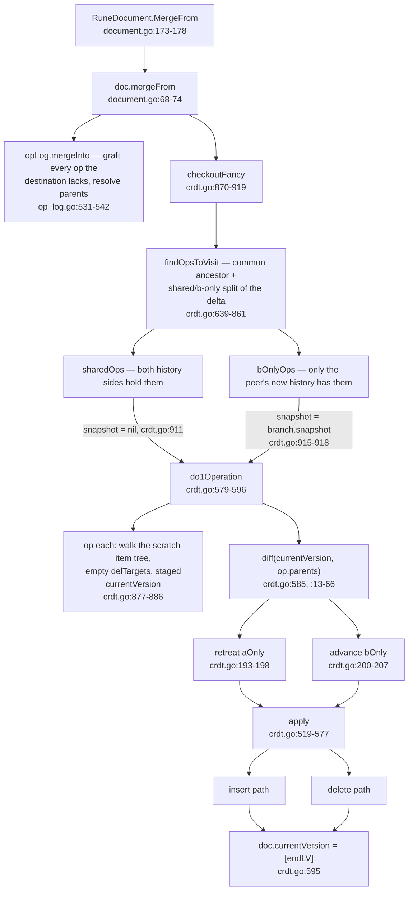
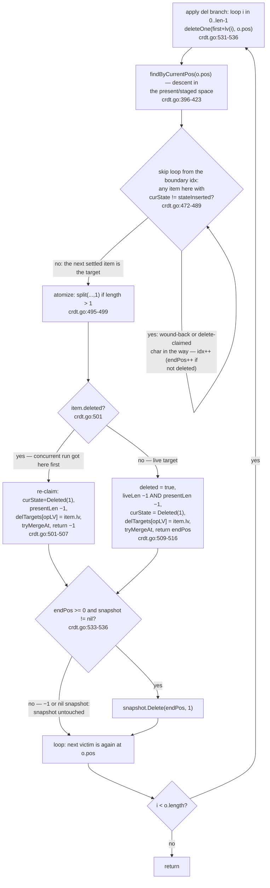
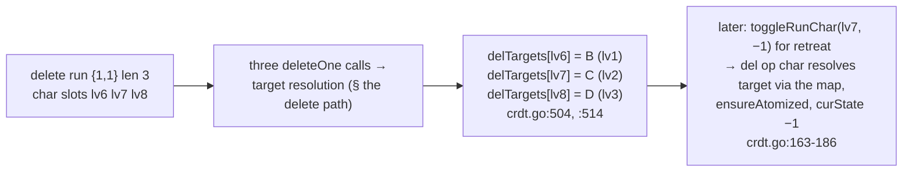
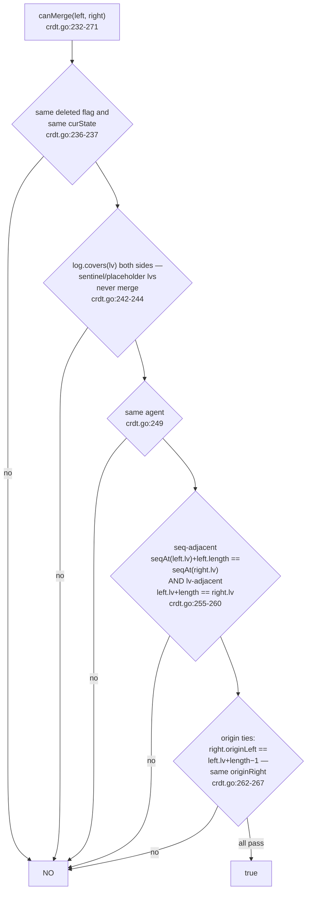
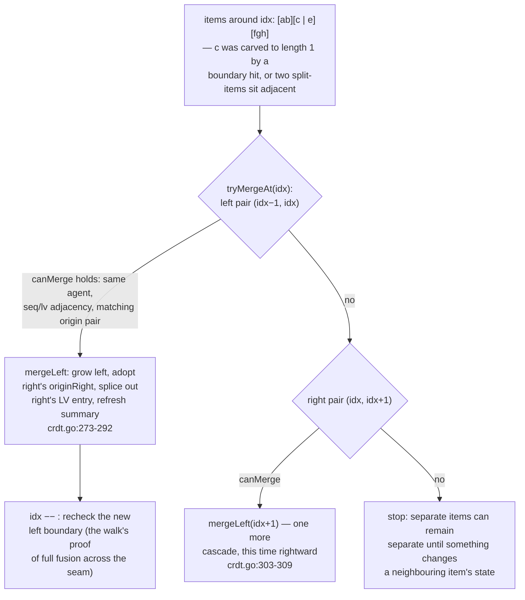
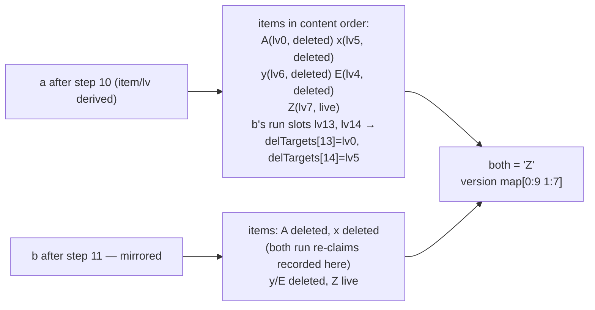

# CRDT: The Merge Drive — `mergeFrom` → `do1Operation` → `apply`

`docs/crdt/01-replica-model.md` left off at the remote path's black box
(`checkoutFancy`); `docs/crdt/02-op-log.md` filled that box with ops, lvs,
and the seq index. This page opens the drive that turns a grafted log back
into content — the machinery in `go/crdt/crdt.go` plus the one-call entry
`doc.mergeFrom` (`go/crdt/document.go:66-74`). It reuses previous pages'
material — lvs, `(agent, seq)` ids, frontier, parents, run ops — without
re-explaining it.

Read in this order: the top-level call graph; what a replay step winds
*before* it applies (the staged state); then the two real work paths —
insert (`findByCurrentPos` + origin anchors + `integrate`) and delete
(the per-character `deleteOne` loop with its `-1` already-gone skips);
then the delete-run ledger `delTargets` and the re-fusion recurrence
`tryMergeAt`; the snapshot doctrine at model level; a worked example whose
second act is two concurrent delete runs sharing one character; and the
invariants that fence all of it.

## One level down: what a merge actually runs

`doc.mergeFrom` is two calls (`go/crdt/document.go:68-74`). Why this
matters: everything this page does happens *after* the log is complete —
the drive never invents content, it re-derives it from a log whose graft
mechanics the op-log page already explained.

```go include go/crdt/document.go L66-L74
// mergeFrom performs the batch log merge and a single checkoutFancy. Element
// recursion is the families' job and must happen BEFORE this call.
func (d *doc[C]) mergeFrom(other *doc[C]) {
	if d == other {
		return
	}
	mergeInto(d.opLog, other.opLog)
	checkoutFancy(d.opLog, d.branch, d.opLog.frontier)
}
```



The interesting top-level fact is the *order* of what `checkoutFancy`
replays. Shared ops go first with `snapshot = nil` (`crdt.go:910-912`);
peer-only ops go second, with the branch's real snapshot
(`crdt.go:914-918`). One drive, two phases, one flag — that flag is all
the checkout interplay this page needs, and the full replay scheme is
`docs/crdt/06-deltas-and-checkout.md`'s subject.

```go include go/crdt/crdt.go L870-L887 L910-L919
func checkoutFancy[C content[C]](log *opLog[C], b *branch[C], mergeFrontier []lv) {
	if mergeFrontier == nil {
		mergeFrontier = log.frontier
	}

	visit := findOpsToVisit(log, b.frontier, mergeFrontier)

	doc := &crdtDoc{
		items: newBxTree(
			bxtree.WithSummarizer(crdtSummaryConfig),
			bxtree.WithOnItemMoved(func(item *crdtItem, node *bxtree.Node[*crdtItem, crdtSummary]) {
				item.node = node
			}),
		),
		currentVersion: visit.commonVersion,
		delTargets:     make(map[lv]lv),
		sortedItems:    []*crdtItem{},
	}
// …
	for _, curLV := range visit.sharedOps {
		do1Operation(doc, log, curLV, nil)
	}

	for _, curLV := range visit.bOnlyOps {
		do1Operation(doc, log, curLV, b.snapshot)
		o := log.opAt(curLV)
		b.frontier = advanceFrontier(b.frontier, curLV, o.parents)
	}
}
```

Why this matters: a *fresh* `crdtDoc` is built per checkout
(`crdt.go:877-886`), optionally anchored at the common ancestor version
and seeded with a *placeholder* sentinel item that keeps b-only ops from
integrating past the branch's own edge (`crdt.go:889-908`); the branch's
real contentTree is untouched until the b-only phase. Also notice what a
fresh doc carries: an **empty `delTargets`** — the ledger is rebuilt by
replaying, never persisted (§ below).

## One op per step: `do1Operation`, winding before applying

The per-op step in full (`go/crdt/crdt.go:579-596`) — the same step the
full-replay drive `checkout` runs for every op of a whole log
(`crdt.go:613-615`), which is what `Check()` and `Compact` invoke:

```go include go/crdt/crdt.go L579-L596
func do1Operation[C content[C]](doc *crdtDoc, log *opLog[C], opLV lv, snapshot *contentTree[C]) {
	idx := log.opIdxAt(opLV)
	o := &log.ops[idx]
	first := log.opLV[idx]
	end := log.endLV(idx)

	diffRes := diff(log, doc.currentVersion, o.parents)

	for _, i := range diffRes.aOnly {
		retreat(doc, log, i)
	}
	for _, i := range diffRes.bOnly {
		advance(doc, log, i)
	}

	apply(doc, log, snapshot, first)
	doc.currentVersion = []lv{end}
}
```

Why this matters: an op cannot simply be "included" — it must be applied
on top of the state its own causal `parents` name, and the drive's
staged state may be at a different tip. The drive therefore maintains a
**staged state**: characters in the item tree that can be toggled in and
out via `curState` (`go/crdt/types.go:87,120-123`) without changing the
item set. `diff` (`crdt.go:13-66`) computes which *currently staged* ops
are not ancestors of the op about to apply (`aOnly` — wind them back,
`retreat`, `crdt.go:193-198`) and which ancestor ops of the op's parents
are missing from the staged set (`bOnly` — wind them in, `advance`,
`crdt.go:200-207`). Only then does `apply` run, and the staged cursor
jumps to the op's end LV (`crdt.go:595`).

The state vocabulary the rest of the page leans on
(`go/crdt/types.go:82-95,100,120-123`):

- `crdtItem` — one (slice of) character(s) with an `lv`, permanent
  `originLeft`/`originRight` anchors, the permanent `deleted` flag, and
  `curState`, the *staged replay counter* (`-1` `stateNotYetInserted`
  wound back, `0` `stateInserted` staged in, `1` a delete-run claim —
  the `Deleted(1)` deleteOne stamps below).
- `crdtSummary` carries two counters with different jobs: `presentLen`
  counts items whose `curState == stateInserted` — the *staged* space,
  the position key during replay winding — and `liveLen` counts
  not-deleted items — the *visible* space the snapshot is rendered from
  (`crdt.go:74-87`; the two only coincide when nothing is wound back).

The toggle primitive (`go/crdt/crdt.go:158-188`) is worth reading whole,
because delete runs' character slots resolve through `delTargets` — the
next section's subject — right here:

```go include go/crdt/crdt.go L153-L188
// toggleRunChar toggles the staged insertion state (delta = -1 retreat, +1
// advance) of the single character at opLV. For an insert op the character
// itself is the target; for a delete op the target is the character the delete
// removed (looked up in delTargets). Items are atomized so each character is
// toggled independently.
func toggleRunChar[C content[C]](doc *crdtDoc, log *opLog[C], opLV lv, delta int) {
	o := log.opAt(opLV)
	var targetLV lv
	if o.opType == opTypeIns {
		targetLV = opLV
	} else {
		var ok bool
		targetLV, ok = doc.delTargets[opLV]
		if !ok {
			return
		}
	}

	item := ensureAtomized(doc, targetLV)
	if item == nil {
		return
	}

	oldM0 := 0
	if item.curState == stateInserted {
		oldM0 = 1
	}
	item.curState += delta
	newM0 := 0
	if item.curState == stateInserted {
		newM0 = 1
	}
	if oldM0 != newM0 {
		item.node.SummaryAddUpward(crdtSummary{presentLen: newM0 - oldM0}, doc.items)
	}
}
```

(For an insert-op char the target is the char itself; a delete-op char
has *no item of its own* — a delete op owns lv slots but no content — so
its `opLV` resolves through the map, and `ensureAtomized`
(`crdt.go:131-151`) splits the underlying item into single characters
when needed. The per-op bookkeeping and summary updates both ride the
`bxtree` summaries rather than a recount — the subject of
`docs/crdt/04-content-tree.md`.)

## The insert path

What `apply` does for a length-L insert (`opTypeIns`) run (`go/crdt/crdt.go:540-577`):

```go include go/crdt/crdt.go L540-L577
	posIdx, endPos := findByCurrentPos(doc, o.pos)

	if posIdx >= 1 {
		prevPtr, _ := doc.items.GetAt(posIdx - 1)
		if (*prevPtr).curState != stateInserted {
			panic("Item to the left is not inserted!")
		}
	}

	originLeft := lv(-1)
	if posIdx > 0 {
		prevPtr, _ := doc.items.GetAt(posIdx - 1)
		originLeft = (*prevPtr).lv + lv((*prevPtr).length-1)
	}

	originRight := lv(-1)
	for i := posIdx; i < doc.items.Size(); i++ {
		item2Ptr, _ := doc.items.GetAt(i)
		item2 := *item2Ptr
		if item2.curState != stateNotYetInserted {
			originRight = item2.lv
			break
		}
	}

	item := &crdtItem{
		lv:          first,
		originLeft:  originLeft,
		originRight: originRight,
		deleted:     false,
		curState:    stateInserted,
		length:      o.length,
	}
	addItemLV(doc, item)

	posIdx = integrate(doc, log, item, posIdx, endPos, snapshot)
	tryMergeAt(doc, log, posIdx)
}
```

What the code does, in this codebase's own terms, step by step:

1. **Position resolve + atomization.** `findByCurrentPos(o.pos)`
   (`crdt.go:396-423`) descends the `bxtree` against the `presentLen`
   summary and, when the position falls *inside* a multi-character item,
   splits that item on the spot (`crdt.go:415-420`) so the insert lands
   exactly at a boundary between two items:

```go include go/crdt/crdt.go L396-L423
func findByCurrentPos(doc *crdtDoc, targetPos int) (int, int) {
	if targetPos == 0 {
		return 0, 0
	}

	node, posInNode, acc := doc.items.FindPath(func(acc crdtSummary, cur crdtSummary) bool {
		return acc.presentLen+cur.presentLen >= targetPos
	})

	if node == nil {
		if doc.items.Root() == nil {
			return 0, 0
		}
		return doc.items.Size(), doc.items.Root().Summary().liveLen
	}

	item := node.Items()[posInNode]
	m := crdtSummaryConfig.FromItem(item)

	if targetPos > acc.presentLen && targetPos < acc.presentLen+m.presentLen {
		idx := node.Index() + posInNode
		offset := targetPos - acc.presentLen
		split(doc, idx, offset)
		return findByCurrentPos(doc, targetPos)
	}

	return node.Index() + posInNode + 1, acc.liveLen + m.liveLen
}
```

   Why this matters: the same function serves both op types and returns
   *two* indexes — `posIdx`, the item index after the resolved position
   (the *staged* axis), and `endPos`, the *live* (snapshot) axis
   (`acc.liveLen + m.liveLen`, `crdt.go:422`) the snapshot needs. The
   split it may perform is the atomization: a run is only ever cut when
   something legitimately has to reference *between* two of its
   characters, never to renumber anything (`docs/crdt/02-op-log.md`'s
   lv-immutability rule).
2. **The two origin anchors.** `originLeft` is the would-be left
   neighbour item's last character LV (`crdt.go:549-553`); `originRight`
   is found by scanning forward past `stateNotYetInserted` neighbours to
   the next *currently staged* item (`crdt.go:555-563`). These anchors
   are the item's permanent identity — later replicas that integrate this
   op from a *different* log shape still place it identically relative
   to them.
3. **The integrating scan.** `integrate` (`crdt.go:323-394`) re-resolves
   the two anchors into current positions (`getLogicalPos`,
   `crdt.go:312-321`), then scans neighbours around that spot: the
   concurrency decision. When all settled neighbours have been walked,
   the item is inserted at the slot where it clears the break condition;
   the scan may shift `endPos` if it passes live items
   (`crdt.go:366-367`).
4. **The snapshot.** If the snapshot parameter is non-nil, the run's
   content joins the rope at `endPos`
   (`crdt.go:390-392`) — the visible/live axis, adjusted for the items
   that were wound back during this step's wind.
5. **Fusion.** After every successful insert, `tryMergeAt` is called at
   the inserted position (`crdt.go:576`): re-fusion made
   possible by integrating a run in the middle of another run's span is
   undone immediately (see § `delTargets`+`tryMergeAt`).

```mermaid
flowchart TD
    I0["apply, opTypeIns<br/>crdt.go:540"] --> I1["findByCurrentPos(o.pos)<br/>crdt.go:396-423:<br/>staged-position descent over bxtree;<br/>split the containing item<br/>at the boundary (crdt.go:415-420)")
    I1 --> I2["originLeft = prev item's last-char lv<br/>crdt.go:549-553"]
    I1 --> I3["originRight scan — first settled<br/>(not stateNotYetInserted) item<br/>crdt.go:555-563"]
    I2 --> I3
    I3 --> I4["crdtItem{lv=run's first LV,<br/>origins fixed} · addItemLV<br/>crdt.go:565-573, :95-105"]
    I4 --> I5["integrate — re-resolve anchors via<br/>getLogicalPos · crdt.go:312-321, :327-332"]
    I5 --> I6{"scan forward over not-yet-inserted<br/>neighbours; break on a settled one<br/>whose origin place or agent id<br/>outranks the new item<br/>crdt.go:341-381"}
    I6 -->|"scan may tally live items into endPos<br/>crdt.go:366-367"| I7["doc.items.InsertAt(idx, item)<br/>crdt.go:383"]
    I6 -->|"settled: idx final (crdt.go:376-379)"| I8["only if snapshot != nil:<br/>snapshot.Insert(endPos, o.content)<br/>crdt.go:390-392"]
    I7 --> I9["tryMergeAt(posIdx)<br/>crdt.go:576"]
    I8 --> I9
```

## The delete path

Every delete op is replayed as *independent per-character deletes*; the
_run_ is a concession to logging efficiency, not to a concurrency
primitive. From `apply`'s delete branch (`go/crdt/crdt.go:524-538`):

```go include go/crdt/crdt.go L524-L538
	if o.opType == opTypeDel {
		// A delete run removes o.length visible characters at positions
		// pos..pos+o.length-1 of the staged state, one character at a time.
		// Each deleteOne reports the visible position it removed; characters
		// already deleted by a concurrent op are skipped (-1) and leave the
		// snapshot untouched. checkoutFancy replays shared ops with a nil
		// snapshot (their content is already in the branch).
		for i := 0; i < o.length; i++ {
			endPos := deleteOne(doc, log, first+lv(i), o.pos)
			if endPos >= 0 && snapshot != nil {
				snapshot.Delete(endPos, 1)
			}
		}
		return
	}
```

And `deleteOne` itself (`go/crdt/crdt.go:467-517`), shown in two slices:

```go include go/crdt/crdt.go L467-L490
func deleteOne[C content[C]](doc *crdtDoc, log *opLog[C], opLV lv, pos int) int {
	idx, endPos := findByCurrentPos(doc, pos)

	node, nodePos, err := doc.items.GetAtNode(idx)
	if err == nil {
		for {
			item := node.Items()[nodePos]
			if item.curState == stateInserted {
				break
			}
			if !item.deleted {
				endPos++
			}
			idx++
			nodePos++
			if nodePos >= len(node.Items()) {
				node = node.Next()
				nodePos = 0
				if node == nil {
					break
				}
			}
		}
	}
```

```go include go/crdt/crdt.go L492-L517
	itemPtr, _ := doc.items.GetAt(idx)
	item := *itemPtr

	if item.length > 1 {
		split(doc, idx, 1)
		itemPtr, _ = doc.items.GetAt(idx)
		item = *itemPtr
	}

	if item.deleted {
		item.curState = 1 // Deleted(1)
		item.node.SummaryAddUpward(crdtSummary{presentLen: -1}, doc.items)
		doc.delTargets[opLV] = item.lv
		tryMergeAt(doc, log, idx)
		return -1
	}

	item.deleted = true
	item.node.SummaryAddUpward(crdtSummary{liveLen: -1}, doc.items)
	item.curState = 1 // Deleted(1)
	item.node.SummaryAddUpward(crdtSummary{presentLen: -1}, doc.items)

	doc.delTargets[opLV] = item.lv
	tryMergeAt(doc, log, idx)
	return endPos
}
```

Walkthrough, top to bottom:

- **`o.pos` is re-passed constant for the whole loop.** Every character
  of the run deletes at *the same* visible position `o.pos`
  (`crdt.go:532`), because each successful `deleteOne` shrinks the
  staged state by exactly one — so the next victim of the run is again
  visible at position `o.pos` in the shrunk state. The run's op `pos`
  is author-side information; the per-character resolution does all the
  target selection work locally.
- **The skip loop** (`crdt.go:471-490`): `findByCurrentPos` gives the
  boundary item in *present* space, but what the delete really needs to
  confirm is that the target item is *settled* (`stateInserted`) rather
  than one of the wound-back/delete-claimed items whose char slots sit
  in between. The loop advances item-by-item until it finds a settled
  one, counting into `endPos` only the live ones it steps past
  (`crdt.go:477-479`).
- **Atomize the kill target.** A run hit at a multi-char item splits it
  to length 1 first (`crdt.go:495-499`) — delete runs toggle/settle
  characters *individually* (the comment at `crdt.go:153-157` is the
  10,000-foot description).
- **The live commit** (`crdt.go:509-516`): `deleted=true` (a permanent
  boolean — it is never reset anywhere in the drive), both summary
  counters are dropped by one, `curState = Deleted(1)` (a delete claim
  rides `curState` like any staging counter), `delTargets[opLV] =
  item.lv`, and `tryMergeAt` — then the loop's `snapshot.Delete(endPos,
  1)` removes exactly one visible cell of the rope
  (`crdt.go:533-536`).
- **The `-1` skip** (`crdt.go:501-507`): the item is already `deleted` —
  a different run got there first. The drive *still reclaims the delete*
  in the bookkeeping sense: it re-asserts the delete claim
  (`curState = Deleted(1)`, presentLen −1: this run, too, currently
  claims the char) and, crucially, records
  `delTargets[opLV] = item.lv` *for its own slot* — so every char of
  every overlapping delete run knows exactly which item it meant.
  Then it returns `-1`, which is why `apply`'s snapshot update is
  guarded with `endPos >= 0` (`crdt.go:533`) — the receiver's own
  concurrent delete already removed that char from its rope.



## `delTargets` and `tryMergeAt`

Two mechanisms make overlapping delete runs converge, and both live
inside the drive state, both get rebuilt on every checkout.

### The ledger: `delTargets`

The field (`go/crdt/types.go:100`) carries one line of prose:

```go include go/crdt/types.go L97-L102
type crdtDoc struct {
	items          *bxtree.BxTree[*crdtItem, crdtSummary]
	currentVersion []lv
	delTargets     map[lv]lv   // Map op_lv (delete op) -> target_lv
	sortedItems    []*crdtItem // Sorted list of items by start LV
}
```

Why this matters: a delete run occupies real LV slots (each deletion truly
costs one lv in `docs/crdt/02-op-log.md`'s address space) but carries no
content, so none of its char slots name an item. `delTargets[opLV] =
item.lv` (written at `crdt.go:504`, `:514`) is the only bridge from a
delete-run character slot to the item it (or a concurrent twin) actually
deleted. The consumer is `toggleRunChar`'s else-branch (`crdt.go:163-168`,
shown in § `do1Operation`): without the map, winding a delete op in or out
would not know *which* single character toggles.



Running properties:

- **Identity across replicas:** two replicas' logs can disagree on where
  the delete run's slots sit in lv space, yet the *map entries* still
  name the same characters-by-lv, because `delTargets` is only ever read
  inside this replica's own winding — targets were recorded during this
  replica's replay (`docs/crdt/01-replica-model.md`'s lv-locality note).
- **Rebuild-on-checkout:** the map resets anew in every drive
  (`crdt.go:607` for full checkout, `crdt.go:885` for the fancy
  one) and re-fills inside `deleteOne` — no serialization, no `Compact`
  preservation (`docs/crdt/05-binary-and-compaction.md`).
- **Concurrent overlap is idempotent in the map itself:** a second run's
  re-claim hits the same item and rewrites the same
  entry, so re-merging cannot diverge the ledger.

### The recurrence: `tryMergeAt`

```go include go/crdt/crdt.go L294-L310
func tryMergeAt[C content[C]](doc *crdtDoc, log *opLog[C], idx int) {
	if idx > 0 {
		leftPtr, _ := doc.items.GetAt(idx - 1)
		rightPtr, _ := doc.items.GetAt(idx)
		if canMerge(log, *leftPtr, *rightPtr) {
			mergeLeft(doc, idx)
			idx--
		}
	}
	if idx < doc.items.Size()-1 {
		leftPtr, _ := doc.items.GetAt(idx)
		rightPtr, _ := doc.items.GetAt(idx + 1)
		if canMerge(log, *leftPtr, *rightPtr) {
			mergeLeft(doc, idx+1)
		}
	}
}
```

Every atomization (a `split` at `findByCurrentPos`, or a `split(...,1)`
before a targeted delete) leaves neighbours that *could* be one run
again. `tryMergeAt` (`go/crdt/crdt.go:294-310`) is the call both paths
make right after touching an item (`apply` insert at `crdt.go:576`,
`deleteOne` at `:505` and `:515`), and — per the checks — each fusion
attempt compares against the *log*, not just neighbors:

```go include go/crdt/crdt.go L246-L270
	opL := log.opAt(left.lv)
	opR := log.opAt(right.lv)

	if opL.id.agent != opR.id.agent {
		return false
	}

	// Contiguous in seq and LV. Items may start at a run-interior lv (after a
	// split), so the op sequence at the item start lv is derived via seqAt.
	if log.seqAt(left.lv)+left.length != log.seqAt(right.lv) {
		return false
	}
	if left.lv+lv(left.length) != right.lv {
		return false
	}

	// Origin check
	if right.originLeft != left.lv+lv(left.length-1) {
		return false
	}
	if left.originRight != right.originRight {
		return false
	}

	return true
```



`mergeLeft` (`crdt.go:273-292`) completes the fusion: grow left's
length, adopt right's `originRight`, splice right's entry out of the LV
index (`crdt.go:107-112`) and back in updated, delete the right item from
the tree, and refresh the tree summary. The recurrence in a picture:



Why this matters: `tryMergeAt` is the drive's self-repair — a
concurrent insert or a carve-to-length-1 delete may split a run
(`crdt.go:415-420`, `:495-499`); after every such event the recurrence
re-fuses the split-off characters whenever
`canMerge`'s conditions still hold. A re-fused run keeps the original
run's lvs and origins intact, so LV-index lookups (`addItemLV`/
`removeItemLV`, `crdt.go:95-112`) and the re-merge guard (`log.covers`,
`crdt.go:242-244` — the checkout placeholder sentinel can never merge
into real items) never see any fraying.

## Snapshot or nil: the model-level interplay

- The replay's shared/b-only phase (`crdt.go:910-918`) uses the same
  `do1Operation` with a single external difference: the `snapshot`
  pointer. `nil` means "rebuild intermediate staged states, never touch
  real content" (the branch's contentTree — the API-visible one —
  stays unmodified); non-nil means "mutate" — only then do `apply`'s
  `snapshot.Insert`/`snapshot.Delete` fire, behind the `endPos >= 0`
  and `!= nil` guards (`crdt.go:391`, `:533-534`).
- Conversely the full-replay `checkout` (`crdt.go:598-617`) runs the same
  step one op at a time, over a snapshot it *builds* from nothing: that
  is the drive that Check() (page 01) and `Compact` (`document.go:115`)
  lease. The asymmetry is worth naming: a nil-snapshot replay builds the
  staged state graph; a live-snapshot replay builds *content*, each
  content-producing edit positioned by `endPos` (`apply`'s two
  insert/delete exits at `crdt.go:391`, `:534`).

`docs/crdt/06-deltas-and-checkout.md` carries the checkout-side replay
details and how this drive is also retraced from batch deltas.

## Worked example: a local insert run, then two delete runs sharing a character

Driver under `/tmp/opencode/drive3`, module-replace wired to this repo
like `docs/crdt/01-replica-model.md`'s and `docs/crdt/02-op-log.md`'s;
output verbatim:

```
1  a.Ins(0,"ABCDE")  a = ABCDE    version: map[0:4]
2  b.MergeFrom(a)    b = ABCDE    version: map[0:4]
3  a.Ins(2,"xy")     a = ABxyCDE  version: map[0:6]
4  b.Ins(5,"Z")      b = ABCDEZ   version: map[0:4 1:0]
5  b.Del(1,3)        b = AEZ      version: map[0:4 1:3]
6  a.MergeFrom(b)    a = AxyEZ    version: map[0:6 1:3]
7  b.MergeFrom(a)    b = AxyEZ    version: map[0:6 1:3]
8  b.Del(0,2)        b = yEZ      version: map[0:6 1:5]
9  a.Del(1,3)        a = AZ       version: map[0:9 1:3]
10 a.MergeFrom(b)    a = Z        version: map[0:9 1:5]
11 b.MergeFrom(a)    b = Z        version: map[0:9 1:5]
a==b: true
Check() OK
```

What to watch in this example:

- **Step 3 vs step 6 — inserting *inside* a range that gets deleted
  elsewhere.** a's `xy` run is anchored between B and C
  (`originLeft` = B's last char lv, `originRight` = C's lv, § the
  insert path). b's delete run (step 5) removes B, C, D — but the
  items stay in the tree with `deleted=true` and keep their lv slots
  (`liveLen` falls; the anchors survive). When a converges (step 6),
  `xy` integrates *at its recorded origins*, inside the tombstones —
  "AxyEZ": the drive's answer to insert-vs-delete is that deletion
  never disturbs the anchoring items later concurrent inserts resolve
  against, and both replicas converge on the same placement.
- **Steps 8/9 — a delete-on-delete lightbulb:** b deletes A, x
  (`b.Del(0,2)`); a deletes x, y, E (`a.Del(1,3)`); the runs share
  **`x`**. When each replica merges the other's run, *one* of
  its characters hits an item that its own local run already deleted.
  That is exactly `deleteOne`'s already-deleted path
  (`crdt.go:501-507`): the deletions are *re-claimed bookkeeping-wise*
  — a `curState = Deleted(1)` bump and the `delTargets` map entry for
  that slot — and `return -1` → `apply`'s `endPos >= 0` guard
  (`crdt.go:533`) keeps the snapshot untouched, because the shared
  char is already invisible *on whichever replica*.
- **Closing state:** only `Z` — the one character neither delete run
  covers — survives, on both replicas (`a == b` and both versions
  print `map[0:9 1:7]`). Nothing here relies on the merge order or on a
  replica winning a race: the same drive, run on whichever side, gives
  the same content.

Step table (call + printed versions verbatim; LV spans / parents are
derived from the push mechanics as `docs/crdt/02-op-log.md`'s table was —
the cited lines pin each row):

| # | Call | Log state after |
|---|------|-----------------|
| 1 | `a.Ins(0,"ABCDE")` | a: `{0,0}` "ABCDE" lv 0-4, parents `[]`, version `{0:4}` (`op_log.go:162-172`) |
| 2 | `b.MergeFrom(a)` | b: appends the same op at lv 0-4 (`op_log.go:442-450`), version `{0:4}` |
| 3 | `a.Ins(2,"xy")` | a: **no fold** (fold tail pos would be 0+5, this is pos 2) → mint `{0,5}` "xy" lv 5-6, version `{0:6}` (`op_log.go:141-149`) |
| 4 | `b.Ins(5,"Z")` | b: tail op is agent 0's → no fold → mint `{1,0}` "Z" lv 5, parents `[4]`, version `{0:4,1:0}` |
| 5 | `b.Del(1,3)` | b: `localDelete` (`op_log.go:178-187`) → del run `{1,1}` len 3, lv 6-8, no content — version `{0:4,1:3}` |
| 6 | `a.MergeFrom(b)` | a: append `{1,0}` at lv 6 (parents `[4]`), `{1,1}` run at lv 7-9 (parents `[6]`) — version `{0:6,1:3}`; `checkoutFancy` walk: b's del chars find their targets live on a, `xy` integrates inside the deleted B|C span → "AxyEZ" |
| 7 | `b.MergeFrom(a)` | b: append `{0,5}` at lv 9-10 — same shape, version `{0:6,1:3}` → "AxyEZ" |
| 8 | `b.Del(0,2)` | b: del run `{1,4}` len 2, lv 11-12, version `{0:6,1:5}` → "yEZ" (deleted A, x) |
| 9 | `a.Del(1,3)` | a: del run `{0,7}` len 3, lv 10-12, version `{0:9,1:3}` → "AZ" (deleted x, y, E — the visible 1…3 span) |
| 10 | `a.MergeFrom(b)` | a: append `{1,4}` at lv 13-14, version `{0:9,1:7}`; replaying b's run: `A` live → deleted; `x` already deleted (a's own step-9 run) → the **-1** path (`crdt.go:501-507`); → "Z" |
| 11 | `b.MergeFrom(a)` | b: append `{0,7}` at lv 13-15, version `{0:9,1:7}`; replaying a's run: `x` → **-1** (b's own step-8 run); `y` and `E` live → deleted → "Z" |



*(The `-1` strikes, delTargets rows, and item-level states above are
derived from the cited code lines — the driver cannot print drive
internals; what it does print is each replica's `GetString()` and
`Version()` verbatim above, and `Check()` passing.)*

## Invariants

1. **The delete run is total — every character is either committed or
   `-1`-skipped, never silently dropped.** `apply`'s loop runs exactly
   `o.length` iterations (`crdt.go:531-536`) and `deleteOne` has two
   exits — live commit (`crdt.go:509-516`) and already-gone re-claim
   (`crdt.go:501-507`) — with the interior length-1 split (`crdt.go:495-499`)
   making sure a multi-char item is never partially claimed.
2. **`deleted` never flips back; `curState` is the only toggle.** The
   permanent boolean (`crdt.go:509`) is the convergence-level fact; the
   staged counter (`crdt.go:158-188`, the `retreat`/`advance`
   primitive) is the only mechanism that "undoes" something during a
   replay — and a concurrent re-claim (`Deleted(1)` rebumps, `crdt.go:502`)
   still cannot resurrect content.
3. **Both delete runs' slots map to the same target — convergence in the
   ledger, too.** When `-1` fires, the receiving index re-records
   `delTargets[opLV] = item.lv` exactly as the first run's char did
   (`crdt.go:504`, `:514` — both exits write it), so the per-char winding
   machinery after any later re-merge behaves identically on every
   replica; no double-deletion happens at rope level (guard
   `endPos >= 0`, `crdt.go:533`).
4. **Position integrity survives splits** — after `findByCurrentPos` or
   `deleteOne` cuts a run, `tryMergeAt` re-fuses the seam only when
   `canMerge`'s five conditions (`crdt.go:236-267`: deleted/curState
   equality, the sentinel-lv guards, agent, seq- and lv-adjacency,
   origin ties) all agree — a deterministic, ancestry-backed
   re-merge-guard, not a neighbour guess.
5. **Branch content must be exactly the drive's output.** The local
   branch content equals full replay (`document.go:96-101` /
   `Check()`'s docs at `document.go:217-228`) — and,
   across arbitrarily interleaved replicas, `FuzzMergeConvergence`
   keeps hammering exactly that (`go/crdt/fuzz_test.go:182`); a real
   editing trace is replayed by the very same drive in `TestTrace`
   (`go/crdt/trace_test.go:121-123`).

Verification:

```
go test -C go ./...                                            # full suite incl. fuzz seed corpora + the doc drift test
go test -C go ./crdt -fuzz=FuzzMergeConvergence -fuzztime=30s   # deeper merge/resolution chaos
go test -C go ./crdt -run TestTrace -count=1                   # real editing trace through this drive
python3 scripts/doc-snippets-check.py                          # snippet drift gate
```

Next page — the rope these drives write into and its own fast paths:
`docs/crdt/04-content-tree.md`.

---

*Related: `docs/crdt/01-replica-model.md` (the remote-path contract this
page implements), `docs/crdt/02-op-log.md` (the lv/seq resolution this
page always builds on), `docs/crdt/04-content-tree.md` (the content view
the snapshot edits target), `docs/crdt/06-deltas-and-checkout.md` (the
checkout replay in full), `docs/index.md` for reading order.*
