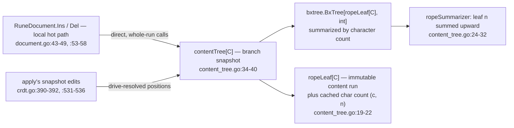
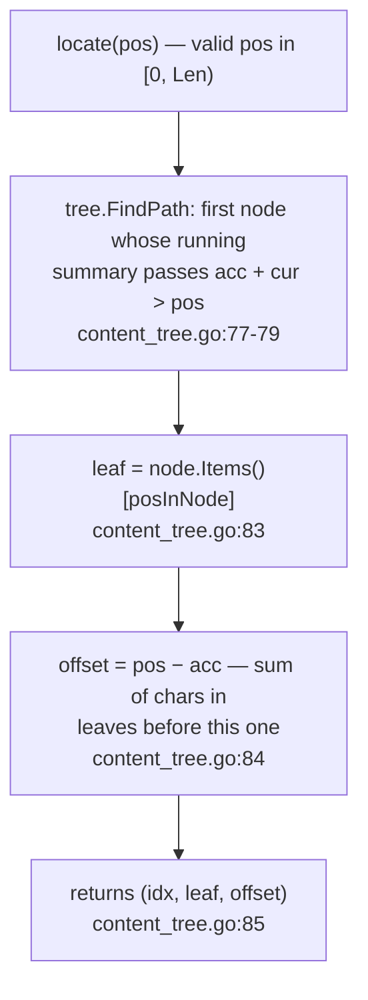
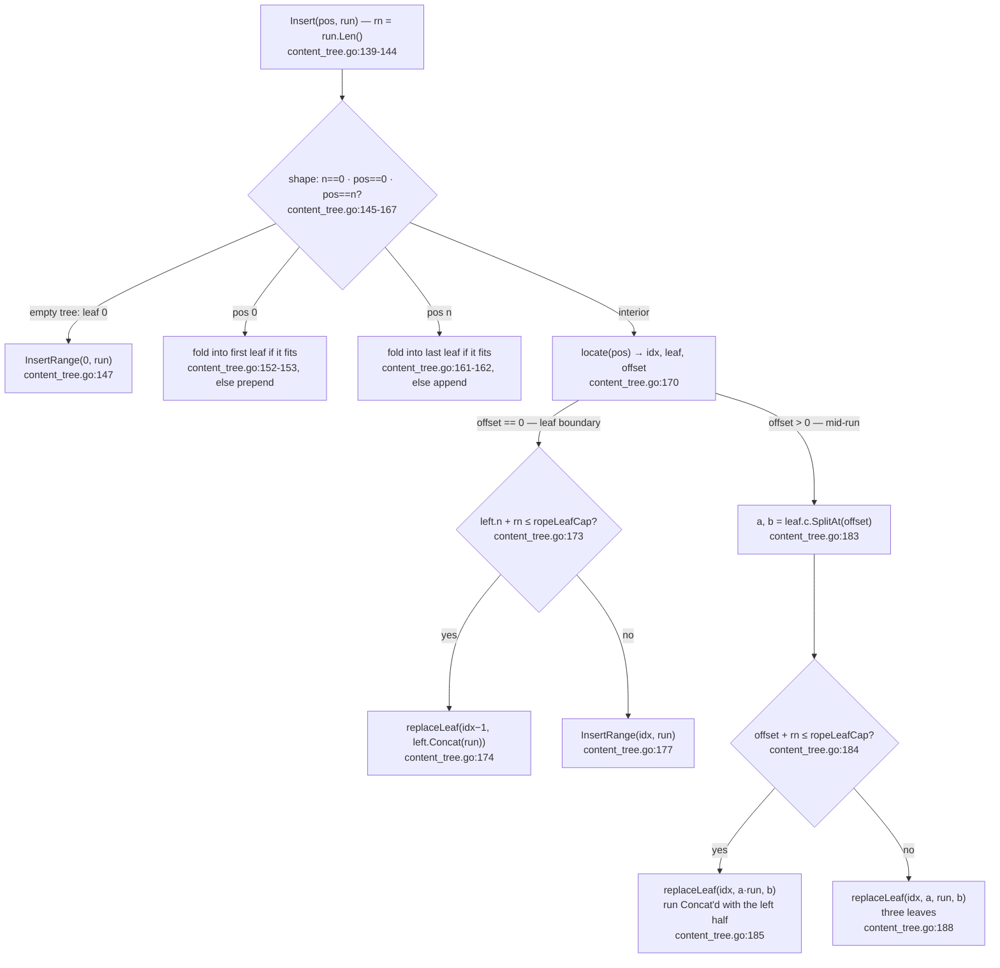
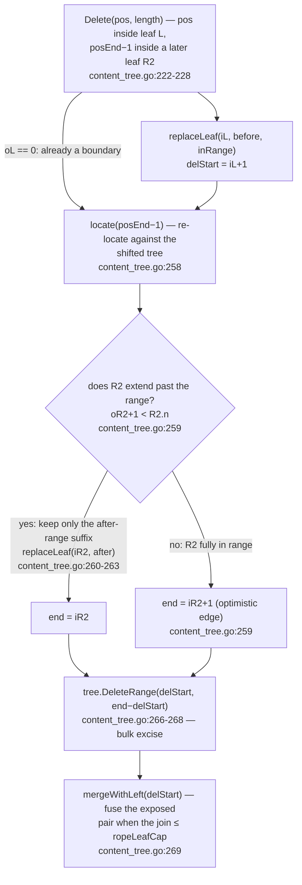
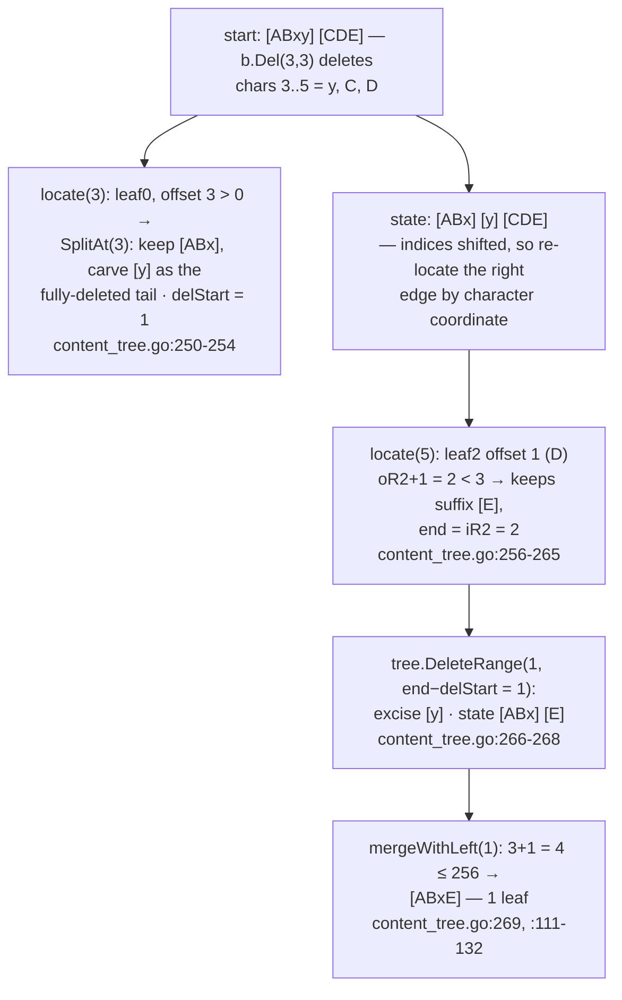
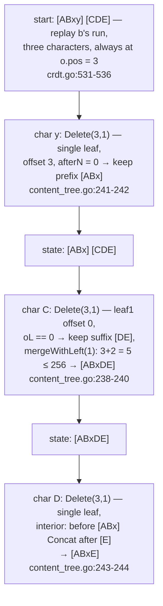

# CRDT: The Content Tree — `contentTree` and its edit math

`docs/crdt/01-replica-model.md` introduced the branch as "a derived view";
`docs/crdt/02-op-log.md` built its addresses; `docs/crdt/03-merge-drive.md`
opened the drive. This page is the other half of that story: the *visible
document itself* — the `branch.snapshot` of type `contentTree` that the drive
feeds and that page 01's local hot path writes directly. It is a run-based
rope (`go/crdt/content_tree.go:34-40`) built on the repo's own `bxtree`, and
it never sees an lv, a frontier, or a concurrency decision — every position
arriving at its `Insert`/`Delete` has already been resolved by the merge
drive (`docs/crdt/03-merge-drive.md`) or is the author's own view, which is
why this page can be pure index math.

Read in this order: what the tree stores (immutable content leaves with
cached character counts); the character-position `locate` descent; `Insert`'s
boundary folding and mid-run split; `Delete(pos, length)` across its case
taxonomy, multi-leaf series included; how leaf *contents* get cut
(`SplitAt` — the rope's own flavor of atomization); the division of labor
with `crdt.go`'s item tree (where tombstones really live); the local
run-granular vs remote per-character trade; a driver-verified worked example
that runs one remote mid-run insert and one multi-leaf delete through both
paths; and the invariants.



## What contentTree is: a rope whose leaves are immutable content

The tree is generic over one run of content, with the same type-erasure
trade as the engine core on `docs/crdt/01-replica-model.md` — the constraint
it actually leans on is `content.go`'s interface (`go/crdt/content.go:13-18`):

```go include go/crdt/content.go L9-L14
type content[C any] interface {
	Len() int
	SplitAt(k int) (C, C) // split after the k-th character; 0 <= k <= Len
	Concat(C) C
	Collapsible() bool // may two adjacent same-agent runs of this type fuse
}
```

Why this matters: only these four verbs enter the rope's algorithms, so the
same tree serves text (`runeText`, rune-counted, `go/crdt/content.go:18-20`)
and arrays (`itemRun[T]`, `go/crdt/content.go:55-66`) with element types
erased; map runs never reach it (map ops carry no positions and no deleted
content, `go/crdt/content.go:83-100`). The trio `(Len, SplitAt, Concat)` is
everything the index math below does; `Collapsible` belongs to the op-log
page's fold fast path (`docs/crdt/02-op-log.md`, `go/crdt/content.go:75-81`),
not to the rope.

The tree itself is one embedded `bxtree` whose items are *rope leaves*
(`go/crdt/content_tree.go:34-40`, built once per branch by `newContentTree`,
`content_tree.go:50-59`), with each leaf carrying its cached count (`content_tree.go:12-22`):

```go include go/crdt/content_tree.go L19-L32
type ropeLeaf[C content[C]] struct {
	c C
	n int
}

// ropeSummarizer provides the character-count summary for the content tree:
// each leaf contributes its cached run length, and a node's summary is the
// total characters under it (bxtree.Size() counts LEAVES, not chars, so all
// positional work goes through this summary).
type ropeSummarizer[C content[C]] struct{}

func (ropeSummarizer[C]) FromItem(l ropeLeaf[C]) int { return l.n }
func (ropeSummarizer[C]) Add(a, b int) int           { return a + b }
func (ropeSummarizer[C]) Sub(a, b int) int           { return a - b }
```

Why this matters: the summary is the whole difference between "a B+Tree of
runs" and "a positional rope". Characters — not leaves — are the addressing
unit (`Len()` is literally the root's summary, `content_tree.go:61-67`), and
each leaf's count is maintained *arithmetically*: SplitAt's halves have known
lengths at the split point (`content_tree.go:16-18`), so the only scan ever
paid is one `run.Len()` at insert time (`content_tree.go:12-15`). Two knobs
complete the shape: `ropeLeafCap = 256`
(`content_tree.go:5-10`) bounds how many characters a single folded leaf
carries (bounding `Concat` cost and leaf fragmentation), and the bxtree's
own leaf-node occupancy is narrowed to `[4, 8]` after a measured sweep
(`content_tree.go:42-48`).

## `locate`: the find descent in character space

Every positional decision in the rope bottoms out in one function
(`go/crdt/content_tree.go:76-85`):

```go include go/crdt/content_tree.go L72-L85
// locate returns the item index of the leaf containing content position pos,
// that leaf, and the offset within it. pos must be in [0, Len) and is in
// content units — characters for runeText, elements for itemRun — matching the
// Len() unit of the content contract. A leaf starting at pos has offset 0.
func (ct *contentTree[C]) locate(pos int) (idx int, leaf ropeLeaf[C], offset int) {
	node, posInNode, acc := ct.tree.FindPath(func(acc, cur int) bool {
		return acc+cur > pos
	})
	if node == nil {
		panic("crdt: rope locate out of range")
	}
	leaf = node.Items()[posInNode]
	return node.Index() + posInNode, leaf, pos - acc
}
```

Why this matters: `locate` is the rope's entire search story (`Insert` needs
the leaf containing `pos`, `Delete` needs the leaves containing both range
edges). Its contract (`content_tree.go:72-75`): descend against summed
character counts (`bxtree.FindPath` — the same descent mechanics as
`docs/bxtree/02-insert-delete.md`'s find, with the rope's `int` summary as
the comparator) and return **three coordinates at once** — the global item
index `idx`, the leaf itself, and `offset` inside that leaf's content. The
offset is pure subtraction because `acc` is the summary *before* the found
leaf (`content_tree.go:84`), and it panics rather than clamps
(`content_tree.go:80-82`) — callers validate positions (`Delete` proves it,
`content_tree.go:209-212`); the drive-side analog returning its own two-axis
resolve is `findByCurrentPos` (`docs/crdt/03-merge-drive.md`, § the insert
path).



## Insert: folding at boundaries, splitting mid-run

`Insert` (`go/crdt/content_tree.go:134-189`) has three shapes. The easy two
are `pos == 0` and `pos == n` (`content_tree.go:150-167`): fold into the
first/last leaf when the result fits `ropeLeafCap`
(`content_tree.go:152-153`, `:161-162`) — those fold checks are why 5000
single-character appends still leave fewer than 100 leaves
(`go/crdt/content_tree_test.go:152-163`) — otherwise append a fresh leaf.
The interesting one is interior insertion, which *lookahead* resolves by
first locating the landing leaf (`go/crdt/content_tree.go:169-189`):

```go include go/crdt/content_tree.go L169-L189
	// Interior: pos in (0, n). Locate the leaf containing character pos.
	idx, leaf, offset := ct.locate(pos)
	if offset == 0 {
		// Boundary between leaves: fold into the left neighbour if it fits.
		if left, err := ct.tree.GetAt(idx - 1); err == nil && left.n+rn <= ropeLeafCap {
			ct.replaceLeaf(idx-1, ropeLeaf[C]{c: left.c.Concat(run), n: left.n + rn})
			return
		}
		_ = ct.tree.InsertRange(idx, []ropeLeaf[C]{rl})
		return
	}

	// SplitAt splits after the k-th character, so the half lengths are exactly
	// offset and leaf.n-offset; no rescanning needed.
	a, b := leaf.c.SplitAt(offset)
	if offset+rn <= ropeLeafCap {
		ct.replaceLeaf(idx, ropeLeaf[C]{c: a.Concat(run), n: offset + rn}, ropeLeaf[C]{c: b, n: leaf.n - offset})
		return
	}
	ct.replaceLeaf(idx, ropeLeaf[C]{c: a, n: offset}, rl, ropeLeaf[C]{c: b, n: leaf.n - offset})
}
```

Why this matters: when an op lands *mid-run* (`offset > 0`), `locate` has
already paid the descent, and `SplitAt`'s "after the k-th character"
contract makes the half lengths arithmetic (`offset`, `leaf.n-offset`,
`content_tree.go:181-182`) — the leaf is cut precisely at the landing
character, after which either the new run fuses with the left half
(`offset+rn <= ropeLeafCap`, `content_tree.go:184-187`) or three leaves
result (`content_tree.go:188`). All of it funnels into the rope's single
write primitive, `replaceLeaf` (`go/crdt/content_tree.go:86-104`):

```go include go/crdt/content_tree.go L86-L104

// replaceLeaf replaces the leaf at item index idx with parts (skipping empty
// parts), keeping document order.
func (ct *contentTree[C]) replaceLeaf(idx int, parts ...ropeLeaf[C]) {
	nonEmpty := parts[:0]
	for _, p := range parts {
		if p.n > 0 {
			nonEmpty = append(nonEmpty, p)
		}
	}
	if err := ct.tree.DeleteAt(idx); err != nil {
		panic("crdt: rope DeleteAt: " + err.Error())
	}
	if len(nonEmpty) > 0 {
		if err := ct.tree.InsertRange(idx, nonEmpty); err != nil {
			panic("crdt: rope InsertRange: " + err.Error())
		}
	}
}
```

Why this matters: every rope mutation becomes "one leaf out, up to three
back" (`content_tree.go:86-104`) — empty parts are skipped (the
never-empty-leaf rule below), order is preserved, and the bxtree's split and
borrow machinery (`go/bxtree/bxtree.go:427-429,618-627`, documented in
`docs/bxtree/02-insert-delete.md`) absorbs all tree-shape work. The
counterpart at a delete seam is `mergeWithLeft`
(`go/crdt/content_tree.go:105-132`) — pull the leaf at `idx` into its left
neighbour when the pair fits the cap, undoing the fragmentation an
exposed boundary would otherwise accumulate:

```go include go/crdt/content_tree.go L105-L132

// mergeWithLeft merges the leaf at item index idx into its left neighbour
// (idx-1) when the combined length fits ropeLeafCap. It is a no-op when idx
// is out of range or the pair does not fit. Used at the seams a Delete
// creates, mirroring Insert's boundary folding: edit points do not
// accumulate fragmentation.
func (ct *contentTree[C]) mergeWithLeft(idx int) {
	if idx <= 0 || idx >= ct.tree.Size() {
		return
	}
	left, errL := ct.tree.GetAt(idx - 1)
	cur, errR := ct.tree.GetAt(idx)
	if errL != nil || errR != nil || left.n+cur.n > ropeLeafCap {
		return
	}
	// GetAt returns pointers into node storage; build merged before the
	// DeleteAt calls below, which shift items under those pointers.
	merged := ropeLeaf[C]{c: left.c.Concat(cur.c), n: left.n + cur.n}
	if err := ct.tree.DeleteAt(idx); err != nil {
		panic("crdt: rope DeleteAt: " + err.Error())
	}
	if err := ct.tree.DeleteAt(idx - 1); err != nil {
		panic("crdt: rope DeleteAt: " + err.Error())
	}
	if err := ct.tree.InsertRange(idx-1, []ropeLeaf[C]{merged}); err != nil {
		panic("crdt: rope InsertRange: " + err.Error())
	}
}
```



## `Delete(pos, length)`: one leaf, many leaves, seams

`Delete`'s doc comment (`go/crdt/content_tree.go:191-204`) names the case
taxonomy; the head handles the cheap exits — invalid/zero-length no-op,
whole-document wipe (`content_tree.go:205-220`) — and then locates *both*
edges of the range (`go/crdt/content_tree.go:222-247`):

```go include go/crdt/content_tree.go L222-L247
	iL, L, oL := ct.locate(pos)
	// For length == 1 the right edge is pos itself, so a second locate would
	// return exactly what we already hold — reuse it.
	iR := iL
	if length > 1 {
		iR, _, _ = ct.locate(posEnd - 1)
	}

	if iL == iR {
		// Single-leaf deletion: build the survivor directly — one contiguous
		// run, so one part suffices (always < ropeLeafCap for cap-respecting
		// leaves; over-cap snapshot leaves were equally over-cap either way).
		before, rest := L.c.SplitAt(oL)  // before: oL chars; rest: the remainder
		_, after := rest.SplitAt(length) // after: chars after the deleted range
		afterN := L.n - oL - length
		switch {
		case oL == 0: // delete starts at the leaf's start: keep the suffix (may be empty)
			ct.replaceLeaf(iL, ropeLeaf[C]{c: after, n: afterN})
			ct.mergeWithLeft(iL) // seam with the previous leaf; removal seam if the leaf emptied
		case afterN == 0: // delete reaches the leaf's end: keep the prefix, no copy
			ct.replaceLeaf(iL, ropeLeaf[C]{c: before, n: oL})
		default: // interior: one merged leaf, no seam created
			ct.replaceLeaf(iL, ropeLeaf[C]{c: before.Concat(after), n: oL + afterN})
		}
		return
	}
```

Why this matters: the single-leaf branch never *splits in order to delete* —
it computes the survivor directly from one immutable run: `before` is
`SplitAt(oL)` and `after` is the `SplitAt(length)` of the remainder
(`content_tree.go:234-235`). The three sub-cases differ only in what seam
they create: a delete starting at the leaf's start leaves a seam to coalesce
(`:240`), a delete reaching the leaf's end keeps the prefix as-is (`:242`),
an interior delete splices `before.Concat(after)` back into one leaf and
creates no seam at all (`:244`). Note the reuse rule for the right edge:
`length == 1` makes `posEnd - 1 == pos`, so the second `locate` is skipped
entirely (`content_tree.go:222-225`).

Multi-leaf is the opposite philosophy: rather than densifying one big write,
trim both boundary leaves so the whole span sits on leaf boundaries, excise
the interior in one bulk call, then coalesce the exposed seam
(`go/crdt/content_tree.go:249-270`):

```go include go/crdt/content_tree.go L249-L270
	// Multi-leaf. First make the range start on a leaf boundary.
	delStart := iL
	if oL > 0 {
		before, inRange := L.c.SplitAt(oL) // inRange starts at pos, fully deleted
		ct.replaceLeaf(iL, ropeLeaf[C]{c: before, n: oL}, ropeLeaf[C]{c: inRange, n: L.n - oL})
		delStart = iL + 1
	}

	// Re-locate the right boundary leaf (indices shifted by the left split).
	iR2, R2, oR2 := ct.locate(posEnd - 1)
	end := iR2 + 1 // exclusive index: optimistic, R2 fully in range
	if oR2+1 < R2.n {
		// R2 extends past the range: keep its suffix after the last in-range char.
		_, after := R2.c.SplitAt(oR2 + 1)
		ct.replaceLeaf(iR2, ropeLeaf[C]{c: after, n: R2.n - oR2 - 1})
		end = iR2
	}
	if err := ct.tree.DeleteRange(delStart, end-delStart); err != nil {
		panic("crdt: rope DeleteRange: " + err.Error())
	}
	ct.mergeWithLeft(delStart) // re-join the neighbours of the excised range
}
```

Why this matters, step by step: the *left* edge is normalized by splitting
its leaf so the range begins on a leaf boundary — the `inRange` tail leaf
that starts at `pos` is itself destined for the excise
(`content_tree.go:250-254`); the *right* edge is then **re-located**, because
the left split shifted item indices and the only honest bookmark is the
character coordinate (`content_tree.go:256-258`); the right leaf is kept
whole when the range ends inside it (`content_tree.go:259-264`, keeping its
after-range suffix) or included wholesale when it ends exactly at the leaf's
end; then one `DeleteRange` removes every interior leaf
(`content_tree.go:266-268`); and `mergeWithLeft` fuses the leaves the
excision just exposed (`content_tree.go:269`) so a delete cannot leave a
permanently-fragmented seam. The diagram series (same walk the worked
example below runs on real content):



## Where each shape gets called: local whole-run vs remote per-char

The local call sites, in full (`docs/crdt/document.go:33-37,53-58`) — both
rope edits sit inline next to the log push (the fast-path story of
`docs/crdt/01-replica-model.md` § two paths):

```go include go/crdt/document.go L33-L37 L53-L58
func (d *doc[C]) syncRun(pos int, run C) {
	d.branch.snapshot.Insert(pos, run)
	d.branch.frontier = make([]lv, len(d.opLog.frontier))
	copy(d.branch.frontier, d.opLog.frontier)
}
// …
func (d *doc[C]) Del(pos, delLen int) {
	localDelete(d.opLog, d.agent, pos, delLen)
	d.branch.snapshot.Delete(pos, delLen)
	d.branch.frontier = make([]lv, len(d.opLog.frontier))
	copy(d.branch.frontier, d.opLog.frontier)
}
```

And the remote path's per-character rope edits, from `apply`'s delete branch
(`go/crdt/crdt.go:524-538`; the full drive walk is
`docs/crdt/03-merge-drive.md` § the delete path):

```go include go/crdt/crdt.go L531-L536
		for i := 0; i < o.length; i++ {
			endPos := deleteOne(doc, log, first+lv(i), o.pos)
			if endPos >= 0 && snapshot != nil {
				snapshot.Delete(endPos, 1)
			}
		}
```

The trade, in one paragraph:

- **Local edits take whole-run calls.** `d.Del` applies the author's own
  range in one call — `snapshot.Delete(pos, delLen)`
  (`document.go:55`) → `contentTree.Delete(pos, length)`
  (`content_tree.go:205`) — and `InsRun`'s `syncRun` does the same for
  inserts (`document.go:34`). This is the rope's *cheapest* shape: a range
  delete costs at most two `locate`s plus one `DeleteRange`
  (`content_tree.go:222-227,266`), and single-document wipes skip even that
  (`content_tree.go:215-220`).
- **Remote deletes cannot batch the same way.** The drive targets
  characters by identity (`delTargets`, `docs/crdt/03-merge-drive.md`),
  characters can already have been deleted by a concurrent run, and
  `deleteOne` returns `-1` for exactly those (`crdt.go:501-507`); the
  rope update can therefore only trust the drive's *per-character* resolve
  — each success removes one visible cell via `snapshot.Delete(endPos, 1)`
  (`crdt.go:532-534`). Same content, slower-looking route: the per-char
  concession is the drive's, never the rope's own.
- **Inserts are whole-run on both paths.** Once the drive has integrated an
  op and resolved `endPos`, the snapshot still gets the entire run in one
  call (`crdt.go:390-392`), just as the local path does. Position resolution
  of *items* is per-character (`docs/crdt/03-merge-drive.md`), but the rope
  only ever sees `(pos, whole run)` or `(pos, length)`.

That third bullet is also the cleanest statement of the *rope vs item-tree
division of labor* — the merge's real state machine (`crdt.go`'s item tree
and its per-character slots) and the *visible* document are separate
structures with separate jobs, bridged only at `apply`'s two exits:

```go include go/crdt/crdt.go L390-L394
	if snapshot != nil {
		snapshot.Insert(endPos, o.content)
	}
	return idx
}
```

Why this matters: the drive owns every CRDT concern — `crdtItem`'s permanent
`lv`/`originLeft`/`originRight`/`deleted` fields (`go/crdt/types.go:82-90`),
tombstones that stay as items forever (`crdt.go:509-516` sets `deleted=true`
and never resets it — `docs/crdt/03-merge-drive.md` § invariants), staging
counters, `tryMergeAt` fusion. The rope holds none of that: no lv, no
deleted flag, no tombstone slots — a character's remote deletion removes the
visible cell from the rope (`crdt.go:534-536`) while the *item* remains in
the item tree. The contentTree is thus a pure *content view*: renderable by
a plain leaf walk (`content_tree.go:272-280`), identical on every replica
because the drive above it is deterministic.

## Leaf-content cutting: `SplitAt` is the rope's atomization

The items tree atomizes *runs into characters* when concurrency needs to
reference between them (`docs/crdt/03-merge-drive.md`, `ensureAtomized`).
The rope has the mirror-image discipline: leaves are immutable, so no edit
ever mutates a leaf's content — instead the *content value* is cut on
boundaries. For `runeText` that means cutting on rune boundaries in a
byte-backed string (`go/crdt/content.go:22-49`):

```go include go/crdt/content.go L22-L49
// SplitAt splits after the k-th rune. runeText is byte-backed, so the split
// must land on a rune boundary: one pass finds the k-th rune's byte offset
// (ASCII bytes count one rune each; anything else decodes), then the halves
// are cut by zero-copy byte slicing — substrings share the parent string's
// backing, which is safe because strings are immutable. Invalid UTF-8 bytes
// each count as one rune and are preserved as raw bytes on the slice side of
// the boundary (identical rune sequence to the old []rune round-trip, which
// re-encoded them as U+FFFD).
func (t runeText) SplitAt(k int) (runeText, runeText) {
	if k <= 0 {
		return "", t
	}
	off, i := 0, 0
	for i < k && off < len(t) {
		if t[off] < utf8.RuneSelf {
			off++
			i++
			continue
		}
		_, size := utf8.DecodeRuneInString(string(t[off:]))
		off += size
		i++
	}
	if i < k { // fewer than k runes: k >= Len
		return t, ""
	}
	return t[:off], t[off:]
}
```

Why this matters: `SplitAt` is the *only* way any piece of content gets
smaller — `Insert`'s interior path (`content_tree.go:183-188`) and `Delete`'s
single-leaf survivors (`content_tree.go:234-235`) and edge trims
(`content_tree.go:252,262`) all cut through it, so rune-boundary correctness
for multibyte text is inherited by every rope operation from this one
function (`content_tree_test.go:225-243` pins it; the multibyte storm
attacks it, `content_tree_test.go:171-221`). Slice-backed `itemRun[T]` cuts
the same way with cheap subslices (`content.go:58-66`).

## Worked example: mid-run remote insert, multi-leaf delete, per-char replay

Driver (scratch, not committed here — run the exported-API reproduction to
get the same lines), module-replace wired to this repo like
the previous pages' drivers; output verbatim (`Check()` was called on the
acting replica after every step and both replicas end merged-clean):

```
1  a.Ins(0,"ABCDE") a = ABCDE version: map[0:4]  b =  version: map[]
2  b.MergeFrom(a) a = ABCDE version: map[0:4]  b = ABCDE version: map[0:4]
3  a.Ins(2,"xy") a = ABxyCDE version: map[0:6]  b = ABCDE version: map[0:4]
4  b.MergeFrom(a) a = ABxyCDE version: map[0:6]  b = ABxyCDE version: map[0:6]
5  b.Del(3,3) a = ABxyCDE version: map[0:6]  b = ABxE version: map[0:6 1:2]
6  a.MergeFrom(b) a = ABxE version: map[0:6 1:2]  b = ABxE version: map[0:6 1:2]
7  b.MergeFrom(a) a = ABxE version: map[0:6 1:2]  b = ABxE version: map[0:6 1:2]
```

Leaf states below are derived from the cited lines and were cross-checked
against the rope's actual leaf sequence (an in-package render via
`ForEachContent`, `content_tree.go:272-280` — the driver outside the package
can only see rendered strings, which is what the transcript above prints
verbatim):

| # | Call | Rope leaves after | Cited mechanics |
|---|------|-------------------|-----------------|
| 1 | `a.Ins(0,"ABCDE")` | a: `[ABCDE]` — 1 leaf | empty tree → `InsertRange(0, run)` (`content_tree.go:145-148`) |
| 2 | `b.MergeFrom(a)` | b: `[ABCDE]` — 1 leaf | remote insert is whole-run too: `snapshot.Insert(endPos, "ABCDE")`, `endPos == 0` (`crdt.go:390-392`) |
| 3 | `a.Ins(2,"xy")` | a: `[ABxy] [CDE]` — 2 leaves | local whole-run `Insert(2, "xy")` (`document.go:34`); interior mid-run: `locate(2)` → offset 2 in leaf `ABCDE`; `SplitAt(2)` → `a="AB"`, `b="CDE"`; `offset+rn = 4 ≤ 256` → `replaceLeaf(0, "ABxy", "CDE")` (`content_tree.go:170,183-185`) |
| 4 | `b.MergeFrom(a)` | b: `[ABxy] [CDE]` — 2 leaves | same rope math on the remote side: `findByCurrentPos(2)` first splits the item `ABCDE` at the boundary (`crdt.go:415-420`), `integrate` places the `xy` item, then `snapshot.Insert(2, "xy")` re-runs the identical `replaceLeaf` step (`content_tree.go:169-189`) |
| 5 | `b.Del(3,3)` | b: `[ABxE]` — 1 leaf | local whole-run `Delete(3,3)` (`document.go:55`) spanning leaves `[ABxy]`/`[CDE]` — the multi-leaf series traced below |
| 6 | `a.MergeFrom(b)` | a: `[ABxE]` — 1 leaf | remote per-char: b's length-3 delete run (lv 6-8, `document.go:54` pushed by `localDelete`) replays as three `DeleteOne` → `Delete(endPos,1)` calls (`crdt.go:531-536`) — one per single-leaf sub-case, traced below |
| 7 | `b.MergeFrom(a)` | b: unchanged | both already hold all ops (`docs/crdt/01-replica-model.md` § invariants 2) — no rope work |

Step 5, the multi-leaf series on b's rope (leaves quoted per state):



Step 6, the per-character replay on a's rope (same final state, different
write shape):



The symmetry worth naming: b removed its three characters in *one* bulk
operation (two edge trims + one excise + one seam merge), while a landed
the same rope shape with three single-character deletes hitting all three
single-leaf sub-cases in sequence. Same leaves out, two different write
routes in — the per-character concession lives in the drive, never in the
rope's index math.

## Invariants

1. **The rope always equals the naive model** — the direct content tests
   `TestRopeMatchesNaive` and `TestRopeArrayMatchesNaive`
   (`go/crdt/content_tree_test.go:20-78`, `:82-142`) replay every case's ops
   against a naive `[]rune`/slice model and assert both `Len()` and full
   content after *every* step; end-to-end, the same promise is `Check()`'s
   full-replay-vs-branch comparison (`document.go:96-101`, page 01 § Check).
2. **The tree never stores an empty leaf** (`content_tree.go:36-37`) —
   `replaceLeaf` filters `n == 0` parts (`content_tree.go:89-95`), folds and
   coalesces only into leaves that stay non-empty, and `Delete`'s
   whole-document path removes leaves rather than emptying them
   (`content_tree.go:215-220`).
3. **Edit points do not accumulate fragmentation** — boundary folds
   (`content_tree.go:150-167`) and consumer-side seam coalescing
   (`mergeWithLeft`, `content_tree.go:105-132`, called from the seamed
   sub-cases and after every excision) keep the leaf count near
   `~Len/ropeLeafCap`: append-only 5000-char building stays under 100
   leaves (`content_tree_test.go:152-163`) and a 200-delete multibyte storm
   stays at ≤ `insRuns` (`content_tree_test.go:171-221`);
   `BenchmarkRopeDeleteStorm` reports `leaves-after-storm` so a regression
   is directly visible (`content_tree_test.go:282-302`).
4. **Positions are in content units and rune-safe** — `runeText.Len` counts
   runes (`content.go:20`), `SplitAt` never splits inside a multibyte rune
   (`content.go:30-49`), and the multibyte storm plus `TestRuneTextSplitAt`
   hammer exactly that boundary (`content_tree_test.go:171-221,225-243`).
5. **Structure changes never corrupt positioning** — half lengths come from
   arithmetic at the split point, not rescans (`content_tree.go:16-18,
   :181-182`), and `Delete` re-locates its right edge after the left split
   shifted indices (`content_tree.go:256-258`); the `ropeLeafNodeSize` knee
   that makes the descent cheap is pinned by `BenchmarkRopeLeafSizeSweep`
   (`content_tree.go:42-48`, `content_tree_test.go:368-394`).

Verification:

```
go test -C go ./...                                             # full suite incl. rope tests + the doc drift test
go test -C go ./crdt -run TestRopeMatchesNaive -count=1          # rope vs naive model (rune + array twins)
go test -C go ./crdt -run TestRopeMultibyteDeleteStorm -count=1  # storm coalescing + rune boundaries
go test -C go ./crdt -run '^$' -bench BenchmarkRopeLeafSizeSweep # the sweep that pinned node size
python3 scripts/doc-snippets-check.py                           # snippet drift gate
```

Next page — compaction rewrites this tree's log into one anchor op, and the
columnar wire format behind it: `docs/crdt/05-binary-and-compaction.md`.

---

*Related: `docs/crdt/01-replica-model.md` (the replica/branch model whose
snapshot this tree *is*), `docs/crdt/02-op-log.md` (the immutable lv
addressing the rope must never renumber), `docs/crdt/03-merge-drive.md` (the
twin drive: its staged item tree resolves exactly what this rope receives),
`docs/bxtree/02-insert-delete.md` (the container primitives the rope's
writes funnel into), `docs/crdt/05-binary-and-compaction.md` (the wire and
compaction story the log feeds), `docs/index.md` for reading order.*
