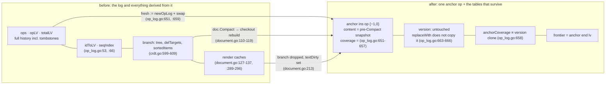

# CRDT: The Binary Frame and Compaction

`docs/crdt/01-replica-model.md` treated the op log as a black box that
"remembers everything", and pages 02–04 opened it (`02-op-log.md`,
`03-merge-drive.md`, `04-content-tree.md`). This page closes the loop with
two questions a live CRDT has to answer: how that history gets *across the
wire*, and what happens when remembering everything gets too expensive to
keep.

- **Serialization** (`go/crdt/binary.go`, `go/crdt/serialization.go`) — the
  whole history of a replica reduces to a self-describing byte frame: magic,
  version, eleven length-prefixed columns, all zstd-compressed. It exists so
  a replica's *entire state* can travel to a peer without the sender walking
  the merge drive twice (the incremental form is the delta frame, whose wire
  dialect is the topic of `docs/crdt/06-deltas-and-checkout.md` — this page
  only touches the delta format's model, never its mechanics).
- **Compaction** (`opLog.Compact`, [`go/crdt/op_log.go:622-661`](../../go/crdt/op_log.go#L622-L661)) — when every
  peer has caught up, the history collapses onto one anchor op. The result
  is a GC: what it *strips* (the tree layer's `delTargets`, the per-op
  caches, the sequence index), what it *persists* (`version`, the coverage
  table), and the invariants the compacted log still keeps.

Sections in order: the frame format and its columns; the columnar two-layer
encoder; the content codecs; the decode path and its hostile-input armor; a
worked example with the real bytes; Compact end to end; invariants.

## Why ops serialize, and what the frame looks like

A document is only as durable as its ability to leave the process: two
replicas converge by exchanging op data, and `MergeFrom` needs the other
side's ops in *some* transferable form. The full-state path is a byte blob:
`MarshalBinary` encodes the log's columnar form ([`go/crdt/binary.go:102-108`](../../go/crdt/binary.go#L102-L108))
and `UnmarshalBinary` rebuilds an equivalent log on the receiving side
([`go/crdt/binary.go:412-419`](../../go/crdt/binary.go#L412-L419)). The frame grammar, verbatim from the header
comment (the magic and abuse bound are the constants a wire peer actually
meets first):

```go include go/crdt/binary.go L12-L47
// The binary frame layout (compressed as a whole with zstd, all integers
// varint-encoded — signed values in zigzag form):
//
//	magic "EGW1" || uvarint version || column × N
//
// A column is a length-prefixed body: uvarint bodyLen || body. v1 frames
// (N == 10) carry Types, TypeRuns, Agents, AgentRuns, Seqs, Positions,
// Lengths, Content, Parents, Frontier. v2 frames (N == 11, the only version
// writers emit) append the Coverage column; v1 frames remain decodable and
// can only describe uncompacted logs, so they decode as such.
//
// The Coverage column carries an anchor log's coverage table. The column is
// never omitted: uncompacted logs write a zero-length body, so a non-empty
// body unambiguously means "compacted". Its body is
//
//	uvarint rowCount || rowCount × (uvarint rowLen || rowLen bytes)
//
// The first row always holds the coverage table itself: uvarint entryCount,
// then per entry in ascending-agent order a zigzag agent delta (from the
// previous agent, first delta from 0) and a uvarint seq. With an anchor op
// (ops[0].agent == anchorAgent) rowCount == op count and row 0 is that op's
// per-op row; every later row is an empty per-op row. Anchorless compaction
// (a zero-op or edited empty-anchor log has no anchor op to carry the table)
// emits rowCount == op count + 1: the table row followed by one empty per-op
// row per op. Decode reconstructs the anchor op's coverage from the table,
// folds the table into the version vector (compaction never rewrites
// version, so the pre-critical high-water marks must ride with the coverage
// table), and scrubs the anchor sentinel from version.
const binaryMagic = "EGW1"

// maxBinaryDecoded bounds the decompressed frame size accepted from any
// single blob. Real logs sit far below this; hostile input declaring a huge
// frame would otherwise make the decoder pre-allocate gigabytes before
// failing (fuzz-found: a 26-byte blob triggered a 4 GB transient
// allocation).
const maxBinaryDecoded = 1 << 26 // 64 MiB
```

Four things to read off that:

- **"EGW1" magic + uvarint version** (`binaryMagic`/`binaryVersion`,
  `go/crdt/binary.go:40,78`) open every frame; v2 (11 columns) is what
  writers emit, v1 (10 columns) remains decodable ([`go/crdt/binary.go:16-21`](../../go/crdt/binary.go#L16-L21)).
- **All integers are varints, signed ones zigzag** ([`go/crdt/binary.go:12-13`](../../go/crdt/binary.go#L12-L13))
  — negative values really occur, because `anchorAgent` is `-1` (the
  sentinel [`go/crdt/types.go:30-33`](../../go/crdt/types.go#L30-L33)) and agent deltas start from 0.
- **Each column is `uvarint bodyLen || body`** (`appendBinaryColumn`,
  [`go/crdt/binary.go:284-288`](../../go/crdt/binary.go#L284-L288)), so a decoder can skip unknown columns and
  never has to guess where one ends.
- **zstd compresses the whole frame at once** ([`go/crdt/binary.go:219`](../../go/crdt/binary.go#L219),
  shared codec pair `:54-73`); there is no checksum — an integrity failure
  surfaces as a decode error (§ decode path).

That shape, for the v2 frame:

```mermaid
graph LR
    H["“EGW1” magic · uvarint version (binary.go:40, :78)"] --> C1["col 1 Types · run-level type codes 0=ins 1=del (binary.go:117-126, :81-89)"]
    C1 --> C2["col 2 TypeRuns · RLE lengths (binary.go:128-133)"]
    C2 --> C3["col 3 Agents · zigzag varint (binary.go:135-140)"]
    C3 --> C4["col 4 AgentRuns · RLE lengths (binary.go:142-147)"]
    C4 --> C5["col 5 Seqs · one per agent run (binary.go:150-154)"]
    C5 --> C6["col 6 Positions · one delta per op (binary.go:156-161)"]
    C6 --> C7["col 7 Lengths · run length per op (binary.go:163-168)"]
    C7 --> C8["col 8 Content · codec blobs (binary.go:170-180)"]
    C8 --> C9["col 9 Parents · counts then lvs (binary.go:182-192)"]
    C9 --> C10["col 10 Frontier · end lvs (binary.go:194-199)"]
    C10 --> C11["col 11 Coverage · anchor table of compacted logs (binary.go:201-217)"]
    C11 --> Z["zstd EncodeAll over the whole frame (binary.go:219)"]
```



## The two-layer encoder: columns first, frame second

The columnar layer is generic and zstd-free: `opLog.Marshal` turns the log
into a `ColumnarData` ([`go/crdt/serialization.go:7-23`](../../go/crdt/serialization.go#L7-L23)) — one row per run
op, with the repetitive columns squeezed first. Why run lengths matter: the
fold path (`docs/crdt/02-op-log.md`) means a typing burst is *one* log entry
holding *n* characters, so a per-op layout would repeat "ins / same agent"
thousands of times; RLE collapses that to one entry plus a count.

```go include go/crdt/serialization.go L7-L23
// ColumnarData represents the opLog in a columnar format for efficient
// compression. There is one row per run op: Types/Agents/Seqs/Positions/
// Lengths/Parents/Content each hold one entry per op, and TypeRuns/AgentRuns
// run-length-encode the op sequence. Content stores each run op's whole run
// (deletes carry a zero content; their Lengths entry is authoritative).
type ColumnarData[C content[C]] struct {
	Types     []opType
	TypeRuns  []int
	Agents    []int
	AgentRuns []int
	Seqs      []int // Start sequence for each agent run
	Positions []int // Delta-encoded positions
	Lengths   []int // Run length of each op
	Content   []C
	Parents   [][]lv
	Frontier  []lv
}
```

The per-op sweeps in `Marshal` ([`go/crdt/serialization.go:46-87`](../../go/crdt/serialization.go#L46-L87)). Types RLE
into `Types` + `TypeRuns` pairs; agent runs additionally carry the run's
starting seq (because `Seqs` is per agent-run, later ops of the same run
advance by the previous op's length — the decoder's job, `:129-141`), and
positions travel as deltas against the previous op:

```go include go/crdt/serialization.go L40-L58
	var lastType opType
	var lastAgent int
	var typeRun int
	var agentRun int
	var lastPos int

	for i, o := range log.ops {
		// --- 1. Run-Length Encode Types ---
		if i == 0 {
			lastType = o.opType
			typeRun = 1
		} else if o.opType == lastType {
			typeRun++
		} else {
			res.Types = append(res.Types, lastType)
			res.TypeRuns = append(res.TypeRuns, typeRun)
			lastType = o.opType
			typeRun = 1
		}
```

```go include go/crdt/serialization.go L60-L73
		// --- 2. Run-Length Encode Agents & Seqs ---
		if i == 0 {
			lastAgent = o.id.agent
			agentRun = 1
			res.Seqs = append(res.Seqs, o.id.seq)
		} else if o.id.agent == lastAgent {
			agentRun++
		} else {
			res.Agents = append(res.Agents, lastAgent)
			res.AgentRuns = append(res.AgentRuns, agentRun)
			lastAgent = o.id.agent
			agentRun = 1
			res.Seqs = append(res.Seqs, o.id.seq)
		}
```

```go include go/crdt/serialization.go L75-L87
		// --- 3. Delta-Encode Positions ---
		if i == 0 {
			res.Positions = append(res.Positions, o.pos)
		} else {
			res.Positions = append(res.Positions, o.pos-lastPos)
		}
		lastPos = o.pos

		// --- 4. Length, Content & Parents ---
		res.Lengths = append(res.Lengths, o.length)
		res.Content = append(res.Content, o.content)
		res.Parents = append(res.Parents, o.parents)
	}
```

Why content and parents ride verbatim while everything numeric is squeezed:
content blobs go through the codec (§ below) and `Parents` is the only
column that is irregular per op — counts first, then all lvs — so it keeps
its own two-part layout ([`go/crdt/serialization.go:83-87`](../../go/crdt/serialization.go#L83-L87)).

`Unmarshal` ([`go/crdt/serialization.go:98-178`](../../go/crdt/serialization.go#L98-L178)) is the mirror sweep, and
worth reading because it *rebuilds every derived structure from the four
surviving columns*: the `opLV` first-lv table, `idToLV` end-lv map, the
per-agent `seqIndex`, and the version vector all fall out of lengths +
agents + seqs ([`go/crdt/serialization.go:155-175`](../../go/crdt/serialization.go#L155-L175)) — nothing derived needs
its own column:

```go include go/crdt/serialization.go L155-L175
	// --- 4. Content, Parents & derived tables ---
	for i := 0; i < totalOps; i++ {
		log.ops[i].content = data.Content[i]
		log.ops[i].parents = data.Parents[i]

		// op i's first LV is the running character count before it.
		log.opLV = append(log.opLV, log.totalLV)
		log.totalLV += lv(log.ops[i].length)

		// idToLV maps an op id to its causal head (end) LV.
		log.idToLV[log.ops[i].id] = log.opLV[i] + lv(log.ops[i].length) - 1

		log.indexAppend(log.ops[i].id.agent, log.ops[i].id.seq, log.opLV[i])

		// Update version map (high-water seq covers the whole run).
		agent := log.ops[i].id.agent
		seq := log.ops[i].id.seq + log.ops[i].length - 1
		if currentSeq, ok := log.version[agent]; !ok || seq > currentSeq {
			log.version[agent] = seq
		}
	}
```

Two rebuild details worth naming. First, an agent run's seqs advance by the
*previous op's length*, not by one, because a run op occupies `length` seq
numbers ([`go/crdt/serialization.go:129-141`](../../go/crdt/serialization.go#L129-L141)). Second, `Unmarshal` is the
deserialization path's spine: the binary layer decodes columns and hands
them here, and anything preserved across compaction's rebuilds leans on the
same sweep (`docs/crdt/02-op-log.md` states the invariants the rebuilt log
must re-satisfy).

## Content codecs: opaque blobs by design

The frame decodes *everything* itself except one thing — content values.
Those travel as per-op opaque length-prefixed blobs behind a codec interface
(`go/crdt/codec.go`) so each concrete content type owns its byte format; the
encoder path is the Content column loop ([`go/crdt/binary.go:170-180`](../../go/crdt/binary.go#L170-L180)), and
its decode mirror is `:618-650`. Why opaque: content semantics drift
independently of frame structure, so codecs version their own payloads and
the frame never has to look inside ([`go/crdt/codec.go:3-7`](../../go/crdt/codec.go#L3-L7)):

```go include go/crdt/codec.go L8-L19
type ContentCodec[C content[C]] interface {
	Encode(C) ([]byte, error)
	Decode([]byte) (C, error)
}

// RuneTextCodec is the codec for RuneDocument's runeText content: the raw
// UTF-8 bytes. runeText is a string, so no other representation exists;
// invalid UTF-8 bytes pass through unchanged, matching in-memory semantics.
type RuneTextCodec struct{}

func (RuneTextCodec) Encode(t runeText) ([]byte, error) { return []byte(t), nil }
func (RuneTextCodec) Decode(b []byte) (runeText, error) { return runeText(b), nil }
```

Runes are the trivial case (the string *is* the bytes, UTF-8 or not,
[`go/crdt/codec.go:16-19`](../../go/crdt/codec.go#L16-L19)). The generic families gob the whole run slice,
because their content carries arbitrary Go values — including `Mergeable`
recursive documents kept as value snapshots ([`go/crdt/document.go:240-245`](../../go/crdt/document.go#L240-L245);
pointer-carrying document types stay merge-only, that note's last line):

```go include go/crdt/document.go L262-L284
// MapRunCodec is the codec for MapDocument's mapRun content: the run slice
// gob-encoded whole (each MapOp's Key/Value arrive as their encoded shapes).
type MapRunCodec[K comparable, V any] struct{}

func (MapRunCodec[K, V]) Encode(r mapRun[K, V]) ([]byte, error) {
	return gobEncodeValue(r)
}

func (MapRunCodec[K, V]) Decode(b []byte) (mapRun[K, V], error) {
	return gobDecodeValue[mapRun[K, V]](b)
}

// ItemRunCodec is the codec for ArrayDocument's itemRun content: the element
// slice gob-encoded whole.
type ItemRunCodec[T any] struct{}

func (ItemRunCodec[T]) Encode(r itemRun[T]) ([]byte, error) {
	return gobEncodeValue(r)
}

func (ItemRunCodec[T]) Decode(b []byte) (itemRun[T], error) {
	return gobDecodeValue[itemRun[T]](b)
}
```

## The decode path: trust nothing before it checks

`UnmarshalBinary` ([`go/crdt/binary.go:420-444`](../../go/crdt/binary.go#L420-L444)) reads through one
battle-tested driver type, `binaryReader` ([`go/crdt/binary.go:291-365`](../../go/crdt/binary.go#L291-L365)), and
the flow is: decompress → magic → version → eleven columns, each validated
against the invariants the columnar form relies on. Its shape:

```mermaid
flowchart TD
    Z["zstd DecodeAll, ≤ 64 MiB cap (binary.go:421, :42-47)"] --> M{"magic == “EGW1”? (binary.go:425-427)"}
    M -->"no"| X1["error: bad magic"]
    M -->"yes: EGW1" --> V{"version 1 or 2? (binary.go:430-436)"}
    V -->"no"--> X2["error: unsupported version"]
    V -->"yes" --> COL["each column: length-prefixed body<br/>(binary.go:332-344), count ≤ body bytes (binary.go:346-357)"]
    COL --> INV{"cross-column invariants hold? (binary.go:478-480, :526-535, :574-576)"}
    INV -->"no"--> X3["error with the mismatch named"]
    INV -->"yes: all 11 columns" --> R["Unmarshal: rebuild opLV/idToLV/seqIndex/version (serialization.go:99-178)"]
    R --> F["v2 Coverage: restore anchorCoverage + fold (binary.go:733-806, :824-843)"]
    F --> T["trailing bytes = error (binary.go:808-810)"]
```

Everything hostile fails loudly, and the checks are cheap enough to be
unconditional. The frame-level opener also sets the op-count bound the
reader leans on everywhere else:

```go include go/crdt/binary.go L430-L440
	version, err := r.uvarint("version")
	if err != nil {
		return nil, err
	}
	if version != 1 && version != binaryVersion {
		return nil, fmt.Errorf("binary: unsupported version %d", version)
	}

	// Op counts can never exceed the frame's own byte count: every op costs
	// at least one byte in each per-op column.
	maxOps := uint64(len(frame))
```

Per-column, counts must agree with each other — the per-op columns
(Positions, Lengths, Content, Parents) must equal the run sums, and the
agent-run sums must equal each other:

```go include go/crdt/binary.go L468-L487
	// Column 2: TypeRuns (one run length per Types entry).
	body, err = r.column("TypeRuns")
	if err != nil {
		return nil, err
	}
	br = &binaryReader{buf: body}
	n, err = br.count("TypeRuns")
	if err != nil {
		return nil, err
	}
	if n != uint64(len(types)) {
		return nil, fmt.Errorf("binary: TypeRuns count %d != Types count %d", n, len(types))
	}
	typeRuns, totalOps, err := readRunLens(br, n, maxOps, "TypeRuns")
	if err != nil {
		return nil, err
	}
	if err := br.exact("TypeRuns"); err != nil {
		return nil, err
	}
```

```go include go/crdt/binary.go L526-L535 L666-L690
	agentRuns, agentOps, err := readRunLens(br, n, maxOps, "AgentRuns")
	if err != nil {
		return nil, err
	}
	if agentOps != totalOps {
		return nil, fmt.Errorf("binary: AgentRuns sum %d != op count %d", agentOps, totalOps)
	}
	if err := br.exact("AgentRuns"); err != nil {
		return nil, err
	}
// …
	lvBudget := uint64(len(br.buf) - br.off)
	for i := range counts {
		v, err := br.uvarint("Parents")
		if err != nil {
			return nil, err
		}
		cnt, err := uvarintToInt(v, "Parents")
		if err != nil {
			return nil, err
		}
		// Each lv costs at least one byte, so the counts cannot claim more
		// lvs than the body has bytes left.
		if uint64(cnt) > lvBudget {
			return nil, fmt.Errorf("binary: Parents lv count %d exceeds %d remaining body bytes", cnt, lvBudget)
		}
		lvBudget -= uint64(cnt)
		counts[i] = cnt
	}
	parents := make([][]lv, n)
	for i, cnt := range counts {
		// Zero-count ops get an empty non-nil slice: pushLocalOp and the
		// merge path always give parentless ops a non-nil parents slice,
		// and the round-trip must preserve that for DeepEqual comparisons.
		ps := make([]lv, cnt)
		for j := range ps {
```

Why this matters: every count is validated against a bound that hostile
input cannot inflate — `count()` requires one byte per entry
([`go/crdt/binary.go:348-357`](../../go/crdt/binary.go#L348-L357)), `readRunLens` caps the running op-count sum at
`maxOps` ([`go/crdt/binary.go:385-410`](../../go/crdt/binary.go#L385-L410), itself sized from the frame at
`:440`), and Parents counts can never claim more lvs than bytes remain
(`:666-679`). The history behind that bar is the comment on
`maxBinaryDecoded` ([`go/crdt/binary.go:44-47`](../../go/crdt/binary.go#L44-L47)): fuzzing found a 26-byte blob
that triggered a 4 GB transient pre-allocation before failing. The hostile
surface is covered by `FuzzBinaryFrame` ([`go/crdt/fuzz_test.go:394`](../../go/crdt/fuzz_test.go#L394)) and
`TestBinaryRejectsGarbage` ([`go/crdt/binary_test.go:281`](../../go/crdt/binary_test.go#L281)); when a body is not
consumed to its end, `exact()` fails loudly ([`go/crdt/binary.go:360-365`](../../go/crdt/binary.go#L360-L365),
final check at `:808-810`):

```go include go/crdt/binary.go L804-L810
			}
		}
	}

	if r.off != len(r.buf) {
		return nil, fmt.Errorf("binary: %d trailing bytes after Frontier column", len(r.buf)-r.off)
	}
```

There is **no checksum**: corruption manifests as one of those structured
decode errors, not as silent data.

## Worked example: two replicas, real bytes, decode into a fresh replica

Driver: a scratch test inside the package (`zz_docexample_5e_test.go`, calling
`MarshalBinary`/`UnmarshalBinary` directly and then `runeDocFromLog`
([`go/crdt/binary_test.go:38-45`](../../go/crdt/binary_test.go#L38-L45)) to rebuild a fresh document around the
decoded log). Why a test driver and not an external `main`: the whole-state
path takes unexported types (`MarshalBinary(log *opLog[C], ...)`) — it is
package-internal by design; the exported document API stops at delta frames
(`RuneDocument.Delta`, [`go/crdt/document.go:186-188`](../../go/crdt/document.go#L186-L188), the subject of
`docs/crdt/06-deltas-and-checkout.md`). Scenario: replica `a` (agent 1)
writes "Hello"; replica `b` merges from `a` and deletes two runes at
position 1; `a` merges back. Verbatim driver output:

```
PRE-CONTENT  "Hlo"
PRE-VERSION  map[1:4 2:1]
PRE-MARSHAL  Types=[ins del] TypeRuns=[1 1] Agents=[1 2] AgentRuns=[1 1] Seqs=[0 0] Positions=[0 1] Lengths=[5 2] Content=["Hello" ""] Parents=[[] [4]] Frontier=[6]
PRE-FRAMELEN 51
PRE-HEX      45475731020302000103020101030202040302010103020000030200020302050208020548656c6c6f00040200010402010600
PRE-VER      2 magic=EGW1
PRE-COL      Types     len=3 hex=020001
PRE-COL      TypeRuns  len=3 hex=020101
PRE-COL      Agents    len=3 hex=020204
PRE-COL      AgentRuns len=3 hex=020101
PRE-COL      Seqs      len=3 hex=020000
PRE-COL      Positions len=3 hex=020002
PRE-COL      Lengths   len=3 hex=020502
PRE-COL      Content   len=8 hex=020548656c6c6f00
PRE-COL      Parents   len=4 hex=02000104
PRE-COL      Frontier  len=2 hex=0106
PRE-COL      Coverage  len=0 hex=
COMPACT-BLOB pre=64B post=52B isCompacted=true ops=1 anchorCoverage=map[1:4 2:1] version=map[1:4 2:1]
POST-FRAMELEN 46
POST-HEX      4547573102020100020101020101020101020100020100020103050103486c6f0201000201020701050202040201
POST-VER      2 magic=EGW1
POST-COL      Types     len=2 hex=0100
POST-COL      TypeRuns  len=2 hex=0101
POST-COL      Agents    len=2 hex=0101
POST-COL      AgentRuns len=2 hex=0101
POST-COL      Seqs      len=2 hex=0100
POST-COL      Positions len=2 hex=0100
POST-COL      Lengths   len=2 hex=0103
POST-COL      Content   len=5 hex=0103486c6f
POST-COL      Parents   len=2 hex=0100
POST-COL      Frontier  len=2 hex=0102
POST-COL      Coverage  len=7 hex=01050202040201
POST-CONTENT "Hlo"
POST-VERSION map[1:4 2:1]
--- PASS: TestDocExample5E (0.00s)
```

Both directions passed `Check()` after the round trip. The pre-compact log
columns marshal as (`opLog.Marshal`, [`go/crdt/serialization.go:25-96`](../../go/crdt/serialization.go#L25-L96)): op 0
is the ins run `{1,0}` "Hello" (lv 0–4), op 1 is the del run `{2,0}` (lv 5–6,
deleting "el"); frontier `[6]` is op 1's end lv (`endLV`, first 5 + length 2
− 1 = 6; [`go/crdt/op_log.go:110-112`](../../go/crdt/op_log.go#L110-L112)). The byte-level column decode of the
51-byte frame
(hex shown above; `PRE-HEX` is the *decompressed* frame, the blob is 64 B
zstd — the frame header taxes tiny inputs):

| column | body hex (bytes) | meaning — derived per `MarshalBinary` column rules |
|---|---|---|
| header | `45 47 57 31 02` | "EGW1", uvarint version 2 ([`go/crdt/binary.go:112-113`](../../go/crdt/binary.go#L112-L113)) |
| Types | `02 00 01` | count 2; `00`=ins, `01`=del (`:118-125`, codes `:81-89`) |
| TypeRuns | `02 01 01` | two runs of 1 — both ops are their own type run |
| Agents | `02 02 04` | count 2; zigzag `02`=+1 → agent 1, `04`=+2 → agent 2 (`:136-138`) |
| AgentRuns | `02 01 01` | both agents hold single-op runs |
| Seqs | `02 00 00` | run start seqs 0 and 0 |
| Positions | `02 00 02` | pos 0, then delta zigzag `02`=+1 → pos 1 |
| Lengths | `02 05 02` | runs span 5 and 2 characters |
| Content | `02 05 "Hello" 00` | two blobs: 5-byte "Hello", 0-byte (del carries zero content; `Lengths` is authoritative, [`go/crdt/serialization.go:10-11`](../../go/crdt/serialization.go#L10-L11)) |
| Parents | `02 00 01 04` | op counts `[0, 1]`, then op 1's lv `4` (the ins run's end lv) |
| Frontier | `01 06` | one tip: end lv 6 |
| Coverage | *(empty)* | uncompacted log — zero-length body ([`go/crdt/binary.go:22-25`](../../go/crdt/binary.go#L22-L25)) |

Decoding that blob into a fresh replica yields the same content and version
(`c` printed `"Hlo"` and `map[1:4 2:1]`, `Check()` passing) — the throwaway
round trip in `TestBinaryRoundTrip` ([`go/crdt/binary_test.go:46-70`](../../go/crdt/binary_test.go#L46-L70)) asserts
the same equality (`DeepEqual` against the sender's log).

## Compaction: the garbage collection pass

`Compact` is the pass that throws history *away*.
The precondition is that the document is fully synchronized (a single-tip
frontier, [`go/crdt/op_log.go:639-641`](../../go/crdt/op_log.go#L639-L641); a peer compacted at a different point
is the `nonAlignedAnchorMsg` topology boundary, [`go/crdt/op_log.go:340-341`](../../go/crdt/op_log.go#L340-L341));
then the whole log is replaced by one anchor
op holding the content snapshot, agent `anchorAgent = -1`
([`go/crdt/types.go:30-33`](../../go/crdt/types.go#L30-L33)):

```go include go/crdt/op_log.go L622-L661
// Compact collapses the entire log into a single anchor op holding the current
// content, discarding all history including tombstones. Precondition (v1): the
// document is fully synchronized — no unconverged concurrency — validated by
// requiring a single-tip frontier. version is preserved; a coverage table
// (clone of version) lets future (agent, seq) parent references below the
// compaction point resolve to the anchor. The content snapshot is supplied by
// the document layer (the log must not duplicate checkout logic); an empty
// snapshot compacts to a zero-op log that still carries the coverage table, so
// tombstone-only documents compact too.
func (log *opLog[C]) Compact(content C) error {
	if log.isCompacted() && len(log.frontier) == 0 {
		// Already a zero-op compacted log (empty-content anchor): there is
		// no history left to collapse, and the single-tip precondition below
		// would reject the empty frontier. Re-compacting is a no-op,
		// mirroring the non-empty anchor's idempotence.
		return nil
	}
	if len(log.frontier) != 1 {
		return fmt.Errorf("oplog: Compact requires a fully synchronized document (frontier has %d tips)", len(log.frontier))
	}
	for i := range log.ops {
		if log.ops[i].id.agent != anchorAgent {
			continue
		}
		if log.anchorCoverage != nil && i == 0 {
			continue // our own anchor from a previous Compact
		}
		return fmt.Errorf("oplog: Compact: agent %d is reserved for the compaction anchor", anchorAgent)
	}
	fresh := newOpLog[C]()
	if content.Len() > 0 {
		// Anchor ops must not fold into later ops and must survive idToLV
		// rebuilds; pushLocalOp already recorded idToLV[{anchorAgent, 0}].
		fresh.pushLocalOp(anchorAgent, op[C]{opType: opTypeIns, pos: 0, content: content})
		fresh.ops[0].coverage = cloneRemoteVersion(log.version)
	}
	fresh.anchorCoverage = cloneRemoteVersion(log.version)
	log.replaceWith(fresh)
	return nil
}
```

Mechanics: a `newOpLog` is built with a single `pushLocalOp` (parents copy
the frontier — empty, because the fresh log holds only the anchor), the
`version` snapshot is cloned into *both* `fresh.ops[0].coverage` and
`fresh.anchorCoverage` (kept-anchor layout: the anchor rides in the log,
[`go/crdt/op_log.go:656-658`](../../go/crdt/op_log.go#L656-L658)), and everything else never survives:

```go include go/crdt/op_log.go L651-L675
	fresh := newOpLog[C]()
	if content.Len() > 0 {
		// Anchor ops must not fold into later ops and must survive idToLV
		// rebuilds; pushLocalOp already recorded idToLV[{anchorAgent, 0}].
		fresh.pushLocalOp(anchorAgent, op[C]{opType: opTypeIns, pos: 0, content: content})
		fresh.ops[0].coverage = cloneRemoteVersion(log.version)
	}
	fresh.anchorCoverage = cloneRemoteVersion(log.version)
	log.replaceWith(fresh)
	return nil
}

// replaceWith swaps in the fresh log's structural state after a rebuild.
// version is deliberately NOT copied: compaction never rewrites the version
// vector (skip-delivery depends on it), and the fresh log's own vector only
// holds the anchor sentinel that pushLocalOp recorded.
func (log *opLog[C]) replaceWith(fresh *opLog[C]) {
	log.ops = fresh.ops
	log.opLV = fresh.opLV
	log.totalLV = fresh.totalLV
	log.frontier = fresh.frontier
	log.idToLV = fresh.idToLV
	log.anchorCoverage = fresh.anchorCoverage
	log.seqIndex = fresh.seqIndex
}
```

### What Compact strips — and what persists



Reading that picture against the code:

- **Stripped and *lost forever*: every ordinary op.** `replaceWith`
  ([`go/crdt/op_log.go:663-675`](../../go/crdt/op_log.go#L663-L675)) swaps in `ops`, `opLV`, `totalLV`,
  `frontier`, `idToLV`, and `seqIndex` from the fresh one-op log — there is
  no tombstone, no deletion marker (invisible deletions fold away without
  trace, the whole point for GC:
  `docs/superpowers/plans/2026-09-05-critical-version-compaction.md`).
- **Stripped, then rebuilt only where survival demands it:** everything the
  *tree layer* derived.
  `doc.Compact` throws away `d.branch` and rebuilds it through `checkout`,
  the from-log construction path a full replay uses — a fresh `checkout`
  allocates an empty `crdtDoc`, so `delTargets`/`sortedItems`/`items` never
  persist across compaction; they
  exist again only because the new log's ops are replayed into it,
  [`go/crdt/crdt.go:598-617`](../../go/crdt/crdt.go#L598-L617) (one `do1Operation` per op, `:613-615`).
  The family render caches (like `RuneDocument`'s text cache) are invalidated
  rather than copied ([`go/crdt/document.go:209-215`](../../go/crdt/document.go#L209-L215)).

```go include go/crdt/document.go L103-L119
// Compact collapses the op log into a single anchor op holding the current
// content. Requires a fully synchronized document (single-tip frontier).
// content must be the document's current visible snapshot rendered by the
// family (GetString/GetItems) — the core cannot render family content itself.
// The tree layer is rebuilt from the compacted log through checkout, the same
// from-log construction path a full replay uses, and the branch frontier is
// re-synced from the log exactly as syncRun does.
func (d *doc[C]) Compact(content C) {
	if err := d.opLog.Compact(content); err != nil {
		panic("crdt: Compact: " + err.Error())
	}
	b := newBranch[C]()
	b.snapshot = checkout(d.opLog)
	b.frontier = make([]lv, len(d.opLog.frontier))
	copy(b.frontier, d.opLog.frontier)
	d.branch = b
}
```

```go include go/crdt/document.go L209-L215
// Compact collapses the op log into a single anchor op holding the current
// content. Requires a fully synchronized document (single-tip frontier).
func (doc *RuneDocument) Compact() {
	doc.doc.Compact(runeText(doc.GetString()))
	doc.textDirty = true
	doc.Check()
}
```

- **Persists untouched: the version vector.** `replaceWith` deliberately
  does *not* copy `version` ([`go/crdt/op_log.go:663-666`](../../go/crdt/op_log.go#L663-L666)) — skip-delivery
  (`ingestOp`, [`go/crdt/op_log.go:518-527`](../../go/crdt/op_log.go#L518-L527)) depends on the pre-compaction
  high-water marks, and `TestCompactPreservesVersion` pins it
  ([`go/crdt/compact_test.go:121`](../../go/crdt/compact_test.go#L121)).
- **Persists as new data: the coverage table.** `fresh.anchorCoverage` is a
  clone of compaction-time `version` ([`go/crdt/op_log.go:658`](../../go/crdt/op_log.go#L658)) — identical
  to the anchor op's own `coverage` clone at `:656`. Its job: a future
  `(agent, seq)` parent reference into the folded history resolves to the
  anchor's end lv instead of panicking (`coveredByAnchor` interception,
  [`go/crdt/op_log.go:595-607`](../../go/crdt/op_log.go#L595-L607); the resolution story is
  `docs/crdt/02-op-log.md`, which is why § there previews this page).
- **An empty-content document compacts too**: `Compact` with `Len() == 0`
  skips the anchor op but still records `anchorCoverage`, the
  tombstone-only case ([`go/crdt/op_log.go:652-660`](../../go/crdt/op_log.go#L652-L660)), tested in
  `TestCompactTombstoneOnly` ([`go/crdt/compact_test.go:95`](../../go/crdt/compact_test.go#L95)) and re-compact
  idempotence in `TestCompactIdempotent`/`TestCompactZeroOpIdempotent`
  (`go/crdt/compact_test.go:61, :466`; the zero-op no-op branch is
  [`go/crdt/op_log.go:632-638`](../../go/crdt/op_log.go#L632-L638)).

That is what the Coverage column exists to carry across the wire — without
it, a decoded compacted log would have *no record* that its per-op columns
cover a history whose individual ops are gone.

### The compacted frame: the Coverage column

The column is never omitted: v2 always writes it, and an *empty body*
unambiguously means uncompacted ([`go/crdt/binary.go:22-25`](../../go/crdt/binary.go#L22-L25)). The writer
branch ([`go/crdt/binary.go:201-217`](../../go/crdt/binary.go#L201-L217)):

```go include go/crdt/binary.go L201-L217
	// Column 11: Coverage — the anchor coverage table of a compacted log.
	// Uncompacted logs write a zero-length body (the column is never
	// omitted; see the frame-structure comment).
	body = body[:0]
	if log.isCompacted() {
		anchorless := len(log.ops) == 0 || log.ops[0].id.agent != anchorAgent
		rows := len(log.ops)
		if anchorless {
			rows++ // no anchor op to carry the table: it rides in its own row
		}
		body = binary.AppendUvarint(body, uint64(rows))
		body = appendCoverageRow(body, encodeCoverageTable(nil, log.anchorCoverage))
		for range rows - 1 {
			body = binary.AppendUvarint(body, 0) // empty per-op row
		}
	}
	frame = appendBinaryColumn(frame, body)
```

Two layouts exist, switched by `anchorless` ([`go/crdt/binary.go:206-215`](../../go/crdt/binary.go#L206-L215)):

- **Anchor kept** (rowCount == op count): row 0 carries the coverage
  table on the anchor op's per-op row; every later row is empty
  ([`go/crdt/binary.go:29-32`](../../go/crdt/binary.go#L29-L32)).
- **Anchorless** (zero-op or edited-empty-anchor log): there is no anchor op
  to ride in, so rowCount = op count + 1 and row 0 is the bare table
  ([`go/crdt/binary.go:33-36`](../../go/crdt/binary.go#L33-L36)).

The table itself is delta-encoded agent ids with zigzag, one entry per
agent in ascending order (`encodeCoverageTable`,
[`go/crdt/binary.go:228-245`](../../go/crdt/binary.go#L228-L245)), and `parseCoverageTable` is its inverse
(`:247-282`):

```go include go/crdt/binary.go L228-L245
// encodeCoverageTable appends a version vector as a coverage table: uvarint
// entry count, then per entry in ascending-agent order the zigzag delta to
// the previous agent (first delta from 0) and the uvarint seq.
func encodeCoverageTable(body []byte, m remoteVersion) []byte {
	agents := make([]int, 0, len(m))
	for agent := range m {
		agents = append(agents, agent)
	}
	sort.Ints(agents)
	body = binary.AppendUvarint(body, uint64(len(agents)))
	prev := 0
	for _, agent := range agents {
		body = binary.AppendVarint(body, int64(agent-prev))
		prev = agent
		body = binary.AppendUvarint(body, uint64(m[agent]))
	}
	return body
}
```

The decode end ([`go/crdt/binary.go:733-806`](../../go/crdt/binary.go#L733-L806)) validates the row shape — count
must be exactly op count or op count+1 (`:749-751`), only row 0 may be
non-empty (`:800-804`), an anchor op must actually carry coverage
(`:767-780`) — and on a well-formed frame wraps up by restoring
`anchorCoverage`, re-attaching the anchor op's coverage, folding the table
into `version` (adjacent entries the per-op columns could not re-derive),
and scrubbing the anchor sentinel both tables must never leak
([`go/crdt/binary.go:812-843`](../../go/crdt/binary.go#L812-L843)):

```go include go/crdt/binary.go L824-L843
	if anchorCoverage != nil {
		log.anchorCoverage = anchorCoverage
		if anchorOpCoverage != nil {
			// Row 0 belonged to the anchor op (agents[0] == anchorAgent in
			// this layout), so op 0 is the anchor.
			log.ops[0].coverage = anchorOpCoverage
		}
		// The per-op columns re-derive only the entries the surviving ops
		// cover; the pre-critical high-water marks ride in the coverage
		// table (compaction never rewrites version). Fold them in — the
		// key must exist even when its value is 0 — and scrub the anchor
		// sentinel Unmarshal recorded from the anchor op: neither Compact
		// nor adoption ever leaves it in version.
		for agent, seq := range log.anchorCoverage {
			if cur, ok := log.version[agent]; !ok || cur < seq {
				log.version[agent] = seq
			}
		}
		delete(log.version, anchorAgent)
	}
```

(In the worked example's POST frame this whole logic sits behind the 7-byte
Coverage body `01 05 02 02 04 02 01`: uvarint rowCount 1, rowLen 5, then the
table — zigzag `02`=+1 → agent 1 seq `04`, zigzag `02`=+1 from prev 1 →
agent 2 seq `01`: `{1:4, 2:1}`, matching the printed `anchorCoverage`.)

Round-trip integrity of the compacted form is exercised by
`TestBinaryRoundTripCompacted` ([`go/crdt/binary_test.go:91-150`](../../go/crdt/binary_test.go#L91-L150),
`isCompacted()` preserved) and the anchorless variant (`:152`), and v1
frames still decode — as uncompacted logs only ([`binary_test.go:214-232`](../../go/crdt/binary_test.go#L214-L232),
the `version >= 2` gate at [`go/crdt/binary.go:738`](../../go/crdt/binary.go#L738)).

### What a compacted log merges like

One subtlety worth one sentence each (details are page 03/06 turf): incoming
anchor records follow skip/adopt-or-panic rules in `ingestOp`
([`go/crdt/op_log.go:469-517`](../../go/crdt/op_log.go#L469-L517)) — a compacted peer's state can bootstrap an
empty replica but cannot merge into a partially-converged one; and a
compact log stays *mergeable as a peer*: `ingestOp` raises `version` to the
coverage on adoption so skip-delivery keeps dropping re-deliveries
([`go/crdt/op_log.go:491-499`](../../go/crdt/op_log.go#L491-L499), mirrored for zero-record frames at
[`go/crdt/op_log.go:575-584`](../../go/crdt/op_log.go#L575-L584)). The delta-frame side of the same contract is
`docs/crdt/06-deltas-and-checkout.md`.

## Invariants

1. **A frame round-trips to a structurally identical log** — decoded logs
   keep empty-but-non-nil `parents` slices ([`go/crdt/binary.go:685-689`](../../go/crdt/binary.go#L685-L689)),
   and the combined gate keeps `go test -C go ./...` checking
   `TestSerializationLossless`/`TestBinaryRoundTrip*`.
2. **Coverage never exceeds version, anchor sentinel never survives
   decode/adoption/encode** — enforced by the fold-then-scrub in
   `UnmarshalBinary` ([`go/crdt/binary.go:824-843`](../../go/crdt/binary.go#L824-L843)), by `ingestOp`'s adoption
   ([`go/crdt/op_log.go:492-499`](../../go/crdt/op_log.go#L492-L499)), and re-checked for any compacted log in
   `checkCompacted` ([`go/crdt/op_log.go:677-696`](../../go/crdt/op_log.go#L677-L696)), which `RuneDocument.Check`
   runs first ([`go/crdt/document.go:218-222`](../../go/crdt/document.go#L218-L222)):

```go include go/crdt/op_log.go L677-L696
// checkCompacted validates the compacted-log invariants: when the log carries
// an anchor op it must be the first op and carry coverage (an empty-content
// anchor log holds no anchor op at all, and still holds none once edits land
// on the empty state), and coverage never exceeds version. Called from the
// document Check() implementations when the log is compacted.
func checkCompacted[C content[C]](log *opLog[C]) {
	if len(log.ops) > 0 && log.ops[0].id.agent == anchorAgent && log.ops[0].coverage == nil {
		panic("Check: compacted log's anchor op must carry coverage")
	}
	for i := 1; i < len(log.ops); i++ {
		if log.ops[i].id.agent == anchorAgent {
			panic("Check: compacted log's anchor op must be the first op")
		}
	}
	for agent, seq := range log.anchorCoverage {
		if log.version[agent] < seq {
			panic("Check: anchorCoverage exceeds version")
		}
	}
}
```

3. **Decode trusts only what it can bound** — every count is cross-checked
   (§ decode path); the 64 MiB cap ([`go/crdt/binary.go:42-47`](../../go/crdt/binary.go#L42-L47)) and the
   ≥-1-byte-per-entry bounds (`:348-357`, `:666-683`) keep hostile frames
   linear in their own size, with `FuzzBinaryFrame` ([`go/crdt/fuzz_test.go:394`](../../go/crdt/fuzz_test.go#L394))
   as the continuous pressure.
4. **Compact is safe only on full sync** — the single-tip frontier check
   ([`go/crdt/op_log.go:639-641`](../../go/crdt/op_log.go#L639-L641)) plus reserved-agent scan (`:642-650`),
   surfaced as a panic by the document layer ([`go/crdt/document.go:111-113`](../../go/crdt/document.go#L111-L113)),
   and re-verified post-Compact by `RuneDocument.Compact` calling `Check()`
   ([`document.go:211-215`](../../go/crdt/document.go#L211-L215)).

```
python3 scripts/doc-snippets-check.py          # snippet drift check
go test -C go ./...                            # whole suite incl. fuzz seed corpora
go test -C go ./crdt -fuzz=FuzzBinaryFrame -fuzztime=30s   # hostile-input surface
```

Next page in the sequence: the *incremental* wire format — delta frames,
checkout replay, and the shared-ops fast path — where the coverage table
from this page rides again as a frame field,
`docs/crdt/06-deltas-and-checkout.md`.

---

*Related: `docs/crdt/01-replica-model.md` (the replica model the blob
captures), `docs/crdt/02-op-log.md` (the structures the columns encode),
`docs/crdt/03-merge-drive.md` (what a decoded log replays through),
`docs/crdt/04-content-tree.md` (the view a compacted branch is rebuilt
into), `docs/index.md` for reading order.*
