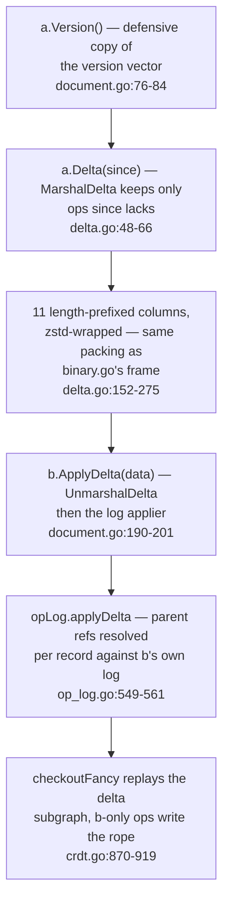
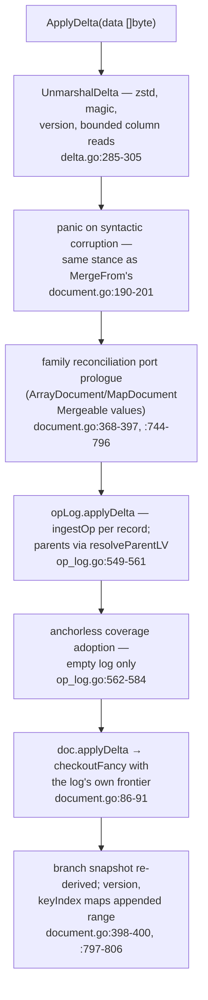
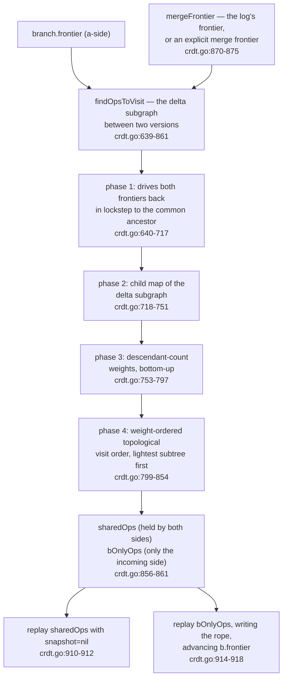
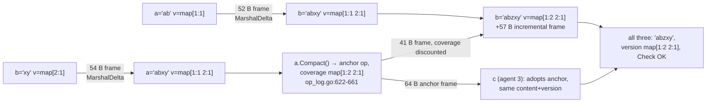

# CRDT: Delta Frames and Checkout

`docs/crdt/03-merge-drive.md` ended by pointing *here* for two pieces it
deliberately deferred: how a replica's history travels as an
**incremental** delta frame (the binary page, 05, owns the whole-log
frame and the columnar encoding — this page owns its delta dialect), and
how a branch is **re-checked-out** against a changed log. Everything here
stands on the vocabulary those pages built: lvs and `(agent, seq)` ids
(02), the `do1Operation` drive (03), the content tree (04), the encoding
columns (05).

The cast in one sentence: every document type exposes three
synchronization verbs (`Version`, `Delta`, `ApplyDelta`,
[[`go/crdt/document.go:180-201`](../../go/crdt/document.go#L180-L201)](../../go/crdt/document.go#L180-L201)), the frame is `EGD1` — magic, version,
eleven columns, zstd ([[`go/crdt/delta.go:8-22`](../../go/crdt/delta.go#L8-L22)](../../go/crdt/delta.go#L8-L22)) — and applying a delta
replays the *same* drive a merge does ([[`go/crdt/op_log.go:544-560`](../../go/crdt/op_log.go#L544-L560)](../../go/crdt/op_log.go#L544-L560),
[[`go/crdt/crdt.go:870-919`](../../go/crdt/crdt.go#L870-L919)](../../go/crdt/crdt.go#L870-L919)), which is why a delta apply must land exactly
where a merge lands.

Read in this order: what a delta frame contains and how a sender
declares which ranges it carries; the apply path and where it re-enters
page 03's drive; the checkout scheme page 01 called the remote path's
final black box — full replay vs the fancy delta subgraph replay and its
shared-ops fast path; a worked example driven through the real exported
API; how the real-world editing trace exercises all of it
(`TestTrace` / `BenchmarkTrace`); and the invariants that fence it.

## What a delta frame contains



The sender still owns a full log in the columnar form page 05 owns; a
delta is the sub-log the *receiver* lacks. The frame grammar's own
comment is the most load-bearing paragraph of the format — verbatim,
with the two constants ([[`go/crdt/delta.go:19-22`](../../go/crdt/delta.go#L19-L22)](../../go/crdt/delta.go#L19-L22)):

```go include go/crdt/delta.go L8-L22
// Delta frames are the incremental-sync counterpart of full binary frames:
// magic "EGD1" || uvarint deltaVersion || column × N, zstd-wrapped with the
// same 64 MiB decode cap. Columns reuse the full-frame encodings (mirroring
// binary.go's MarshalBinary encoder EXACTLY — see the column-by-column
// comments there) except Parents, which carries (agent, endSeq) references
// instead of sender-local lvs — a delta's parents are exactly the ops the
// receiver already holds, so lv references would be unresolvable. There is no
// Frontier column: the receiver never takes the sender's frontier.
// SenderVersion is informational (debugging, future ack/watermark wrappers);
// it is NEVER folded into the receiver's version, which would claim ops the
// receiver does not hold.
const (
	deltaMagic   = "EGD1"
	deltaVersion = 1
)
```

Why this matters: two decisions differentiate `EGD1` from the `EGW1`
full-log frame of page 05. **Parents travel as `(agent, endSeq)`
character references, not sender-local lvs** ([[`go/crdt/delta.go:130-142`](../../go/crdt/delta.go#L130-L142)](../../go/crdt/delta.go#L130-L142)
below) — a delta's parents name *ops the receiver may already hold in
different op boundaries*, and the receiver resolves them against its own
log ([[`go/crdt/op_log.go:554-560`](../../go/crdt/op_log.go#L554-L560)](../../go/crdt/op_log.go#L554-L560)). And **there is no Frontier column**:
the receiver never takes the sender's frontier, it folds new history
through its own ([[`go/crdt/delta.go:15`](../../go/crdt/delta.go#L15)](../../go/crdt/delta.go#L15), `:590-591`).

The one remaining delta-specific field is `SenderVersion`
([[`go/crdt/delta.go:16-18`](../../go/crdt/delta.go#L16-L18)](../../go/crdt/delta.go#L16-L18)): a coverage table that is *informational &
ignored by the applier* — never folded into `version`, which would claim
ops the receiver does not hold. Built at [[`go/crdt/delta.go:270-273`](../../go/crdt/delta.go#L270-L273)](../../go/crdt/delta.go#L270-L273),
decoded at `:691-699` with no further effect than populating a
`deltaFrame` field (`:705`).

### Coverage: how a frame declares what it carries

The sender never ships a "range list" — coverage is declared by *shape*:

1. **Every kept wire record is fully self-describing**
   ([[`go/crdt/delta.go:24-32`](../../go/crdt/delta.go#L24-L32)](../../go/crdt/delta.go#L24-L32)): op id `(agent, seq)`, span `length`
   (an agent run's per-char seqs expand from `seq` plus each op's
   length), type, position, content blob, and `(agent, endSeq)` parents.
   The receiver reconstructs exactly which log ranges the frame covers
   by walking the records themselves.
2. **A compacted sender's pre-critical history has no per-op records** —
   it rides as a *coverage table* (`remoteVersion`), in one of the
   encoder's two shapes ([[`go/crdt/delta.go:240-268`](../../go/crdt/delta.go#L240-L268)](../../go/crdt/delta.go#L240-L268)):

```go include go/crdt/delta.go L240-L273
	// Column 10: Coverage — v2's row scheme (binary.go:201-217). When the
	// sender log is compacted and no anchor record is kept (a fully-held
	// anchor), the table rides in an extra row; the kept-anchor shape gives
	// rowCount == op count and row 0 is the anchor's per-op row.
	body = body[:0]
	if log.isCompacted() {
		anchorless := len(kept) == 0 || kept[0].id.agent != anchorAgent
		rows := len(kept)
		if anchorless {
			rows++ // no anchor record to carry the table: it rides alone
		}
		body = binary.AppendUvarint(body, uint64(rows))
		if len(kept) > 0 && kept[0].id.agent == anchorAgent {
			// Kept-anchor shape: row 0 is the anchor record's per-op row and
			// carries its table; every later row is an empty per-op row.
			body = appendCoverageRow(body, encodeCoverageTable(nil, kept[0].coverage))
			for range rows - 1 {
				body = binary.AppendUvarint(body, 0)
			}
		} else {
			// Anchorless shape: empty per-op rows, then the extra row that
			// carries the log-level table.
			for range len(kept) {
				body = binary.AppendUvarint(body, 0)
			}
			body = appendCoverageRow(body, encodeCoverageTable(nil, log.anchorCoverage))
		}
	}
	frame = appendBinaryColumn(frame, body)

	// Column 11: SenderVersion — one coverage table, always present.
	body = body[:0]
	body = encodeCoverageTable(body, log.version)
	frame = appendBinaryColumn(frame, body)
```

Why this matters: when the kept slice starts with the anchor record, the
frame's row scheme is `rowCount == op count` and row 0 is the anchor's
per-op coverage row ([[`go/crdt/delta.go:252-258`](../../go/crdt/delta.go#L252-L258)](../../go/crdt/delta.go#L252-L258)); when the sender's log
is compacted but its anchor is *not* in the delta (it was redundant vs
`since`), the log-level table rides alone as an extra row — the
"anchorless shape" — and the receiver may adopt it only into an empty
log ([[`go/crdt/op_log.go:562-584`](../../go/crdt/op_log.go#L562-L584)](../../go/crdt/op_log.go#L562-L584), § below). The decoder enforces the
shape ([[`go/crdt/delta.go:621-689`](../../go/crdt/delta.go#L621-L689)](../../go/crdt/delta.go#L621-L689)): an anchor record with an empty row
is an error, a non-anchor op with a row is an error.

### The sender's inclusion rule

`MarshalDelta` walks the whole log in *causal* order and keeps a slice
that is itself a causally-valid log ([[`go/crdt/delta.go:44-48`](../../go/crdt/delta.go#L44-L48)](../../go/crdt/delta.go#L44-L48)):

```go include go/crdt/delta.go L44-L66
// MarshalDelta encodes every op the receiver lacks: ops whose seq range
// extends past since[agent], plus the anchor iff not redundant vs since.
// Log order is topological (parents always precede children), so the kept
// slice is a causally-valid delta.
func MarshalDelta[C content[C]](log *opLog[C], codec ContentCodec[C], since remoteVersion) ([]byte, error) {
	kept := make([]op[C], 0, len(log.ops))
	for i := range log.ops {
		o := &log.ops[i]
		if o.id.agent == anchorAgent {
			// Include the anchor iff some covered seq is missing at since.
			for agent, seq := range o.coverage {
				if since[agent] < seq {
					kept = append(kept, *o)
					break
				}
			}
			continue
		}
		if last, ok := since[o.id.agent]; ok && last >= o.id.seq+o.length-1 {
			continue
		}
		kept = append(kept, *o)
	}
```

Why this matters, per branch of the rule:

- **Per-op skip** ([[`go/crdt/delta.go:62-65`](../../go/crdt/delta.go#L62-L65)](../../go/crdt/delta.go#L62-L65)): an ordinary op is excluded
  iff the receiver *fully holds its seq range* — `since[agent] >=
  seq+length-1`. Because a run op spans `length` per-agent sequences
  (`docs/crdt/02-op-log.md`'s run ops), the test is range-based, and an
  op that merely *straddles* the boundary (receiver holds part of the
  run) rides **whole** — partial reuse would break run-internal causal
  contiguity.
- **Anchor inclusion** ([[`go/crdt/delta.go:51-61`](../../go/crdt/delta.go#L51-L61)](../../go/crdt/delta.go#L51-L61)): the anchor record
  rides iff some seq it covers is missing at `since`. A fully-caught-up
  receiver gets no anchor; a fresh receiver gets the whole pre-critical
  history as one snapshot record.
- **Everything else is kept, in log order.** Log order is topological
  (parents always precede children, [[`go/crdt/delta.go:46-47`](../../go/crdt/delta.go#L46-L47)](../../go/crdt/delta.go#L46-L47)), so no
  extra packing pass is needed to make the delta replayable.

The measured consequences (recorded in `CONTEXT.md`'s delta-frames
entry) are worth pinning: at `n=10,000` ops
(`BenchmarkDeltaAtScale`, [[`go/crdt/bench_test.go:398`](../../go/crdt/bench_test.go#L398)](../../go/crdt/bench_test.go#L398)) the whole-log
binary frame is 20,277 B, the empty-since delta 22,963 B, and an
incremental delta to a receiver missing the last `k=1,000` ops only
**4,336 B**; at real-trace scale (83,751 log ops,
`TestDeltaTraceScale`, [[`go/crdt/delta_test.go:954`](../../go/crdt/delta_test.go#L954)](../../go/crdt/delta_test.go#L954)) the empty-since
delta is 397,126 B against the 327,592-B full frame — the routing cost
of an empty-delta exchange is ~1.2× the whole-log blob. The test the
rules are pinned by is `TestDeltaInclusionRules`
([[`go/crdt/delta_test.go:38`](../../go/crdt/delta_test.go#L38)](../../go/crdt/delta_test.go#L38)).

### Parents on the wire: `(agent, endSeq)` pairs

```go include go/crdt/delta.go L130-L145
		// --- 4. Length, Content & remapped Parents ---
		lengths = append(lengths, o.length)
		parentsIDs = append(parentsIDs, nil)
		if len(o.parents) > 0 {
			ps := make([]id, len(o.parents))
			for j, p := range o.parents {
				// Parents on the wire are (agent, endSeq) character
				// references, not sender-local lvs.
				pa := log.opAt(p)
				ps[j] = id{agent: pa.id.agent, seq: log.seqAt(p)}
			}
			parentsIDs[i] = ps
		}
		contents = append(contents, o.content)
	}
	if len(kept) > 0 {
```

Why this matters: in-log ops parent through lvs
(`docs/crdt/02-op-log.md`), but the delta receiver may hold the parent
op *at a different lv* inside its own log shape. The remap
(`log.opAt`/`log.seqAt`, [[`go/crdt/delta.go:138-139`](../../go/crdt/delta.go#L138-L139)](../../go/crdt/delta.go#L138-L139)) turns each internal
edge into a `(agent, endSeq)` character reference; the receiver resolves
them with `resolveParentLV` ([[`go/crdt/op_log.go:554-560`](../../go/crdt/op_log.go#L554-L560)](../../go/crdt/op_log.go#L554-L560)), the same
mechanism `mergeInto` uses for grafted logs. Wire encoding for the
pairs is zigzag-agent-delta + uvarint seq ([[`go/crdt/delta.go:223-238`](../../go/crdt/delta.go#L223-L238)](../../go/crdt/delta.go#L223-L238),
`:525-588`).

## The apply path: how a frame lands, and where it re-enters the drive



The landing path in full is three calls, and the top one is the whole
design in miniature — the log applier and the re-checkout are *exactly*
`mergeFrom`'s tail ([[`go/crdt/document.go:66-74`](../../go/crdt/document.go#L66-L74)](../../go/crdt/document.go#L66-L74)):

```go include go/crdt/document.go L86-L91
// applyDelta applies a delta frame at the log and re-checks out the branch:
// the delta counterpart of mergeFrom's tail.
func (d *doc[C]) applyDelta(frame *deltaFrame[C]) {
	d.opLog.applyDelta(frame)
	checkoutFancy(d.opLog, d.branch, d.opLog.frontier)
}
```

Why this matters: `applyDelta` does *not* re-invent an ingestion path.
At the log it is `ingestOp` per record — the same core `mergeInto` uses,
including the skip-delivery check for ops the log fully holds
([[`go/crdt/op_log.go:518-528`](../../go/crdt/op_log.go#L518-L528)](../../go/crdt/op_log.go#L518-L528)) — and at the branch it is
`checkoutFancy(log, branch, log.frontier)`, the drive from page 03. The
parents of a wire record are resolved against *this* log's causal state:
`resolveParentLV(p.agent, p.seq)` per pair ([[`go/crdt/op_log.go:549-561`](../../go/crdt/op_log.go#L549-L561)](../../go/crdt/op_log.go#L549-L561)):

```go include go/crdt/op_log.go L549-L561
func (log *opLog[C]) applyDelta(frame *deltaFrame[C]) int {
	oldLen := len(log.ops)
	for _, rec := range frame.ops {
		o := rec.op
		o.coverage = rec.coverage // wire records carry coverage beside the op
		log.ingestOp(o, func(o op[C]) []lv {
			parents := make([]lv, len(rec.parents))
			for i, p := range rec.parents {
				parents[i] = log.resolveParentLV(p.agent, p.seq)
			}
			return parents
		})
	}
```

Why this matters: this is where the `(agent, endSeq)` wire format pays
off — the receiver needs no knowledge of how the sender numbered its
log, only of the *ops themselves*. The anchorless coverage table
follows the loop ([[`go/crdt/op_log.go:562-584`](../../go/crdt/op_log.go#L562-L584)](../../go/crdt/op_log.go#L562-L584)): it adopts **only into an
empty log** (`log.totalLV == 0 && log.anchorCoverage == nil`,
`:575`), raising `version` to the coverage so the receiver counts as
holding every pre-critical op — the same bootstrap `ingestOp`'s record
adopt branch performs for an anchor op ([[`op_log.go:480-499`](../../go/crdt/op_log.go#L480-L499)](../../go/crdt/op_log.go#L480-L499),
`docs/crdt/05-binary-and-compaction.md`).

### The document layer: one page of ceremony, three spellings

The exported trio on `RuneDocument` ([[`go/crdt/document.go:180-201`](../../go/crdt/document.go#L180-L201)](../../go/crdt/document.go#L180-L201);
`ArrayDocument` at `:353-401`, `MapDocument` at `:721-810` keep the
same shape):

```go include go/crdt/document.go L180-L201
// Version returns a defensive copy of the document's version vector — the
// handshake token a peer passes to Delta.
func (doc *RuneDocument) Version() map[int]int { return doc.doc.version() }

// Delta encodes a delta frame carrying everything this document holds that a
// peer at version `since` lacks.
func (doc *RuneDocument) Delta(since map[int]int) ([]byte, error) {
	return MarshalDelta(doc.doc.opLog, RuneTextCodec{}, since)
}

// ApplyDelta decodes and applies a delta frame. A syntactically corrupt frame
// panics (wrapping the decode error); a semantically invalid topology panics
// from the applier exactly as MergeFrom does.
func (doc *RuneDocument) ApplyDelta(data []byte) {
	frame, err := UnmarshalDelta[runeText](data, RuneTextCodec{})
	if err != nil {
		panic("crdt: ApplyDelta: " + err.Error())
	}
	doc.doc.applyDelta(frame)
	doc.textDirty = true
	doc.Check()
}
```

Why this matters: the per-family design shows up in the ceremony around
the shared landing path. `ApplyDelta` decodes first (corrupt syntax =
panic, like `MergeFrom`'s malformed-log panics), then — for the element
families — runs the *reconciliation port* of `MergeFrom`'s recursion
pass *before* the log apply: `ArrayDocument` folds a frame record's
first element into our held element when the id already exists
([[`document.go:368-397`](../../go/crdt/document.go#L368-L397)](../../go/crdt/document.go#L368-L397), mirroring `mergeRecursive` at `:449-477`);
`MapDocument` folds anchor records **by key** and keyed records by id,
then indexes the appended range into `keyIndex` and re-checks the
compacted invariants ([[`document.go:744-810`](../../go/crdt/document.go#L744-L810)](../../go/crdt/document.go#L744-L810), `checkCompacted` at
`:807-809` — the map has no `Check()` of its own, compaction plan F2).
The equivalence oracle `TestDeltaEqualsMerge`
([[`go/crdt/delta_test.go:310`](../../go/crdt/delta_test.go#L310)](../../go/crdt/delta_test.go#L310)) holds them together:

> "sync shape, ApplyDelta(Delta(since)) must land exactly where MergeFrom
> lands" — content, version, and `Check()` (delta_test.go:308-309).

```
go test -C go ./crdt -run TestDeltaEqualsMerge -count=1
```

The apply is one round trip: `MergeFrom`-equivalent state, no extra
verification pass, and the branch re-checks out (including the delta
path — [[`go/crdt/view_cache_test.go:32`](../../go/crdt/view_cache_test.go#L32)](../../go/crdt/view_cache_test.go#L32)).

## Checkout: full replay vs the fancy delta replay



Full replay — the `checkout` every `Check()` and `Compact` lease
([[`go/crdt/crdt.go:598-617`](../../go/crdt/crdt.go#L598-L617)](../../go/crdt/crdt.go#L598-L617), cited in page 03) — walks *every* op of the
log through `do1Operation`, building the snapshot from nothing. That is
always correct, and always `O(whole log)`. `checkoutFancy`
([[`go/crdt/crdt.go:870-919`](../../go/crdt/crdt.go#L870-L919)](../../go/crdt/crdt.go#L870-L919)) exists to make every subsequent
synchronization cost proportional to the *delta subgraph* — the ops
between the branch's frontier and the incoming frontier — not the log.

### Phase 1 in detail: the common-ancestor walk

The priority-queue walk that publishes the three sets
([[`go/crdt/crdt.go:639-717`](../../go/crdt/crdt.go#L639-L717)](../../go/crdt/crdt.go#L639-L717); `mergePoint` stacks whole versions and pops
equal version vectors together, [[`go/crdt/crdt.go:623-637`](../../go/crdt/crdt.go#L623-L637)](../../go/crdt/crdt.go#L623-L637),
[[`go/crdt/types.go:110-113`](../../go/crdt/types.go#L110-L113)](../../go/crdt/types.go#L110-L113)). The core loop, collapsed to the
decision-bearing lines:

```go include go/crdt/crdt.go L700-L716
		if len(v) >= 2 {
			for _, vv := range v {
				enq([]lv{vv}, isInA)
			}
		} else {
			curLV := v[0]
			allDeltaOps[curLV] = true
			if isInA {
				sharedOpsSet[curLV] = true
			} else {
				bOnlyOpsSet[curLV] = true
			}

			o := log.opAt(curLV)
			enq(o.parents, isInA)
		}
	}
```

Why this matters: pop items are compared as *version arrays*
(`compareArrays`, [[`go/crdt/crdt.go:623-637`](../../go/crdt/crdt.go#L623-L637)](../../go/crdt/crdt.go#L623-L637)); every point reached by
both sides before the queues drain is the common ancestor version
(`visit.commonVersion`), settled exactly when the heap empties
([[`crdt.go:700-717`](../../go/crdt/crdt.go#L700-L717)](../../go/crdt/crdt.go#L700-L717) — every remaining point is equal). While
descending, every leaf op reached is classified: on the a-side
(the branch's own frontier) it belongs to `sharedOpsSet`,
on the b-side `bOnlyOpsSet` ([[`crdt.go:705-711`](../../go/crdt/crdt.go#L705-L711)](../../go/crdt/crdt.go#L705-L711)). The remaining
phases just shape *the order*: children are collected within the
delta subgraph ([[`crdt.go:718-751`](../../go/crdt/crdt.go#L718-L751)](../../go/crdt/crdt.go#L718-L751)), each op's descendant count within it
is computed bottom-up ([[`crdt.go:753-797`](../../go/crdt/crdt.go#L753-L797)](../../go/crdt/crdt.go#L753-L797)), and phase 4 emits a
deterministic topological order — lightest subtree first — split back
into the `sharedOps` / `bOnlyOps` lists
([[`go/crdt/crdt.go:799-864`](../../go/crdt/crdt.go#L799-L864)](../../go/crdt/crdt.go#L799-L864)). All four phases cost `O(delta subgraph)`, so
an empty delta visit is cheap by construction (§ worked example's
fast-path check).

### The replay scheme, with nil snapshot for shared ops

Page 03 explained what `do1Operation` does; here is what `checkoutFancy`
runs *around* it ([[`go/crdt/crdt.go:870-919`](../../go/crdt/crdt.go#L870-L919)](../../go/crdt/crdt.go#L870-L919), verbatim):

```go include go/crdt/crdt.go L870-L887 L910-L919
func checkoutFancy[C content[C]](log *opLog[C], b *branch[C], mergeFrontier []lv) {
	if mergeFrontier == nil {
		mergeFrontier = log.frontier
	}

	visit := findOpsToVisit(log, b.frontier, mergeFrontier)

	doc := &crdtDoc{
		items: newBxTree(
			bxtree.WithSummarizer(crdtSummaryConfig),
			bxtree.WithOnItemMoved(func(item *crdtItem, node *bxtree.Node[*crdtItem, crdtSummary]) {
				item.node = node
			}),
		),
		currentVersion: visit.commonVersion,
		delTargets:     make(map[lv]lv),
		sortedItems:    []*crdtItem{},
	}
// …
	for _, curLV := range visit.sharedOps {
		do1Operation(doc, log, curLV, nil)
	}

	for _, curLV := range visit.bOnlyOps {
		do1Operation(doc, log, curLV, b.snapshot)
		o := log.opAt(curLV)
		b.frontier = advanceFrontier(b.frontier, curLV, o.parents)
	}
}
```

Why this matters: a fresh `crdtDoc` is built per checkout
([[`crdt.go:877-886`](../../go/crdt/crdt.go#L877-L886)](../../go/crdt/crdt.go#L877-L886)) with `currentVersion` seeded at the common ancestor
(`:884`) — the staged state from which b-only ops wind *forward*. Three
pieces complete the scheme:

- **The placeholder sentinel** ([[`go/crdt/crdt.go:889-908`](../../go/crdt/crdt.go#L889-L908)](../../go/crdt/crdt.go#L889-L908)): one ghost
  item at tree position 0 whose length covers the branch's own history
  (`max(0, maxFrontier+1)` — `maxFrontier` over `b.frontier`, `:889-895`),
  with origins `-1`. It keeps incoming b-only ops from integrating
  *before* the branch's own content, "to the left" of everything the
  branch had already placed. That is why it is a **nil-snapshot
  precondition**: the shared phase (`:910-912`) re-runs the branch's own
  ancestry with `snapshot = nil` so the staged state is rebuilt —
  `do1Operation` never mutates the rope on a nil snapshot (page 03's
  § "Snapshot or nil") — and b-only ops replay afterwards *against* the
  branch-shaped state. The sentinel is never a real item: `log.covers`
  refuses to merge anything into it ([[`crdt.go:242-244`](../../go/crdt/crdt.go#L242-L244)](../../go/crdt/crdt.go#L242-L244)).
- **The shared-ops fast path is the `snapshot = nil` flag.** Ops both
  sides already hold are replayed with no rope writes — their content
  already lives in the branch (`b.snapshot` was built when they were
  first replayed); what the nil pass rebuilds is *staged state* only:
  the item set's `curState` windings and the `delTargets` ledger needed
  so that subsequent b-only deletions resolve their targets identically.
- **The frontier is advanced only by the b-only phase**
  ([[`crdt.go:914-918`](../../go/crdt/crdt.go#L914-L918)](../../go/crdt/crdt.go#L914-L918)): `advanceFrontier` ([[`go/crdt/op_log.go:234-241`](../../go/crdt/op_log.go#L234-L241)](../../go/crdt/op_log.go#L234-L241))
  folds each replayed op into the branch's version frontier. Shared ops
  do not touch it — the branch already counted them.

What `mergeFrontier` *is*: the common case (`mergeFrom`, `applyDelta`,
page 03's call sites) passes `d.opLog.frontier` — the log's tip — so the
replay reconciles branch-frontier → log-frontier
([[`go/crdt/document.go:72-73`](../../go/crdt/document.go#L72-L73)](../../go/crdt/document.go#L72-L73), `:88-91`). The parameter exists because a
caller can name a different merge frontier to reconstruct a historical
version (the internal uses pass nothing or the log frontier;
`check` at [[`document.go:96-101`](../../go/crdt/document.go#L96-L101)](../../go/crdt/document.go#L96-L101) uses plain full `checkout` for its
ground truth).

The equivalence "fancy replay == full replay" is the same invariant as
the document check: `check` *runs the full checkout* and compares
([[`document.go:96-101`](../../go/crdt/document.go#L96-L101)](../../go/crdt/document.go#L96-L101)), and it is the last statement of every
`ApplyDelta`/`MergeFrom`-shaped test path — see the invariants section.

## Worked example: delta exchange, fast checkout, coverage

Driver (scratch, not committed here; module-replace to this repo, same
pattern as `docs/crdt/03-merge-drive.md`); every line below
is verbatim program output, all calls through the exported API
(`Ins`, `Delta`, `ApplyDelta`, `Version`, `Compact`, `Check`):

```
--- divergence: concurrent Ins on both sides
a: text="ab" version=map[1:1]
b: text="xy" version=map[2:1]
a.Delta(b.Version()) = 52 bytes
b.ApplyDelta(delta) -> b: text="abxy" version=map[1:1 2:1]
b.Check() OK
b.Delta(a.Version()) = 54 bytes
a.ApplyDelta(delta) -> a: text="abxy" version=map[1:1 2:1]
a.Check() OK
equal: a==b text true, equal: versions true
--- fully converged: re-delta is a no-op frame
b: text="abxy" version=map[1:1 2:1]
--- incremental: delta carries only the new op
a: text="abzxy" version=map[1:2 2:1]
a.Delta(empty)=75 bytes  a.Delta(b.Version())=57 bytes
b: text="abzxy" version=map[1:2 2:1]
b.Check() OK
--- compacted sender: coverage rides the frame
a(after Compact): text="abzxy" version=map[1:2 2:1]
a.Delta(empty) for fresh c = 64 bytes
c.ApplyDelta -> c: text="abzxy" version=map[1:2 2:1]
c.Check() OK
a.Delta(b.Version()) after Compact = 41 bytes
b: text="abzxy" version=map[1:2 2:1]
b.Check() OK
```

What to watch, act by act:

1. **Divergence, then two independent deltas converge the pair.** Both
   replicas write concurrently (each a one-op root: `a` seq 0 "ab",
   `b` seq 0 "xy"), so each frame keeps exactly the peer's missing op —
   the `since[agent] >= seq+length-1` test ([[`delta.go:62-65`](../../go/crdt/delta.go#L62-L65)](../../go/crdt/delta.go#L62-L65)) skips
   nothing yet. After the first apply, b's log holds a's op too, so the
   return frame skips it ([[`delta.go:62-65`](../../go/crdt/delta.go#L62-L65)](../../go/crdt/delta.go#L62-L65)) and keeps only b's own op —
   both frames carry exactly one op, with empty parents (concurrent
   roots). Both replicas print identical text and identical versions —
   the versions are the strongest equality: a stitched
   `map[1:1 2:1]` on both sides.
2. **Re-delta after convergence is a no-op frame.** Fully converged,
   every op is covered by `since` ([[`delta.go:62-65`](../../go/crdt/delta.go#L62-L65)](../../go/crdt/delta.go#L62-L65)) and the anchor, if
   any, is redundant (`:52-59`) — what remains is the header, the
   SenderVersion column, and nothing else
   ([[`go/crdt/delta.go:152-273`](../../go/crdt/delta.go#L152-L273)](../../go/crdt/delta.go#L152-L273)). The apply-length print of the same
   round in this driver's internal test census (`TestDeltaFrameEmptyLog`,
   [[`go/crdt/delta_test.go:209`](../../go/crdt/delta_test.go#L209)](../../go/crdt/delta_test.go#L209)) shows the zero-op frame is legal input
   and does nothing.
3. **Incremental delivery:** before `a.Ins(2,"z")`, a 75-byte
   everything-frame; after it, a 57-byte frame to `b.Version()` — one
   op on the wire instead of four. The frame cost is *log-shaped*,
   not content-shaped (`BenchmarkDeltaAtScale`'s k=1,000 case: 4,336 B
   for 1,000 missing ops among 10,000, `CONTEXT.md`).
4. **Compact then delta: the coverage table rides the frame.** The
   fresh replica `c` receives the anchor record (row-0 shape,
   [[`delta.go:252-258`](../../go/crdt/delta.go#L252-L258)](../../go/crdt/delta.go#L252-L258)), adopts it ([[`op_log.go:480-499`](../../go/crdt/op_log.go#L480-L499)](../../go/crdt/op_log.go#L480-L499) → coverage
   adoption), and lands on *the same version vector the compactor
   kept* — `map[1:2 2:1]`, equal to a's post-Compact version — with
   content, seen through `GetString()`, byte-identical. `Check()` on
   `c` verifies the adopted branch through the full replay
   ([[`document.go:96-101`](../../go/crdt/document.go#L96-L101)](../../go/crdt/document.go#L96-L101)).
5. **A compacted sender vs a fully-caught-up peer ships no anchor
   record** ([[`delta.go:52-59`](../../go/crdt/delta.go#L52-L59)](../../go/crdt/delta.go#L52-L59)), but the frame still carries the
   anchorless coverage *row* ([[`delta.go:259-266`](../../go/crdt/delta.go#L259-L266)](../../go/crdt/delta.go#L259-L266)) — and the receiver
   refuses to adopt it ([[`op_log.go:575-576`](../../go/crdt/op_log.go#L575-L576)](../../go/crdt/op_log.go#L575-L576) guards on
   `log.totalLV == 0`), so b's state is untouched: `b.ApplyDelta(bb)`
   is the no-op, and `b.Check()` stays green.

|(The driver prints only what the exported API observes; byte counts,
texts, version maps, and `Check` results above are verbatim output.
Frame internals — wire parent ids, coverage rows, per-record maps —
are *derived from the cited code lines* here; they are pinned against
real decoded frames in `TestDeltaFrameLevelRoundTrip`
([[`go/crdt/delta_test.go:76-149`](../../go/crdt/delta_test.go#L76-L149)](../../go/crdt/delta_test.go#L76-L149)) and `TestDeltaFrameCompacted`
([[`go/crdt/delta_test.go:151-207`](../../go/crdt/delta_test.go#L151-L207)](../../go/crdt/delta_test.go#L151-L207)).)*

Step table:

| Act | Call | Observable after |
|-----|------|------------------|
| 1a | `a.Ins(0,"ab"); b.Ins(0,"xy")` | concurrent roots: `version` `map[1:1]` / `map[2:1]` — `op_log.go` assignment of per-agent seq 0 |
| 1b | `ab, _ := a.Delta(b.Version())` | 52 B: one op record, run encoded; parents empty (root, [[`delta.go:52-65`](../../go/crdt/delta.go#L52-L65)](../../go/crdt/delta.go#L52-L65) alone decides) |
| 1c | `b.ApplyDelta(ab)` | `"abxy"`, `map[1:1 2:1]`, `Check OK` ([[`document.go:193-201`](../../go/crdt/document.go#L193-L201)](../../go/crdt/document.go#L193-L201)) |
| 1d | `ba, _ := b.Delta(a.Version())` | 54 B: since `map[1:1]` covers a's op fully ([[`delta.go:62-65`](../../go/crdt/delta.go#L62-L65)](../../go/crdt/delta.go#L62-L65)), only "xy" is kept — the 54 vs 52 B difference is byte cost, not op count |
| 2 | `re, _ := a.Delta(b.Version())` | zero-op frame, header + SenderVersion only ([[`delta.go:44-66`](../../go/crdt/delta.go#L44-L66)](../../go/crdt/delta.go#L44-L66) keeps nothing; legal input per `TestDeltaFrameEmptyLog`, delta_test.go:209) |
| 3 | `incr, _ := a.Delta(b.Version())` after `a.Ins(2,"z")` | 57 B: all previously-exchanged ops skip ([[`delta.go:62-65`](../../go/crdt/delta.go#L62-L65)](../../go/crdt/delta.go#L62-L65)), only the new op rides; 75 B is the everything-frame for comparison; `b` lands on `"abzxy"`, equal versions |
| 4 | `cb, _ := a.Delta(c.Version())` after `a.Compact()` | 64 B: anchor record row-0 shape ([[`delta.go:252-258`](../../go/crdt/delta.go#L252-L258)](../../go/crdt/delta.go#L252-L258)); `c` adopts, versions equal, `Check OK` |
| 5 | `bb, _ := a.Delta(b.Version())` | 41 B: the anchor is redundant vs b's `since` ([[`delta.go:52-59`](../../go/crdt/delta.go#L52-L59)](../../go/crdt/delta.go#L52-L59)) → no anchor record; but the frame still carries the anchorless coverage row ([[`delta.go:259-266`](../../go/crdt/delta.go#L259-L266)](../../go/crdt/delta.go#L259-L266)) — which b ignores, b holding history ([[`op_log.go:575`](../../go/crdt/op_log.go#L575)](../../go/crdt/op_log.go#L575)); b unchanged |



## Trace replay: the numbers a real editing trace produces

The 83,751-edit real-world trace (`resources/editing-trace.json`) is the
only non-fuzz workload this whole stack is measured against, and it
exercises everything this page owns at once:

- **`TestTrace`** ([[`go/crdt/trace_test.go:121-132`](../../go/crdt/trace_test.go#L121-L132)](../../go/crdt/trace_test.go#L121-L132)) replays the trace
  into one `RuneDocument` and checks convergence against the recorded
  final text (`trace.FinalText`) — the same `do1Operation` drive in a
  real-user-scale workload.
- **`BenchmarkTrace`** ([[`go/crdt/trace_test.go:134-181`](../../go/crdt/trace_test.go#L134-L181)](../../go/crdt/trace_test.go#L134-L181)) is the
  performance twin: measured loop replaying all edits, then — *untimed
  epilogue* ([[`trace_test.go:157-181`](../../go/crdt/trace_test.go#L157-L181)](../../go/crdt/trace_test.go#L157-L181)) — writing
  `go/crdt/trace-data.csv` (`id,position,is_insert,char,avg_time_ms`,
  `:164`) for `scripts/plot-trace.py`, and printing wall time and final
  memory. Recorded numbers (kept in `TODO.md:37-38`, measured with the
  per-agent sequence index of `docs/crdt/02-op-log.md`): **602 ms →
  250 ms** replay wall (2.4×) at **+1.34 MB** memory
  (`CONTEXT.md:78`; `--cpuprofile` runs preload the trace in `TestMain`,
  [[`trace_test.go:79`](../../go/crdt/trace_test.go#L79)](../../go/crdt/trace_test.go#L79), so the JSON decode stays out of the profile).

Delta-side numbers at the same scale, recorded rather than reproduced
here: the trace-scale empty-since delta frame is **397,126 bytes**
against the **327,592-byte** whole-log binary frame — content
byte-identical, `Check()` green (`TestDeltaTraceScale`,
[[`go/crdt/delta_test.go:954`](../../go/crdt/delta_test.go#L954)](../../go/crdt/delta_test.go#L954)), i.e. ~1.2× the whole-log frame when a
receiver wants everything (`CONTEXT.md` delta-frames entry). Apply-cost
recording at op scale: 82.70 ms/op at n=10k, 138.23 ms/op at n=50,000
(`BenchmarkDeltaAtScale`, [[`go/crdt/bench_test.go:398`](../../go/crdt/bench_test.go#L398)](../../go/crdt/bench_test.go#L398)); the per-agent
sequence index (page 02) is the lookup layer the parent resolution and
skip checks route through.

```
go test -C go ./crdt -run TestTrace -count=1                 # correctness
go test -C go ./crdt -run '^$' -bench BenchmarkTrace         # writes trace-data.csv (+ wall/memory)
python scripts/plot-trace.py go/crdt/trace-data.csv          # plot the CSV
```

## Invariants

1. **Delta ≡ merge at the endpoint.** The landing path *is* the merge
   landing path — `ingestOp` both ([[`op_log.go:524-560`](../../go/crdt/op_log.go#L524-L560)](../../go/crdt/op_log.go#L524-L560) vs
   `:531-542`) — so content, version and `Check()` equality is
   property-tested by `TestDeltaEqualsMerge`
   ([[`go/crdt/delta_test.go:308-351`](../../go/crdt/delta_test.go#L308-L351)](../../go/crdt/delta_test.go#L308-L351)) and hammered across arbitrary
   interleavings by `FuzzDeltaConvergence`
   ([[`go/crdt/fuzz_test.go:428-674`](../../go/crdt/fuzz_test.go#L428-L674)](../../go/crdt/fuzz_test.go#L428-L674); three replicas via interleaved
   exchanges and merges, `Compact()` checkpoints) — recorded
   42,006 execs / 0 crashers at 120 s (`CONTEXT.md`).
2. **The sender never overstates the receiver's state.** Inclusion is
   `since`-driven and conservative: fully-held ops skipped
   ([[`delta.go:62-65`](../../go/crdt/delta.go#L62-L65)](../../go/crdt/delta.go#L62-L65)), straddlers whole, anchor only when redundant
   (`:52-61`); `SenderVersion` is never folded into `version`
   ([[`delta.go:16-18`](../../go/crdt/delta.go#L16-L18)](../../go/crdt/delta.go#L16-L18), `:270-273`, `:691-699`) — the receiver would
   otherwise claim ops it does not hold (skip-delivery and
   coverage invariants would both misfire, [[`op_log.go:524-528`](../../go/crdt/op_log.go#L524-L528)](../../go/crdt/op_log.go#L524-L528)).
3. **Coverage can only bootstrap an empty log.** The anchorless
   log-level table is refused on any non-empty destination
   ([[`op_log.go:562-584`](../../go/crdt/op_log.go#L562-L584)](../../go/crdt/op_log.go#L562-L584)) — claiming pre-critical history without the
   pre-critical ops behind it is exactly what the compacted-state
   panics of page 05 forbid; the *record* adopt branch performs the
   one legal non-empty bootstrap: adopting a whole anchor
   ([[`op_log.go:480-499`](../../go/crdt/op_log.go#L480-L499)](../../go/crdt/op_log.go#L480-L499)).
4. **Wire parents are receiver-independent.** `(agent, endSeq)`
   references (built at [[`delta.go:133-142`](../../go/crdt/delta.go#L133-L142)](../../go/crdt/delta.go#L133-L142), resolved at
   [[`op_log.go:554-560`](../../go/crdt/op_log.go#L554-L560)](../../go/crdt/op_log.go#L554-L560)) make the frame receiver-independent: no
   sender-lv indirection a different log shape could not resolve —
   the delta-format point, spelled out at [[`delta.go:24-27`](../../go/crdt/delta.go#L24-L27)](../../go/crdt/delta.go#L24-L27).
5. **Fancy replay must equal full replay.** The `nil`-snapshot shared
   phase writes no rope; the b-only phase writes exactly what a full
   checkout would ([[`crdt.go:910-918`](../../go/crdt/crdt.go#L910-L918)](../../go/crdt/crdt.go#L910-L918) vs `:613-615`,
   [[`document.go:96-101`](../../go/crdt/document.go#L96-L101)](../../go/crdt/document.go#L96-L101)); `Check()` after every `ApplyDelta`
   ([[`document.go:200`](../../go/crdt/document.go#L200)](../../go/crdt/document.go#L200), `:400`) and after the trace (`TestTrace`) stands
   on that equality. `FuzzDeltaFrame` ([[`go/crdt/fuzz_test.go:764`](../../go/crdt/fuzz_test.go#L764)](../../go/crdt/fuzz_test.go#L764)) and
   the hostile-column battery ([[`delta_test.go:810-953`](../../go/crdt/delta_test.go#L810-L953)](../../go/crdt/delta_test.go#L810-L953)) keep the
   decoder's syntactic thrift honest (`maxOps` bound,
   [[`delta.go:303-305`](../../go/crdt/delta.go#L303-L305)](../../go/crdt/delta.go#L303-L305)).

```
python3 scripts/doc-snippets-check.py              # snippet drift gate
go test -C go ./...                                # whole suite incl. seed corpora + drift test
go test -C go ./crdt -fuzz=FuzzDeltaConvergence -fuzztime=30s
go test -C go ./crdt -fuzz=FuzzDeltaFrame -fuzztime=30s
go test -C go ./crdt -run TestDeltaEqualsMerge -count=1
```

*Related: `docs/crdt/01-replica-model.md` (the black box this page
finally opens), `docs/crdt/02-op-log.md` (the lv/seq/address space the
frames encode), `docs/crdt/03-merge-drive.md` (`do1Operation`, which
both checkout flavors drive), `docs/crdt/05-binary-and-compaction.md`
(the columnar machinery the delta frame borrows and the coverage table
it reuses), `docs/index.md` for reading order.*
