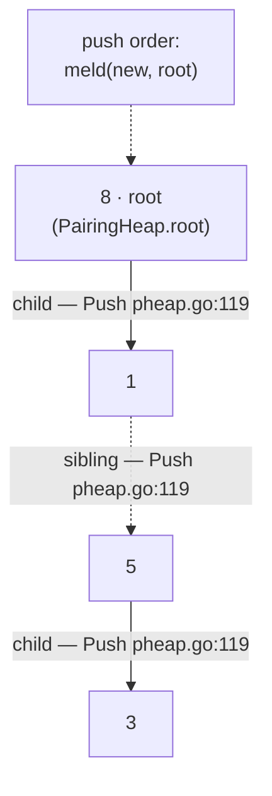
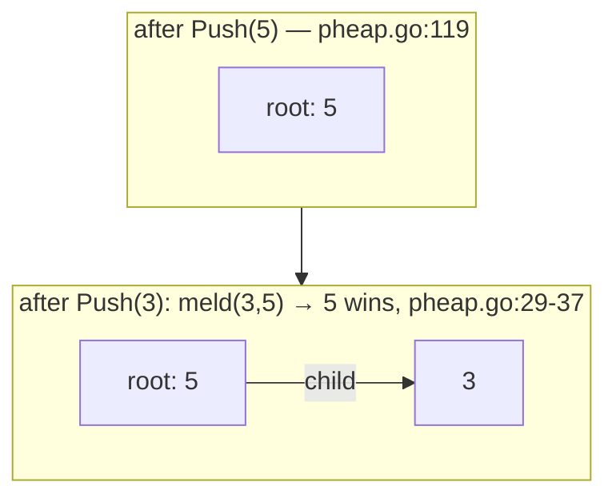
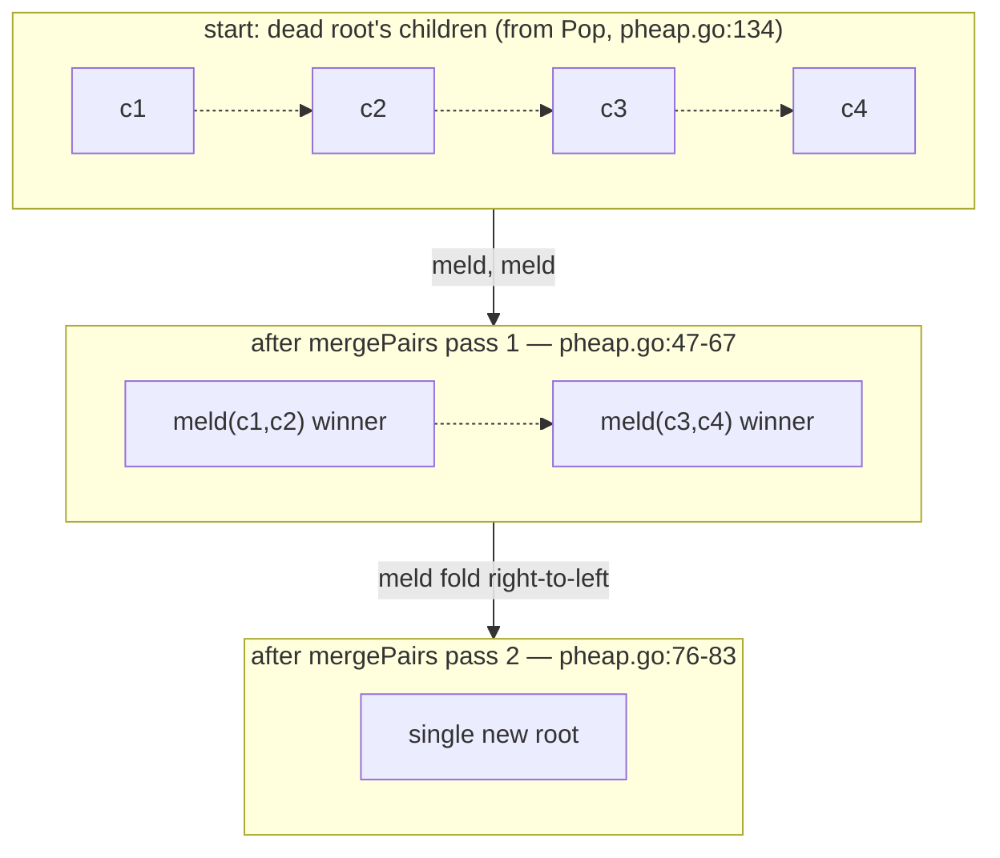
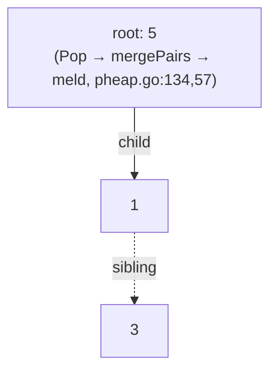
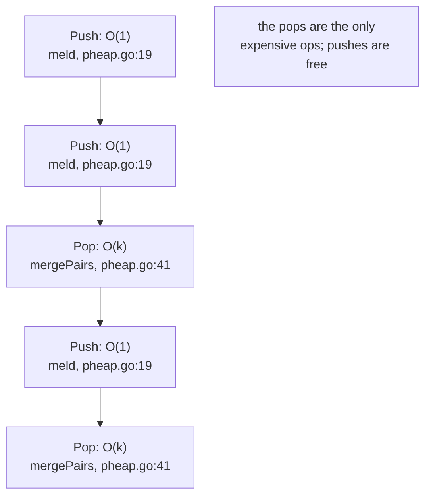

# Pairing Heap

`pheap` is a self-adjusting priority queue: a single (!) heap-ordered tree whose
root holds the highest-priority element, plus a list of rooted sub-trees hanging
off that root ([[`go/pheap/pheap.go:1-6`](../../go/pheap/pheap.go#L1-L6)](../../go/pheap/pheap.go#L1-L6)). Unlike a binary heap it stores no array and
no explicit balance metadata — the only "rebalancing" operation is **pairing**:
when the root is removed, its children are melded together pairwise in a
two-pass tournament ([[`go/pheap/pheap.go:40-86`](../../go/pheap/pheap.go#L40-L86)](../../go/pheap/pheap.go#L40-L86)). That laziness is why `Push`,
melding, and peeking are O(1) pointer surgery, and why delete-min is the only
operation that ever touches the forest.

The heap is generic (`PairingHeap[T any]`, [[`go/pheap/types.go:12-16`](../../go/pheap/types.go#L12-L16)](../../go/pheap/types.go#L12-L16)) and
priority is whatever your `less` function says: `a < b` gives a max-heap
(the default, [[`go/pheap/pheap.go:92`](../../go/pheap/pheap.go#L92)](../../go/pheap/pheap.go#L92)), `a > b` gives a min-heap. In this
document we use a **max-heap of numbers**, matching the default.

## Layout: one tree, three pointers

The entire structure is this node type and its three fields:

Every node knows its leftmost child and its right sibling; the `PairingHeap`
itself only tracks the root, the size, and the comparator.

```go include go/pheap/types.go L3-L7
type node[T any] struct {
	value   T
	child   *node[T]
	sibling *node[T]
}
```

`value` — the payload. `child` — the head of this node's child list. `sibling` —
the *next node in the same child list* (types.go:3-7). That means a node's
children are a singly-linked list reachable via `root.child` and walked with
`sibling`; the list is **hollow** in the sense that the root itself is never
linked through anyone's `sibling` except transiently during mergePairs
(pheap.go:47-67). The `PairingHeap` wrapper holds just three fields
(types.go:12-16):

```go include go/pheap/types.go L12-L16
type PairingHeap[T any] struct {
	root *node[T]
	size int
	less func(a, b T) bool
}
```

Note what is *absent*: there is no `prev` pointer and no `rank`/`order` field.
A classic pairing heap uses a doubly-linked child list (`prev`) so that
`decreaseKey` can cut a node out cheaply; this implementation doesn't provide
`decreaseKey` at all (nothing in `go/pheap/pheap.go` exposes it), so the node
stays minimal. Trade-off: smaller memory footprint, fewer pointers to fix —
but only `Push`, `Pop`, `Peek`, and `Size` are available.

Here is the heap produced by `push 5; push 3; push 8; push 1` (max-heap), drawn
the way the code sees it; every edge is annotated with the field that realizes
it and the function that built it:



The root (8) holds the child list `1 → 5`, and **5 keeps its own first-child 3**
(it became 3's parent during `Push(3)` and keeps that subtree; melding under 8
never flattens anyone into a sibling of anyone else's grandparent, pheap.go:29-37).
Verified by dumping the structure the code actually builds — there is no
`1 → 5 → 3` chain: each `Push` made the smaller of {new, root} become the
other's first *child*, via `meld` (pheap.go:29-37).

## `Push`: meld the new node onto the root

`Push` builds a one-node tree and melds it with the current root
(pheap.go:114-121):

```go include go/pheap/pheap.go L114-L121
// Push adds a new value to the heap.
func (h *PairingHeap[T]) Push(value T) {
	if h == nil {
		panic("pheap: Push called on nil heap")
	}
	h.root = h.meld(&node[T]{value: value}, h.root)
	h.size++
}
```

All the ordering work happens in `meld` (pheap.go:19-38): it compares the two
roots and wires the loser under the winner's `child` slot, pushing the
winner's previous child list one sibling to the right.

```go include go/pheap/pheap.go L19-L38
func (h *PairingHeap[T]) meld(a, b *node[T]) *node[T] {
	if a == nil {
		return b
	}
	if b == nil {
		return a
	}

	// For a max-heap, less(a, b) should be true if a < b.
	// If less(b.value, a.value) is true, then b < a, so a becomes the parent.
	if h.less(b.value, a.value) {
		b.sibling = a.child
		a.child = b
		return a
	} else {
		a.sibling = b.child
		b.child = a
		return b
	}
}
```

Because `meld` always promotes the winning value to the returned root, `Push`
is O(1): allocate a node (pheap.go:119), one comparison, a couple of pointer
writes, `size++` (pheap.go:120). Unconditional — no sifting, no heapification
cascade.

### Worked example: `push 5`, then `push 3`

Max-heap (`less = a < b`).

1. `Push(5)`: `meld(5, nil)` returns 5 as root — pheap.go:24-25.
2. `Push(3)`: `meld(3, 5)` — is `less(5, 3)`? `5 < 3` is false, so the else
   branch runs (pheap.go:33-36): 3 links itself under 5 and loses → root stays 5.



Reversing the arguments (`push 5; push 3` with `less = a > b`, a min-heap)
flips which node ends up on top — same code path, opposite outcome, because
`meld`'s only question is "which of the two roots wins?" (pheap.go:29).

## `Pop`: delete-min/max as a pairing tournament

`Pop` itself is three lines (pheap.go:123-137): stash the root's value, throw
the root away, and hand the root's former child list to `mergePairs`, the
consolidation routine:

```go include go/pheap/pheap.go L123-L137
// Pop removes and returns the highest priority element from the heap.
// It returns (zero value, false) if the heap is empty.
func (h *PairingHeap[T]) Pop() (T, bool) {
	if h == nil {
		panic("pheap: Pop called on nil heap")
	}
	if h.root == nil {
		var zero T
		return zero, false
	}
	val := h.root.value
	h.root = h.mergePairs(h.root.child)
	h.size--
	return val, true
}
```

`mergePairs` (pheap.go:40-86) is the heart of the structure. Its input is the
flat sibling chain `c1 → c2 → … → ck` left behind by the dead root; its
promise is a single tree covering all of them, rooted at the highest-priority
node. It does so in two passes (pheap.go:46-83):

- **Pass 1 (left to right, pheap.go:47-62):** walk the chain two nodes at a
  time, `meld` each pair, and *prepend* the winner to a fresh `pairs` list
  (pheap.go:58-59) — prepending is what reverses the list.
- **Pass 2 (right to left, pheap.go:76-83):** because pass 1 reversed the
  winners, folding `meld` across this list from its head runs right-to-left
  over the original order, ending on one tree.

The code below is pass 1 shown whole (with the reversal trick at its end), then
pass 2's fold. Both snippets cite the same function — pheap.go defines
`mergePairs` at pheap.go:41-86 — because only the pair-welding and the
reversal are what make the *amortized* bound work (see §Amortized analysis):

```go include go/pheap/pheap.go L46-L67
	// Pass 1: Merge pairs from left to right
	var pairs *node[T] // using sibling pointer to link the results of the first pass
	curr := n
	for curr != nil && curr.sibling != nil {
		a := curr
		b := curr.sibling
		next := b.sibling

		a.sibling = nil
		b.sibling = nil

		res := h.meld(a, b)
		res.sibling = pairs
		pairs = res

		curr = next
	}

	if curr != nil {
		curr.sibling = pairs
		pairs = curr
	}
```

Pass 1's second loop head (pheap.go:64-67) handles an odd leftover child:
if `curr` has no sibling to pair with, it's simply prepended to `pairs` too,
still treated as a winner of a "meld against nothing" — `meld`'s nil branches
(pheap.go:20-25) make that a no-op.

Pass 2 then folds (pheap.go:76-83):

```go include go/pheap/pheap.go L76-L83
	root := pairs
	curr = pairs.sibling
	for curr != nil {
		next := curr.sibling
		curr.sibling = nil
		root = h.meld(root, curr)
		curr = next
	}
```

The tournament, once, in one picture — `⇢meld() passes 1, 2` labels each
merge and each step names the function that performed it:



### Worked example: `push 5, 3, 8, 1`, then `Pop`

Recall the heap after those four pushes (built exactly as in the layout
section): root **8**, children `1 → 5` (with `5.child = 3`). Now `Pop()` in the default
max-heap:

| # | Op | State after (function involved) |
|---|----|---------------------------------|
| 1 | `Push(5)` | root 5 (`meld`, pheap.go:19) |
| 2 | `Push(3)` | root 5, child 3 (`meld` else-branch, pheap.go:33) |
| 3 | `Push(8)` | root 8, child **5**, and 5 keeps its own child 3 — `meld(8,5)` true-branch: `5.sibling = 8.child (nil)`, `8.child = 5` (pheap.go:29-32); 3 stays under 5 |
| 4 | `Push(1)` | root 8, children `1 → 5`, 5.child = 3 (`meld(1,8)` else-branch: `1.sibling = 8.child = 5`, `8.child = 1`, pheap.go:33-36) |
| 5 | `Pop()` → 8 | `mergePairs(1→5)` — exactly one pair, no odd leftover (pheap.go:134) |
| 6 | pass 1 pair (1,5) | `meld(1,5)`: `less(5,1)` = false ⇒ else-branch: `1.sibling = 5.child = 3`, `5.child = 1`; winner 5 with children `1 → 3`; `pairs = 5` (pheap.go:57-59) |
| 7 | pass 2 | single winner, `pairs.sibling = nil` ⇒ loop body never runs; root stays 5 (pheap.go:76-83) |

Checking step 6 against the code: after `a.sibling = nil; b.sibling = nil`
(pheap.go:54-55) meld(1,5) asks `less(5, 1)` = `5 < 1` = false, so the *else*
branch (pheap.go:33-36) runs — 1 becomes 5's first child, and 5's old child 3
slides to 1's sibling slot for the next round. After `Pop`, the heap is



## Decrease-key: not implemented

Real pairing-heap descriptions usually include `decreaseKey` with a "restack"
trick: cut the node out of its parent's child list (which needs the `prev`
pointer), re-push it as its own tree, and rely on a later consolidation to
re-absorb it in O(1) amortized time. **This implementation has none of that.**
There is no `decreaseKey`, no `Fix`, and no exposed way to touch an element
after `Push` — the only link that could even support a cut, a `prev` (or
backward) pointer, does not exist in `node` (types.go:3-7).

If you need to *change* a priority, the honest pattern with this API is:
read the value you kept on the side, `Pop` until you find it (or rebuild the
heap with a new `less`), and `Push` the new value. That's O(n) worst case and
forfeits the pairing heap's usual O(log n) decrease-key — worth remembering
when choosing this structure. (`Size` and `Peek`, pheap.go:139-158, are
unaffected.)

## Amortized analysis

Recall the two costs in this structure:

| Operation | Code path | Worst / amortized |
|---|---|---|
| `Push` | one `meld` (pheap.go:119) | O(1) both |
| `Pop` | `mergePairs` over k children (`k` = root's child count) | O(k) / **O(log n)** |
| `Peek`/`Size` | pheap.go:149-158, pheap.go:140-145 | O(1) |

The potential argument, stated plainly: the *potential* is Φ = the number of
trees the structure could be holding (for a pairing heap, expressed through the
children of the root). A `Pop` with k children does Θ(k) real work — pass 1
melds the k children pairwise into about k/2 trees, pass 2 folds those ~k/2
winners into one tree with `meld` (pheap.go:46-83). Two things keep the
amortized cost bounded:

1. Each `meld` inside `mergePairs` consumes two trees and emits one, so the
   tournament halves the tree count per pass, and the fold in pass 2 costs one
   `meld` per remaining tree — O(k) total, never more.
2. The children that caused the big k are produced by earlier, cheap `Push`
   operations; the classic analysis charges that credit to the pushes, giving
   **amortized O(log n) per `Pop`** (and O(1) for `Push`/`Peek`/`Size`).

The full textbook proof tracks a per-node `rank`; this package has no rank
field to maintain (unlike Fibonacci heaps) — the two-pass structure alone
produces the same practical bounds, which is the reason this data structure is
used despite theoretically-unbounded worst cases. Note also that `Push` never
consolidates anything: the heap stays a single tree at all times, so each
`Pop` only ever pays for the children the dead root actually had
(pheap.go:41-86).

Cost per operation across a run of mixed pushes and pops:



## Invariants

There is no `Check()` in this package (unlike `bxtree`/`crdt`); instead the
invariants are enforced in two places: the algorithms themselves, and the test
suite — run everything below with `go test -C go ./pheap`.

- **Heap order at every parent→child edge.** Enforced at every tree
  re-arrangement, and there is exactly one place edges get made: `meld`
  compares before linking (pheap.go:29-37). `mergePairs` (pheap.go:57-59,
  pheap.go:81) and `Push` (pheap.go:119) both build via `meld`, so no path
  creates an out-of-order edge.
- **Single-tree shape, no orphan subtrees.** After `Pop` returns,
  `h.root` is again one tree holding everything that was in the heap —
  `mergePairs`' job (pheap.go:41-86). `Push` (pheap.go:119) and `Pop`
  (pheap.go:134) never leave the `root`/`child`/`sibling` forest disconnected:
  pass 1 and pass 2 only re-root existing nodes.
- **`size` matches reality.** Incremented exactly once in `Push`
  (pheap.go:120) and once per successful `Pop` (pheap.go:135); empty-`Pop`
  returns `(zero, false)` and does not touch `size` (pheap.go:129-132).
- **No value ever de-prioritizes after insertion.** Since values are
  immutable after `Push` and there is no decrease-key path, heap order can
  never be violated *between* operations; `less` must itself be a total
  order consistent with any transitive expectation of the caller.
- **Reflexive/nil behavior is total.** `meld(nil, b) == b` and vice versa
  (pheap.go:20-25); `Pop`/`Peek` on an empty heap return `(zero, false)`
  (pheap.go:129-132, pheap.go:153-156); nil-receiver calls panic with a clear
  message (pheap.go:116-118, pheap.go:126-128, pheap.go:142-144,
  pheap.go:151-153).

These properties are exercised by `TestPairingHeap`, `TestMinHeap`,
`TestNilHeap`, `TestNewAny`, `TestPeekEmpty`, `TestDuplicateValues`, and
`TestSingleElement` in [[`go/pheap/pheap_test.go:23-157`](../../go/pheap/pheap_test.go#L23-L157)](../../go/pheap/pheap_test.go#L23-L157), plus random op-sequence
checking in `FuzzHeap` ([[`go/pheap/fuzz_test.go:19`](../../go/pheap/fuzz_test.go#L19)](../../go/pheap/fuzz_test.go#L19)) — both run as part of
`go test -C go ./pheap`, and `FuzzHeap` under `-fuzz` explores arbitrary
push/pop interleavings for invariant breaks.
